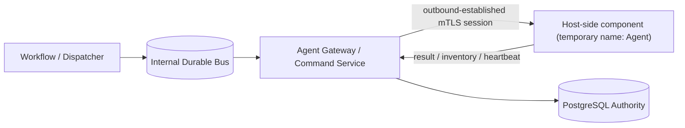

# Agent Protocol Architecture

- 状態: Draft
- 更新日: 2026-08-09

## 1. 決定対象

内部Message BusとHost側コンポーネント（仮称Agent）の通信境界を分離します。標準案ではAgentをNATS JetStreamへ直接接続しません。

Gateway/transport障害時の横断規則は [System-wide Failure Model](failure-model.md) に従います。

## 2. 境界

### Internal Bus

- Control Plane内のwake-up、work distribution、backpressureに使用する。
- Host credential、Tenant credential、Agent固有consumerを発行しない。
- Bus deliveryをCommand execution authorityとして扱わない。

### Agent Gateway / Command Service

- Agent mTLS identityを検証し、certificateからHost identityを導出する。
- Lease authorityをPostgreSQL transactionから発行する。
- typed Command schema、size、version、capabilityを検証する。
- Inventory、heartbeat、Resultを受け付け、bounded responseを返す。
- Busのsubject/credentialをAgentへ露出しない。

### Agent

- outbound connectionだけを必要とする。
- request body/headerの自己申告Host IDをauthorityに使わない。
- 一つのHost identityとcredentialをInventory/Command/Resultで共有する。
- closed capability setを通知し、未知Commandを拒否する。
- hardware factsをobserved evidenceとして報告するが、自身でconfidence/trust/enrollment decisionを決めない。
- challenge/request binding、collector/adapter version、observation generationをevidence envelopeへ含める。

## 3. Transport

最初のtransport候補はHTTPS long pollingまたはbidirectional streamです。Job/Command/Lease/Attempt semanticsはtransportから独立させます。

必須特性:

- TLS 1.3、mutual authentication、証明書rotation
- bounded message、strict schema、unknown field rejection
- request ID、protocol version、capability version
- connection loss後のbounded backoffとfull resync
- proxy/load balancer越しでもPostgreSQL lease authorityを維持
- application-level replay/stale result protection

Agent sessionはAgent artifact digest、protocol envelope range、supported Command/Result schema、module/capability generationをbindします。Gatewayは共通versionを明示negotiationし、未知/互換外schemaを接続成功や別Commandへの変換で隠しません。mixed-version、Agent drain/update、再armingの詳細は [Upgrade and Compatibility Architecture](upgrade-and-compatibility-architecture.md) に従います。

AgentはDB absolute expiryをlocal wall clockだけで解釈せず、Gateway request/responseのserver sample、local monotonic send/receive、uncertainty marginから保守的なstart deadlineを導出します。RTT/uncertainty超過、boot ID/monotonic continuity変更時は未開始Commandを拒否します。詳細は [Time and Clock Semantics Architecture](time-and-clock-semantics.md) に従います。

Agent bootstrap、CSR proof-of-possession、Credential Binding、renewal/rekey/overlap、revocation、session trust generationは [PKI and Trust Lifecycle Architecture](pki-and-trust-lifecycle-architecture.md) に従います。certificateが有効でもEnrollment、armed Host authority、current Command Leaseの代替にはなりません。

## 4. Trust and Authorization

Agent credentialはHost identityを証明しますが、操作許可そのものではありません。Command leaseには以下がすべて必要です。

- 有効なHost credential
- registered/enabled Host
- advertised typed capability
- armed Host Operation Authority generation
- active immutable Command
- PostgreSQLが発行するcurrent Lease
- approved Enrollment、active Baseline Assignment、remediation policyとcurrent compliance/preflight generation

Agent compromise時のblast radiusは、そのHost向けCommandとそのHostからのobserved dataに限定します。Agentから任意publishや他HostのCommand取得を許可しません。

## 5. NATS Direct接続を採る場合の条件

将来AgentをNATSへ直接接続する場合は、別ADRで少なくともsubject-level authorization、credential lifecycle、per-Host isolation、publish allow-list、replay、consumer ownership、compromised Agent threat modelを定義し、Agent Gateway案より優れることを検証します。

## 6. Gateway障害時のAgent動作

Agent GatewayまたはControl Planeへ接続できない場合、Agentはfail-safeに動作します。

- 既存VM、Port、Volumeを維持し、自律的なreconcile/mutation/rollbackを開始しない。
- 新しいLeaseなしにCommandを実行しない。cached Commandを再実行しない。
- Lease取得済みでも実行開始前にlocal lease deadlineを過ぎたCommandは開始しない。
- backend mutation開始後の通信断では処理を推測でcancel/rollbackせず、typed operationを安全な境界まで完了しResultをjournalする。
- Result配送に失敗した場合、同じResult/token/attemptを期限内に再送する。Lease失効後は新しいmutationを開始せず、observationとjournal evidenceを次回接続時に報告する。
- Inventory/heartbeatはbounded local queueに保持できるが、古いobservationをcurrentとして表示しない。
- Gateway復旧だけでHost Operation Authorityをarmしない。
- Agent reconnect、credential renewal、Baseline assignmentだけでもHost Operation Authorityをarmしない。

AgentはControl Plane不在時の自律オーケストレーターではありません。安全性に必要な局所処理を除き、authorityなしのdesired state変更を行いません。
