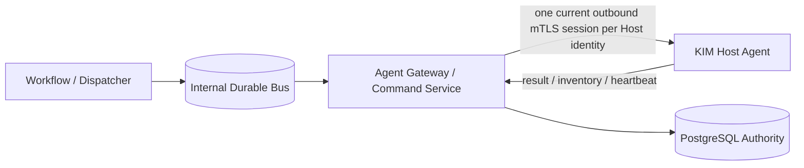
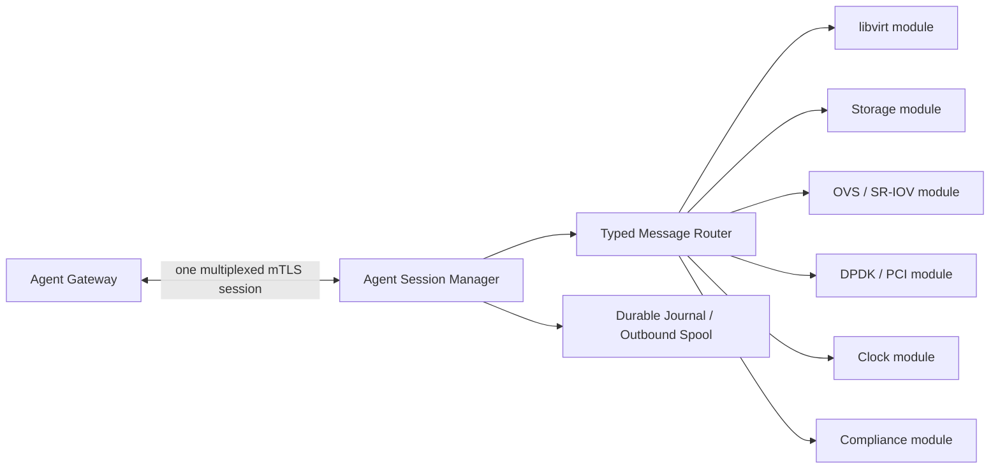

# Agent Protocol Architecture

- 状態: Baseline
- 更新日: 2026-08-09

## 1. 決定対象

内部 Message Bus と KIM Host Agent の通信境界を分離します。KIM Host Agent を NATS JetStream へ直接接続しません。

Gateway/transport障害時の横断規則は [System-wide Failure Model](failure-model.md) に従います。



## 2. 境界

### Internal Bus

- Control Plane内のwake-up、work distribution、backpressureに使用する。
- Host credential、Tenant credential、Agent固有consumerを発行しない。
- Bus deliveryをCommand execution authorityとして扱わない。

### Agent Gateway / Command Service

- Agent mTLS identityを検証し、certificateからHost identityを導出する。
- Lease authorityをPostgreSQL transactionから発行する。
- typed Command schema、size、version、capabilityを検証する。
- Inventory、heartbeat、Resultを受け付け、bounded responseを返す。
- Busのsubject/credentialをAgentへ露出しない。

### Agent

- 原則として Host identity ごとに一つの current long-lived outbound mTLS session だけを必要とする。
- request body/headerの自己申告Host IDをauthorityに使わない。
- 一つのHost identityとcredentialをInventory/Command/Resultで共有する。
- closed capability setを通知し、未知Commandを拒否する。
- hardware factsをobserved evidenceとして報告するが、自身でconfidence/trust/enrollment decisionを決めない。
- challenge/request binding、collector/adapter version、observation generationをevidence envelopeへ含める。
- module は Session Manager が提供する typed publish/receive interface を使用し、socket、TLS key、certificate、reconnect loop を所有しない。

## 3. Transport

transport implementation は HTTP/2、gRPC、HTTPS long polling、bidirectional stream 等から選択できます。Job/Command/Lease/Attempt と Agent capability semantics は transport から独立させます。

必須特性:

- TLS 1.3、mutual authentication、証明書rotation
- bounded message、strict schema、unknown field rejection
- request ID、protocol version、capability version
- connection loss後のbounded backoffとfull resync
- proxy/load balancer越しでもPostgreSQL lease authorityを維持
- application-level replay/stale result protection
- one-current-session generation fencing
- logical stream multiplexing、priority-aware backpressure、bounded queue
- ordering scope、sequence、idempotency、resync contract

Agent sessionはAgent artifact digest、protocol envelope range、supported Command/Result schema、module/capability generationをbindします。Gatewayは共通versionを明示negotiationし、未知/互換外schemaを接続成功や別Commandへの変換で隠しません。mixed-version、Agent drain/update、再armingの詳細は [Upgrade and Compatibility Architecture](upgrade-and-compatibility-architecture.md) に従います。

AgentはDB absolute expiryをlocal wall clockだけで解釈せず、Gateway request/responseのserver sample、local monotonic send/receive、uncertainty marginから保守的なstart deadlineを導出します。RTT/uncertainty超過、boot ID/monotonic continuity変更時は未開始Commandを拒否します。詳細は [Time and Clock Semantics Architecture](time-and-clock-semantics.md) に従います。

Agent bootstrap、CSR proof-of-possession、Credential Binding、renewal/rekey/overlap、revocation、session trust generationは [PKI and Trust Lifecycle Architecture](pki-and-trust-lifecycle-architecture.md) に従います。certificateが有効でもEnrollment、armed Host authority、current Command Leaseの代替にはなりません。

### 3.1 Multiplexing Principle

KIM Host Agent の capability/module 数と Agent Gateway connection/certificate 数を連動させません。通常状態では、1 Host Agent identity に一つの current long-lived outbound mTLS transport session を割り当てます。

次の通信を同じ secure transport 上の typed logical stream として multiplex します。

| Logical stream class | 主な message | Delivery / priority contract |
|---|---|---|
| Session / Control | hello、negotiation、drain、resync control、session fence | highest priority、small bounded message |
| Command / Lease | Command offer、Lease grant/renewal、start decision、ACK | authority-sensitive、deadline-aware |
| Result / Journal | Result、Attempt evidence、receipt recovery | durable、never silently discard |
| Heartbeat / Health | heartbeat、Agent/module health、clock health | small、latency-bounded、bulk stream から独立 |
| Inventory / Observation | inventory snapshot/delta、resource observation、compliance evidence | bulk、bounded、generation-aware coalescing |
| Credential lifecycle | CSR、renewal、rekey、revocation/session transition | control priority、PKI generation へ bind |
| Resync | journal digest、snapshot manifest、missing range request/response | bounded batch、checkpointed |

libvirt、Storage、OVS、SR-IOV、DPDK、PCI、Clock、Compliance module は独立 connection、TLS key、Host certificate を所有しません。分離は typed message kind、schema version、capability advertisement、module registration、authorization、Command/Lease authority で行います。

module 追加だけを理由に connection を増やしてはいけません。別 endpoint/connection は、異なる trust domain、security isolation、traffic volume/QoS、artifact transfer 等の要件が、threat analysis、lifecycle、failure contract、approval とともに定義された場合だけ許可します。

### 3.2 Session Generation and Handoff

Agent Session Manager と Gateway Session Registry は、Host Agent identity ごとに一つの current `session_generation` を共有します。current generation、session handoff decision、Message Receipt、Resync Checkpoint は PostgreSQL へ永続化します。Gateway process 上の live socket/stream buffer は ephemeral であり session authority ではありません。すべての inbound/outbound envelope は少なくとも次を持ちます。

PostgreSQL では mutable な current session authority と、append-only な connection/session attempt・lifecycle event evidence を分離します。reconnect、renewal、handoff で current row を更新しても、旧 attempt/event を上書きしません。attempt/event evidence だけでは current session authority を取得できず、current generation を変更する transaction が必要です。

```text
host_identity
session_generation
logical_stream
message_id
schema_version
sequence_scope + sequence
resource/evidence generation
payload_digest
correlation/idempotency key
```

stale session から届いた Result、Inventory、Observation、Heartbeat、Command ACK、Resync、credential lifecycle message は current authority を進めません。既に durably accepted 済みの同一 message retry は同じ Receipt へ収束できます。

reconnect/rekey 時は old/new connection が一時的に overlap できますが、new session を current にする transaction で generation を進め、old session を draining/stale へ fence します。二つの connection から二つの Host authority を生成しません。

### 3.3 Ordering, Idempotency, and Backpressure

transport arrival 順を resource の global ordering にしません。ordering は logical stream、resource、Command/Attempt、snapshot 等の明示 scope 内で sequence/generation により評価します。異なる stream 間の順序依存は PostgreSQL decision、correlation、verification evidence で表現します。

- message size、stream queue、Agent spool、Gateway ingress buffer に versioned upper bound を設定する。
- Control、Command/Lease、Result、Heartbeat を bulk Inventory/Observation/Resync より優先し、bulk stream による無期限 starvation を防ぐ。
- Result/journal evidence は silent drop しない。bounded spool 超過時は新規 mutation を停止し、health/alarm を報告する。
- Inventory/Observation は generation を保った snapshot/delta contract に限り、未送信の obsolete data を coalesce できる。current decision が参照する evidence は破棄しない。
- oversized message は拒否または明示的な bounded chunk protocol へ移し、暗黙の unbounded fragmentation を行わない。
- reconnect は bounded exponential backoff、jitter、session negotiation、journal/result recovery、inventory/resync checkpoint の順で行う。

### 3.4 Agent Session Manager and Module Boundary



Session Manager が所有するもの:

- mTLS connection、certificate selection、protocol negotiation
- current session generation、reconnect、rekey handoff、drain
- envelope validation、logical stream routing、priority/backpressure
- bounded spool、Receipt、resync coordination、transport metrics

typed module が所有するもの:

- capability advertisement と supported schema range
- typed Command handler、precondition、backend adapter、read-back
- module 固有 Inventory/Observation producer と evidence schema
- local operation state。ただし Command/Lease/session authority は所有しない

module interface は transport object、socket、TLS credential、Gateway endpoint を受け取りません。Session Manager へ typed envelope/handler を登録するため、transport implementation の変更が module contract を変更しない構造にします。

## 4. Trust and Authorization

Agent credentialはHost identityを証明しますが、操作許可そのものではありません。Command leaseには以下がすべて必要です。

- 有効なHost credential
- registered/enabled Host
- advertised typed capability
- armed Host Operation Authority generation
- active immutable Command
- PostgreSQLが発行するcurrent Lease
- approved Enrollment、active Baseline Assignment、remediation policyとcurrent compliance/preflight generation

Agent compromise時のblast radiusは、そのHost向けCommandとそのHostからのobserved dataに限定します。Agentから任意publishや他HostのCommand取得を許可しません。

## 5. NATS Direct接続を採る場合の条件

将来AgentをNATSへ直接接続する場合は、別ADRで少なくともsubject-level authorization、credential lifecycle、per-Host isolation、publish allow-list、replay、consumer ownership、compromised Agent threat modelを定義し、Agent Gateway案より優れることを検証します。

## 6. Gateway障害時のAgent動作

Agent GatewayまたはControl Planeへ接続できない場合、Agentはfail-safeに動作します。

- 既存VM、Port、Volumeを維持し、自律的なreconcile/mutation/rollbackを開始しない。
- 新しいLeaseなしにCommandを実行しない。cached Commandを再実行しない。
- Lease取得済みでも実行開始前にlocal lease deadlineを過ぎたCommandは開始しない。
- backend mutation開始後の通信断では処理を推測でcancel/rollbackせず、typed operationを安全な境界まで完了しResultをjournalする。
- Result配送に失敗した場合、同じResult/token/attemptを期限内に再送する。Lease失効後は新しいmutationを開始せず、observationとjournal evidenceを次回接続時に報告する。
- Inventory/heartbeatはbounded local queueに保持できるが、古いobservationをcurrentとして表示しない。
- Gateway復旧だけでHost Operation Authorityをarmしない。
- Agent reconnect、credential renewal、Baseline assignmentだけでもHost Operation Authorityをarmしない。

AgentはControl Plane不在時の自律オーケストレーターではありません。安全性に必要な局所処理を除き、authorityなしのdesired state変更を行いません。
