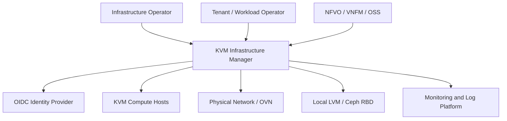
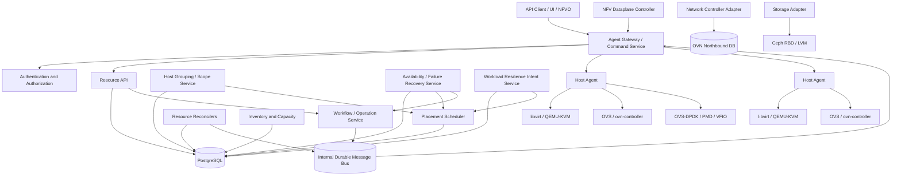
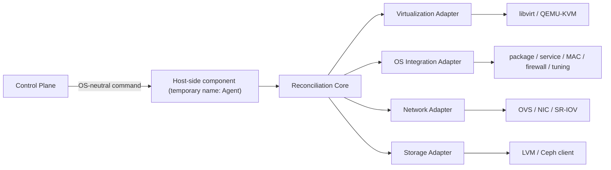

# システムアーキテクチャ

- 状態: Draft
- 更新日: 2026-08-09

## 1. アーキテクチャ目標

- 部分障害が発生しても、要求された状態へ安全に収束する。
- Control Plane を水平冗長化し、Compute Host の障害から分離する。
- テナント境界と管理権限をすべての資源操作で一貫して適用する。
- compute、network、storage の実装を backend adapter で交換可能にする。
- 外部 API と内部実装を分離し、ETSI 対応を段階的に拡張する。

## 2. コンテキスト

## 3. 論理コンポーネント

### API Gateway / Resource API

- REST/OpenAPI の公開面を提供する。
- 認証、認可、rate limit、request ID、idempotency key を処理する。
- 書き込み要求を検証し、desired state と Operation を同一トランザクションで永続化する。
- libvirt や OVN の完了を同期的に待たない。

### Workflow / Operation Service

- 複数資源にまたがる長時間処理を状態機械として管理する。
- retryable、terminal、operator-action-required を区別する。
- 各ステップに補償処理を定義するが、破壊的な自動補償は明示的な安全条件を必要とする。

### Resource Reconciler

- desired state と observed state の差分を検出する。
- at-least-once delivery を前提とし、各処理を冪等にする。
- 定期 reconciliation とイベント駆動 reconciliation の両方を使用する。
- 外部で作られた未知の資源は直ちに削除せず、drift として報告する。

### Placement Scheduler

1. request、policy、inventory、allocation generation を固定したsnapshotを作る。
2. stateを変更しないdry eligibility/admissionで不適格Hostを除外する。
3. eligible Hostだけをversioned policyでscoringする。
4. 候補を選択し、PostgreSQL transaction内でfinal admissionを再評価する。
5. compute、NUMA、HugePages、PCI、network、storage、quotaを不可分に予約する。
6. 競合時は残候補を再選択し、適格性、score、選択・除外理由を記録する。

詳細は [Placement Architecture](placement-architecture.md) を参照します。

### Agent Gateway / Command Service

- 内部Message BusをHost側Trust Boundaryへ公開しない。
- Agentが確立したmTLS session上でInventory、heartbeat、Command Lease、Resultを扱う。
- certificateからHost identityを導出し、body/headerのHost IDをauthorityに使わない。
- Command execution authorityはMessage BusではなくPostgreSQLのLeaseから発行する。
- transportをJob/Command/Lease/Attempt semanticsから分離する。

詳細は [Agent Protocol Architecture](agent-protocol.md) を参照します。

### Host Agent

「Host Agent」はアーキテクチャ上の仮称であり、正式なコンポーネント名は未決定です。

- 各 Compute Host 上で system service として動作する。
- Unix socket の `qemu:///system` を通じてローカル libvirt を操作する。
- Control Plane へ outbound の mTLS 接続を確立する。
- Inventory、heartbeat、observed state、operation result を報告する。
- 任意 XML の実行を受け付けず、versioned command schema のみ処理する。
- 再起動後も重複実行を防げる command journal を持つ。

### Host Lifecycle and Compliance

Host discovery、identity bootstrap、Enrollment approval/Policy Match、Profile/Baseline Assignment、Preflight、Typed Convergence、Verification、Continuous Compliance、Maintenance、Decommissionを一つのauthority modelで管理します。Hardware identityはprovenance付きの複数evidenceから判断し、Compliance Resultはimmutable Evaluator Artifactへbindします。

credentialはidentityだけを証明します。mutation authorityはEnrollment、Baseline、current compliance/preflight、Agent capability、policyを検証した別generationとして発行します。外部remediation完了claimはfresh Host observationとassigned Evaluator再評価までCompliance authorityを変更しません。詳細は [Host Lifecycle and Compliance Architecture](host-lifecycle-and-compliance-architecture.md) を参照します。

### Host Grouping

HostGroupをSystem scopeの第一級resourceとして管理し、Placement Pool、Failure Domain、Operational Cohortを型分離します。membershipはgeneration付きでPostgreSQLへmaterializeし、Placement final admissionで再検証します。Baseline rolloutとMaintenance waveは開始時のimmutable membership snapshotへbindします。

HostGroupはHost capability、Compliance、resource capacityを上書きせず、Group変更だけで既存workloadを暗黙変更しません。Tenantにはexposure policy付きPlacement Scopeだけを公開します。詳細は [Host Grouping Architecture](host-grouping-architecture.md) を参照します。

### Availability Responsibility and Managed Recovery

Placement Poolへimmutable Availability Policyをbindし、Host failure responsibilityをInfrastructure Managed、Workload Managed、Manualへ分類します。Final Admission時のeffective PolicyをVM Availability Bindingへ固定し、Group/Policy変更だけで既存VMの責任を変更しません。

Workload ManagedではFault/Eventを通知して自動restartせず、Infrastructure Managedではsource fencing、VM/resource eligibility、transactional admission、Execution、observationを通じて別Hostへ復旧します。Manualは明示Decisionを要求します。相関rack/power/site障害はversioned Failure Campaignへ束ね、VM単位のunique Campaign Claimとcanonical budget lock順序で重複Recoveryとstormを防ぎます。詳細は [Availability Responsibility and Managed Recovery Architecture](availability-responsibility-architecture.md) を参照します。

### Workload Resilience Intent

NFVO/VNFMが指定するmember集合とrack/power等のhard separationをProject scope resourceとして受け、Final AdmissionでFailure Domain Claimを不可分commitします。active/standby roleはopaqueで、KIMはVNF lifecycleを所有しません。詳細は [Workload Resilience Intent Architecture](workload-resilience-intent-architecture.md) を参照します。

### Data and Persistence

PostgreSQL上のdataをCurrent Authority、Immutable Decision/Evidence、Delivery Journal、Derived Projectionへclassifyし、更新・retention・partition・restore規則を分離します。domain mutationとOutbox、Inbox受理とdomain decisionはそれぞれ不可分にcommitします。

schema変更はexpand/migrate/switch/contractで行い、N/N-1互換、checkpointed backfill、bounded lockを要求します。PITR後はrestore epochで旧Lease/session/claimをfenceし、read-only observation、quarantine、explicit adoption後にscope別authorityを再開します。詳細は [Data and Persistence Architecture](data-persistence-architecture.md) を参照します。

### Host OS Portability Layer

Control Plane と Agent protocol は OS 非依存の正規化モデルのみを扱います。ディストリビューション固有の処理は Agent 内の adapter 境界に閉じ込めます。

OS Integration Adapter は最低限、以下のdiscovery/validation契約を実装します。

- distribution、version、kernel、service manager、security module の検出
- package prerequisite と設定ファイル位置の検出
- service state、log、audit、diagnostic の正規化
- firewall、SELinux/AppArmor、device permission の状態検証
- HugePages、CPU isolation、IOMMU、NUMA などのHost tuning状態検証
- preflight、readiness、capability、remediation hint の報告

Host capability は「OS名」ではなく、機能と制約として Scheduler へ公開します。新しいディストリビューション対応で Control Plane に OS 名による条件分岐を追加してはいけません。

OS変更は別のtyped infrastructure remediation境界です。任意package/service/configuration/kernel argumentを操作する汎用Configuration Managementを提供しません。KIM resource成立に必要な限定操作だけが、明示authority、precondition、verification、bounded rollbackを伴って実行できます。

## 4. データ所有権

| データ | System of Record | 備考 |
|---|---|---|
| Principal credential、User lifecycle | External Identity Platform | KIM は所有しない |
| Tenant、Project、Membership、Role Binding、Quota、Policy | PostgreSQL | KIM が所有 |
| Enrollment、Profile、Baseline、Assignment、Compliance history | PostgreSQL | KIMがversioned authority/evidenceを所有 |
| VM desired state | PostgreSQL | API が更新 |
| VM runtime state | libvirt/QEMU | Agent が observed state として同期 |
| Placement allocation | PostgreSQL | Scheduler が世代管理 |
| Logical network intent | PostgreSQL | Network Controller が OVN へ反映 |
| Network dataplane state | OVN/OVS | observed state を収集 |
| Volume/Backend Binding/Attachment Claim/Fencing decision | PostgreSQL | 実体とclient/device stateはbackend/libvirtのobserved state |
| Operation history | PostgreSQL | 長期監査とは分離 |
| Job、Command、Lease、Attempt | PostgreSQL | Execution authority と履歴 |
| Outbox、Inbox、Receipt | PostgreSQL | delivery journal。domain decisionとtransactionalに接続 |
| Schema/Retention Catalog、Migration/GC record、Backup Manifest、Restore Epoch | PostgreSQL | persistence lifecycleとrestore fencing authority |
| Audit log | Append-only sink | 外部転送を推奨 |

## 5. 整合性モデル

- API metadata と Operation 作成には ACID transaction を使用する。
- 外部 backend との間は eventual consistency とする。
- 書き込み API は成功時に `202 Accepted` と Operation を返す。
- 強い整合性が必要な容量予約は、世代番号または行ロックで競合を検出する。
- Agent message は重複、遅延、順序逆転を前提とする。
- observed state は generation と observation timestamp を持つ。
- Agentの実行Resultと、resourceの収束成功を分離する。
- Execution outcomeのUNKNOWNをFAILEDと区別し、stale ResultをLease token、attempt、authority generationでfencingする。

## 6. Compute

- libvirt Domain は KIM の VM に一対一で対応する。
- libvirt metadata に KIM resource ID、tenant ID、generation を格納する。
- Domain XML は正規化された内部モデルから生成し、ユーザー入力 XML を直接通さない。
- VM delete は Port、Volume、allocation の依存関係を明示的に処理する。
- Host maintenance は新規配置停止、退避計画、残存資源確認の順で進める。
- migration可否は製品全体のbooleanではなく、VMとsource/destinationの組合せごとにcold、live、restart-on-other-host、noneとして評価する。

## 7. Network

初期製品では以下の二方式を扱います。

- Provider VLAN: 物理ネットワークへ直接接続するワークロード向け。
- OVN Geneve overlay: Tenant ごとに重複可能なアドレス空間と論理 L2/L3 を提供。

KIM の Network Controller Adapter が OVN Northbound DB に intent を反映し、各ホストの `ovn-controller` と OVS が dataplane を構成します。OVN は論理 L2/L3、overlay、security group に相当する抽象化を提供します。

KIMのauthorityはNFVI-PoP内のvirtual network resource、provider network binding、virtual router、tenant overlay、VM connectivityまでです。WAN path、transport network、inter-PoP connectivity、物理switch lifecycleはWIMまたは外部Network/PIMの責務です。

### NFV Dataplane

OVS-DPDKを利用するHostでは、PMD/service CPU、DPDK socket memory、Dataplane Port、Rx Queue、VM bindingを第一級resourceとして扱います。workload CPU/HugePages/PCI/networkと同じtransactional final admissionで予約し、desired allocationとobserved OVS/DPDK bindingを分離します。

restart-requiredなDPDK設定は通常VM createに混ぜず、maintenance authorityを持つdisruptive typed operationとして実行します。詳細は [NFV Dataplane Resource Architecture](nfv-dataplane-resource-architecture.md) を参照します。

## 8. Storage

- Storage Backend/Class capabilityをversioned modelで公開する。
- Volume desired state、Backend Binding、Attachment Claim/Generation、backend/libvirt Observationを分離する。
- Local LVMはlocality固定、Ceph RBDはshared block storage候補として扱う。
- SecretはDBへ平文保存せず、Secret Providerとlibvirt/backend secret referenceを介して使用する。
- single-writer DB Claimだけで旧I/O停止を推測せず、compute source、storage client、attachment authority fencingを別々に証明する。
- attach/detach/recovery/migrationはtyped Executionとpost-observationを通じて収束する。

詳細は [Storage, Attachment, and Fencing Architecture](storage-attachment-fencing-architecture.md) を参照します。

## 9. Control Plane HA

- API、Scheduler、Reconciler、Workflow Worker は stateless replica とする。
- PostgreSQL と Message Bus は quorum を持つ構成を前提とする。
- leader が必要な処理は lease と fencing token を使用する。
- clock skew を監視し、順序性に wall clock のみを使わない。
- Control Plane 喪失時も既存 VM と dataplane は稼働を継続する。
- 同一SiteのHA failoverはcommitted PostgreSQL authority dataのRPO 0を目標とする。
- backup/PITRを用いるDRはRPO 5分、RTO 60分を別目標として扱う。

詳細は [HA / DR Architecture](ha-dr.md) を参照します。

## 10. 障害時の基本動作

| 障害 | 動作 |
|---|---|
| Agent 切断 | Host を unreachable とし、新規配置を停止。既存 VM は変更しない |
| OS adapter の preflight 失敗 | Host を unsupported または degraded とし、不足機能と修正候補を表示する |
| Enrollment/identity conflict | Hostをquarantineし、Baseline assignment/authorityを発行しない |
| Critical Baseline drift | Hostまたは該当capabilityの新規placementを停止し、policyによりauthorityをfence |
| Host 障害 | VM を unknown とし、共有ストレージと fencing 条件が満たされた場合のみ再作成を許可 |
| Message 重複 | command ID と generation で同一結果を返す |
| OVN 不整合 | drift を検出し、所有資源のみ再適用する |
| Storage timeout | attachment 状態を照会し、結果不明のまま反対操作を行わない |
| DB failover | client が上限付き retry。処理は idempotency key で重複を防ぐ |

## 11. 配置形態

### Developer

単一 Control Plane、PostgreSQL、Message Bus、1〜2 Compute Host。

### Production

3 Control Plane、HA PostgreSQL、3-node Message Bus、外部 IdP、監視基盤、2台以上の gateway、複数 Compute Host。

## 12. 技術候補

| 領域 | 初期候補 | 状態 |
|---|---|---|
| Control Plane / Agent | Go | Proposed |
| API | REST + OpenAPI 3.1 | Proposed |
| Database | PostgreSQL | Proposed |
| Internal durable messaging | NATS JetStream | Proposed。Agent transportには直接使用しない標準案 |
| Hypervisor API | libvirt | Accepted in principle |
| Network | OVN + Open vSwitch | Proposed |
| NFV dataplane acceleration | OVS-DPDK | Proposed |
| Shared storage | Ceph RBD | Proposed |
| Identity | OIDC | Proposed |
| Telemetry | Prometheus + OpenTelemetry | Proposed |

## 13. OS サポートモデル

| 区分 | 意味 |
|---|---|
| Validated | CI とリリース認定試験を通過し、製品サポート対象 |
| Compatible | Agent preflight を通過し動作可能だが、組合せとして未認定 |
| Unsupported | 必須 capability を満たさない、または既知の非互換がある |

初期候補は Ubuntu/Debian 系、RHEL-compatible 系、SUSE 系です。具体的な version はリリースごとのサポートマトリクスで固定します。

## 14. 参照資料

- [責任境界](responsibility-boundaries.md)
- [Placement Architecture](placement-architecture.md)
- [Execution Architecture](execution-architecture.md)
- [Agent Protocol Architecture](agent-protocol.md)
- [HA / DR Architecture](ha-dr.md)
- [Data and Persistence Architecture](data-persistence-architecture.md)
- [Storage, Attachment, and Fencing Architecture](storage-attachment-fencing-architecture.md)
- [System-wide Failure Model](failure-model.md)
- [Extensibility Architecture](extensibility-architecture.md)
- [NFV Dataplane Resource Architecture](nfv-dataplane-resource-architecture.md)
- [Host Lifecycle and Compliance Architecture](host-lifecycle-and-compliance-architecture.md)
- [Host Grouping Architecture](host-grouping-architecture.md)
- [Availability Responsibility and Managed Recovery Architecture](availability-responsibility-architecture.md)
- [Workload Resilience Intent Architecture](workload-resilience-intent-architecture.md)

- [libvirt API concepts](https://libvirt.org/api.html)
- [libvirt Remote support](https://www.libvirt.org/remote)
- [OVN Architecture](https://www.ovn.org/en/architecture/)
- [Ceph Block Device](https://docs.ceph.com/en/latest/rbd/)
- [Using libvirt with Ceph RBD](https://docs.ceph.com/en/latest/rbd/libvirt/)
