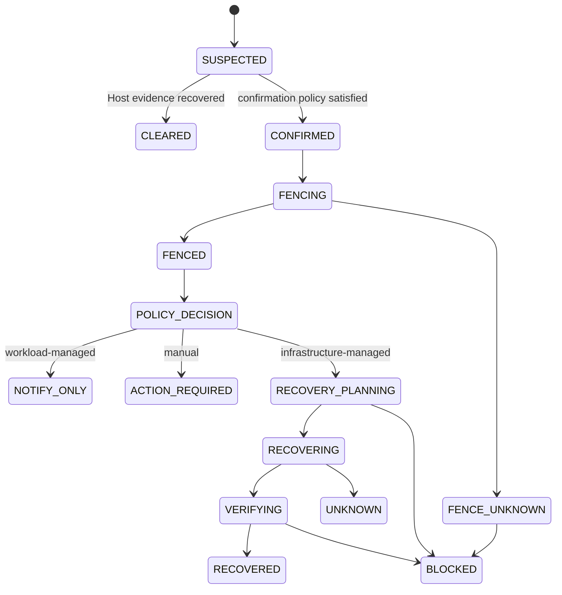

# Availability Responsibility and Managed Recovery Architecture

- 状態: Baseline
- 更新日: 2026-08-09

## 1. 目的

Host障害時にKIM、NF/VNF、operatorの誰がworkload復旧責任を持つかを第一級Policyとして定義します。Control Plane HA/DRではなく、managed VM/workloadのHost failure recoveryを対象にします。

```text
PLACEMENT_POOL
  -> versioned AvailabilityPolicy binding
  -> effective policy resolution
  -> Placement Final Admission
  -> immutable VM AvailabilityBinding
  -> Host failure decision
```

## 2. 基本原則

1. READY/placement可能なHostはactive Placement Pool memberships全体から一つのeffective Availability Policyを解決できなければならない。
2. Availability responsibilityをheartbeat lossや実装defaultから推測しない。
3. Final Admission時のPolicy/Pool/membership generationをVMへAvailability Bindingとして永続化する。
4. Group/Policy変更だけで既存VMの復旧責任を変更しない。
5. `WORKLOAD_MANAGED`と`MANUAL`ではKIMが別Hostへ自動restart/evacuateしない。
6. `INFRASTRUCTURE_MANAGED`でもsource fencing、storage、network、device、migration/restart eligibilityを満たすまで復旧しない。
7. Host failure detection、source fencing、recovery action、verificationを別state/evidenceとして保持する。
8. recovery outcomeがUNKNOWNなら反対操作、重複restart、別Host attachを推測実行しない。
9. failure domain制約とcurrent Placement admissionをrecoveryにも再適用する。
10. fault/event deliveryは復旧責任にかかわらずdurableに行う。

## 3. Availability Policy

`AvailabilityPolicy`はimmutable versioned System resourceです。

```text
policy_id / version / digest
responsibility
host_failure_action
failure_confirmation_policy
fencing_requirements
storage_requirements
network_device_requirements
recovery_eligibility_policy
failure_domain_constraints
recovery_budget_policy_reference
max_attempts / escalation_policy
notification_policy
status / support_tier
created_by / approved_by / audit
```

### Responsibility

| Value | 意味 |
|---|---|
| `INFRASTRUCTURE_MANAGED` | KIMがPolicy条件内でHost failure recovery Operationを自動作成できる |
| `WORKLOAD_MANAGED` | NF/VNF/VNFM等がservice redundancyを管理し、KIMは自動再配置しない |
| `MANUAL` | authorized operator decisionまでKIMは自動再配置しない |

### Host Failure Action

| Value | 意味 |
|---|---|
| `RESTART_ON_OTHER_HOST` | affected VMごとに別Hostへのrestart recoveryを評価・実行 |
| `EVACUATE` | Host failure epoch単位のplanから、eligible VMごとのrecovery Operationを制御された並行度で実行 |
| `NO_AUTOMATIC_ACTION` | fault/eventと状態管理だけを行い、自動VM mutationを開始しない |

`WORKLOAD_MANAGED`と`MANUAL`は`NO_AUTOMATIC_ACTION`だけを許可します。`INFRASTRUCTURE_MANAGED`だけが`RESTART_ON_OTHER_HOST`または`EVACUATE`を使用できます。不正な組合せはPolicy publish時に拒否します。

`EVACUATE`は全VMを一つの分散transactionで復旧する意味ではありません。Host-scoped Recovery Planが各VMを独立したidempotent Operationへ分解し、failure isolation、concurrency、capacityを管理します。

## 4. Placement Pool Binding and Effective Resolution

`AVAILABILITY_POLICY`は`PLACEMENT_POOL`だけに許可された`GroupPolicyBinding` kindです。

```text
group_id / group_generation
policy_id / policy_version
binding_priority
effective_from / expires_at
exposure_class
actor / audit
```

READY/placement可能なHostは少なくとも一つのactive `PLACEMENT_POOL`へmaterialized membershipを持たなければなりません。Policy resolverはHostのcurrent Pool memberships全体から次を行います。

1. current Host membership、Pool lifecycle、binding generationを検証する。
2. applicableなAvailability bindingのhighest priorityを求める。
3. highest priorityが同一Policy versionへ収束すれば、そのPolicyとsource binding setをHost Effective Availability Policyとして採用する。
4. binding欠損、異なるPolicyへの同priority conflict、stale/UNKNOWN generationならHostをREADY/placement eligibleにしない。
5. requested Placement ScopeがあればHost membershipとexposureを確認し、そのPool policyがHost Effective Policyとcompatibleであることを追加検証する。

reason code:

- `availability_pool_missing`
- `availability_policy_missing`
- `availability_policy_conflict`
- `availability_policy_stale`
- `availability_policy_incompatible`

Group score/weightやrequested scopeでPolicy conflictを解消しません。Pool membershipが複数でも構いませんが、Host Effective Availability Policyは一意で、requested scopeによって同一Hostのresponsibilityを変更しません。

## 5. Availability Binding

Final Admissionはcurrent Pool membership/policy bindingを再検証し、VM/Allocationへimmutable `AvailabilityBinding` revisionを保存します。

```text
vm_id / allocation_id
availability_binding_revision
policy_id / policy_version / digest
responsibility / host_failure_action
source_pool_ids / membership_generations
group_policy_binding_generations
fencing/storage/recovery constraints digest
failure_domain constraints digest
placement_decision_id
bound_at / bound_by
supersedes_revision
```

Availability Bindingは「障害発生時にどのPolicyを参照したか」を再現するauthorityです。Pool/Policy更新は新規Placementへ反映しますが、既存VMのBindingを暗黙変更しません。

既存VMを新Policyへ移す場合は明示的な`AvailabilityRebindOperation`を使用し、impact、current Host/Pool、storage/device/failure-domain eligibility、actor approvalを検証して新revisionを発行します。過去revisionを上書きしません。

## 6. Host Failure Model



Host failureごとにimmutable `failure_epoch_id`を発行し、Host identity、last authority/inventory generation、detection evidence、confirmation、fencing state、affected resource snapshotをbindします。

heartbeat/Agent lossだけをsource停止やfencing完了の証明にしません。Policyが要求するBMC、storage fencing、cluster/fabric evidence等をtyped proofとして保持します。

## 7. Responsibility Branches

### WORKLOAD_MANAGED

1. affected VMを`UNAVAILABLE`またはsource state不明なら`UNKNOWN`として記録する。
2. source containment/fencingをinfrastructure safetyとして進める。
3. durable Fault/EventをTenant/NFVO/VNFM subscriptionへ送る。
4. KIMからrestart、evacuate、replacement VM作成を開始しない。
5. workload orchestratorからの明示API要求は通常のauthorization、idempotency、Placement/Availability Policyに従って別Operationとして扱う。

NF/VNFのactive/standby配置はFailure Domain ruleで守れますが、Host failure時のservice failoverはKIMの責任に昇格しません。

### INFRASTRUCTURE_MANAGED

1. source fencing requirementを満たす。
2. VM Availability Bindingとfailure epochをloadする。
3. `restart-on-other-host` capabilityをVM/resource bindingとして評価する。
4. storage single-writer/attachment fencing、network、PCI/SR-IOV、DPDK、image、secret条件を検証する。
5. bound failure-domain/Placement Scopeを含むRecovery Placement Requestを作る。
6. dry evaluation、selection、transactional final admissionを実行する。
7. idempotent Recovery Operation/Commandを実行する。
8. destination observationとKIM resource readinessを検証する。

Recovery destinationはcurrent Pool/Host eligibilityを満たし、bound Availability Policyとcompatibleでなければなりません。別のresponsibilityへsilent fallbackしません。

### MANUAL

Faultを`ACTION_REQUIRED`として保持し、自動VM mutationを開始しません。authorized operatorがreason、impact、current Availability Binding、requested action/target constraintsを伴う`ManualRecoveryDecision`を発行した場合だけ、Infrastructure Managedと同じfencing/admission/verification gateを通るRecovery Operationを開始できます。responsibility自体を変える場合は先に明示Rebindを必要とします。

## 8. Recovery Eligibility

自動/手動を問わず、最低限次を満たします。

- failure epochとaffected VM snapshotがcurrentである。
- source fencing proofがPolicy要求を満たす。
- Volume attachment/single-writer ownershipが確定している。
- old/new Attachment generation、compute source fencing、storage client fencing、attachment authority fencingがStorage Policyを満たす。
- VM migration capabilityが候補Hostに対して`restart-on-other-host`である。
- image、secret、network、storage backendがdestinationで利用可能。
- old/new Port Binding generation、Host/device authority、physnet/overlay/MTU/Gateway/Security realizationがNetwork Policyを満たす。
- PCI/SR-IOV/DPDK/local resourceの代替またはPolicy上の不使用が証明される。
- Placement Pool membership、Availability Policy compatibility、Compliance、capacityがcurrentである。
- failure-domain constraintsを満たす。
- active conflicting Job/Command/Lease/Recovery Attemptがない。

一つでもUNKNOWNならautomatic recoveryを開始しません。既存のVM定義、Volume attachment、Allocationを推測cleanupしません。

## 9. Execution and Idempotency

```text
HostFailureEpoch
  -> RecoveryPlan
      -> VMRecoveryOperation
          -> Job / Command / Lease / Attempt
              -> Observation / Verification
```

各failure epochは初期状態で単一memberのFailure Campaignへ所属します。VM Recoveryのidempotency scopeは`canonical_failure_campaign_id + vm_id + availability_binding_revision + action`です。同じscopeは同じRecovery Campaign Claim/Operationへ収束します。元のepoch ID群はevidence correlationとして保持します。

old failure epoch、old Binding、stale fencing proof、expired LeaseからのResultはcurrent recovery authorityを進めません。Result response lossはaccepted receiptを回収し、side effect後のtimeoutはUNKNOWN/read-backで解決します。

`EVACUATE` planはVM間の部分成功を表現し、失敗した一VMのrollback推測を他VMへ波及させません。capacity不足、ineligible binding、unknown attachmentは対象VMだけをBLOCKED/ESCALATEDにします。

## 10. Recovery Storm Control

多数Host/Failure Domain障害時にRecovery Operationを一斉dispatchしません。immutable versioned `RecoveryBudgetPolicy`をAvailability Policyから参照します。

```text
RecoveryBudgetPolicy
├─ policy_id / version / digest
├─ scope_dimensions
├─ max_concurrent_planning
├─ max_concurrent_recovery
├─ start_rate / window / burst
├─ per_project / resilience_group caps
├─ priority_classes / aging / fair_share
├─ backend_health_gates
├─ circuit_breaker_thresholds
├─ queue_age_escalation
├─ retry_backoff / jitter
└─ approval / audit / support_tier
```

scopeはSite、Placement Pool、Failure Domain、backend、Project等を組み合わせます。Budgetは`PLANNING`と`DISPATCH` phaseを持ちます。

- `PLANNING`: failure epoch、source Site/domain、Project等、候補探索前に確定できるscopeのbudgetを取得する。read-only planningだけを許可する。
- `DISPATCH`: destination Pool/domain/backendが決まった後、mutation開始前に全applicable dispatch budgetを取得する。

Planning budgetはdispatchを許可しません。各phaseで該当する全scope leaseを一transactionで取得し、一つでも不足なら部分leaseを残しません。

### Deterministic Budget Acquisition

複数scopeのrow/tokenは、全workerと全Control Plane serviceが同じcanonical keyで整列してからlockします。

```text
BudgetScopeKey
  = phase_rank
  + scope_dimension_rank
  + normalized_scope_id
  + budget_policy_id
  + budget_generation
```

`phase_rank`と`scope_dimension_rank`はversioned Core schemaで固定し、locale、入力順、query plan、worker実装へ依存させません。取得処理は共通のCore Budget Acquirerだけが所有し、adapter/extensionが独自順序でrow lockまたは部分leaseを取得することを禁止します。

transactionは、applicable scope setとgenerationを確定し、canonical順に全rowをlockし、全limit/tokenを検証してから全Leaseをcommitします。途中でscope/generation変更、serialization failure、deadlock detectionが起きた場合は全transactionをrollbackし、Entryを`WAITING_*`のままbounded backoff/jitter後にscope setから再評価します。deadlock/timeoutをbudget許可へ丸めず、部分取得したLeaseを保持したままretryしません。

### Recovery Queue

```text
RecoveryQueueEntry
├─ queue_entry_id
├─ failure_campaign_id / failure_epoch_ids / vm_id
├─ availability_binding_revision
├─ recovery_campaign_claim_id
├─ recovery_plan_id / requested_action
├─ applicable_budget_versions
├─ priority_class / enqueued_at
├─ state / attempt / bounded_reason
└─ correlation / audit

RecoveryBudgetLease
├─ queue_entry_id / budget_scope
├─ phase: PLANNING | DISPATCH
├─ owner / token / expiry
├─ budget_generation
└─ acquired_at / released_at

RecoveryBudgetConsumption
├─ recovery_operation_id / queue_entry_id
├─ budget_scopes / budget_generations
├─ counted_from / terminal_at
├─ operation_state / verification_state
└─ release_evidence / audit
```

```text
WAITING_PLANNING
  -> PLANNING_LEASED
  -> PLANNING
  -> WAITING_DISPATCH
  -> DISPATCH_LEASED
  -> ADMITTING
  -> DISPATCHED
  -> VERIFYING
  -> RECOVERED | BLOCKED | UNKNOWN | ESCALATED
```

Queue/Budget LeaseはPostgreSQL transactionで発行し、複数workerが同じslotを消費しません。in-memory semaphoreやMessage Bus deliveryをbudget authorityにしません。

queue aging、rate window、Budget Lease expiry、backoff/deadlineはDatabase Authority Timeとdurable policy/windowへbindし、clock jumpでtokenを二重補充したりEntryを即時失効させません。詳細は [Time and Clock Semantics Architecture](time-and-clock-semantics.md) に従います。

Budget Leaseはplanning/dispatch開始許可であり、次を代替しません。

- source fencing proof
- storage/device ownership
- Placement dry/final admission
- CPU/memory/network/storage capacity reservation
- Command Lease/Attempt authority
- post-recovery observation

dispatch transactionはRecovery Operation作成とBudget Leaseのdurable `RecoveryBudgetConsumption`への変換を不可分にcommitします。active consumptionはOperationがverification付きterminalになるまでconcurrencyへ計上します。

Budget Lease expiryは、既にdispatch済みのRecovery Operationが実行されなかった証明ではありません。dispatch前のexpired leaseだけをrelease可能とし、dispatch後はOperation/Consumption/Command authorityとread-backで解決します。budget tokenだけを再利用して重複dispatchまたはconcurrency過小計上をしません。

### Ordering and Fairness

queue選択はversioned policyで次を評価します。

1. phase開始時点で検証可能なsafety/eligibility preconditionを満たすEntryだけを候補にする。
2. explicit priority classを適用するが、fencing/admissionを上書きしない。
3. aging/fair-shareで単一Project/Recovery Planによる飢餓を防ぐ。
4. per-Project/Resilience Group/Failure Domain concurrencyを守る。
5. dependency backendがdegradedならcircuit breakerで該当Entryをpauseする。

priorityはTenantが任意数値で指定せず、公開classとProject policyからbounded Core classへmapします。同priority内のorderingはstable keyで再現可能にします。

### Correlated Failure and Backpressure

```text
FailureCampaign
├─ campaign_id / generation / canonical_campaign_id
├─ correlation_class / rule_version
├─ member_epoch_ids / membership_generation
├─ affected_domain_snapshot
├─ evidence / provenance / confidence
├─ first_observed_at / last_observed_at
└─ OPEN | STABILIZING | CLOSED | UNKNOWN

RecoveryCampaignClaim
├─ canonical_campaign_id / vm_id
├─ availability_binding_revision / action
├─ queue_entry_id / recovery_operation_id
├─ budget_consumption_ids
└─ generation / state / reconciliation_evidence
```

- 同じHost/source failure signalを一つのfailure epochへdeduplicateする。
- 複数のfailure epochを、durable/versioned `FailureCampaign`へ相関付ける。相関はtyped rule、topology/equipment identity、time bound、evidence provenanceを必要とし、時刻近接だけでmergeしない。
- rack/power/site等の相関failureはCampaign scopeへ集約し、`FailureCampaignMembership`のgenerationとaffected domain snapshotを保持する。
- VMごとの`RecoveryCampaignClaim(canonical_campaign_id, vm_id, availability_binding_revision, action)`をunique authorityとし、Queue Entry、Recovery Operation、Budget Consumptionを同じclaimへbindする。同一Campaign/VMを別epochから二重dispatchまたは二重計上しない。
- 後着evidenceでCampaignがmergeされた場合、未dispatch Entryを一transactionでcanonical Campaign/Claimへ収束する。既にdispatch済みOperationは履歴を書き換えたり暗黙cancelせず、追加dispatchをfenceし、既存Operation/Consumptionをreconcileして一つのcurrent decisionへ収束する。
- 相関が証明できない、Campaign membershipが競合する、またはmerge後のsource ownershipが不明な場合は`UNKNOWN`として新規dispatchを停止する。都合よく別CampaignとしてBudgetを迂回しない。
- recovery queue age、budget saturation、blocked reason、backend healthをalarm/eventへ出す。
- capacity不足時にbusy retryせず、event/generation changeまたはbounded backoffでre-evaluateする。
- queue age threshold超過はESCALATED/action-requiredにできるが、成功/失敗を推測しない。
- circuit breaker復旧だけでEntryをdispatchせず、fencing/evidence/Placement generationを再検証する。

RecoveryBudgetPolicy変更は新規leaseへ反映します。既にdispatch/startedしたOperationのauthorityを暗黙cancelせず、明示cancel可能条件とread-backを必要とします。

## 11. Event and Northbound Contract

責任種別にかかわらず次をdurable outboxから通知します。

- Host failure suspected/confirmed/fenced/fence-unknown
- affected workload listのauthorized/bounded projection
- Availability responsibilityとaction class
- Recovery started/blocked/unknown/recovered
- operator action requirementとbounded reason

Eventは`failure_campaign_id/generation`、member `failure_epoch_id`、VM/Operation correlation、policy version、observed generationを持ちます。secret、raw Host topology、他Tenant identityを含めません。

`WORKLOAD_MANAGED`向けevent delivery失敗を理由にKIMがInfrastructure Managed recoveryへ切り替えません。deliveryは再送し、責任Policyは維持します。

## 12. Policy Change and Lifecycle

AvailabilityPolicy lifecycle:

```text
DRAFT -> ACTIVE -> DEPRECATED -> RETIRED
```

- ACTIVE versionだけを新規Bindingへ使用する。
- in-use versionはRETIRED後も既存VM recoveryの再現に必要な間保持する。
- Policy revokeは自動responsibility変更を意味しない。affected BindingをBLOCKED/action-requiredにし、明示Rebindを要求する。
- bulk Rebindは対象VMのimmutable snapshot、canary/batch、failure threshold、pause/abortを持つ。

## 13. Security and Audit

- AvailabilityPolicy publish/bind/rebind/manual recoveryは別permissionとapproval policyを持つ。
- Tenant/Workloadは許可された公開Availability classを要求できるが、内部fencing requirementやresponsibility bindingを直接変更しない。
- automatic recovery decisionはfailure evidence、Policy/Binding、fencing proof、candidate evaluation、actor/service identityを監査する。
- compromised Agent、external event、NFVO callbackだけでfenced/recoveredへ進めない。

## 14. API Resources

```text
/api/v1/availability-policies
/api/v1/availability-policies/{id}/versions
/api/v1/placement-scopes/{id}/availability
/api/v1/vms/{id}/availability-binding
/api/v1/vms/{id}/availability-rebind
/api/v1/host-failure-epochs
/api/v1/host-failure-epochs/{id}/recovery-plan
/api/v1/vm-recovery-operations
/api/v1/manual-recovery-decisions
/api/v1/recovery-budget-policies
/api/v1/recovery-queue
```

すべてのmutationはETag/If-Match、Idempotency-Key、Operation、Authorization、Audit contractに従います。
