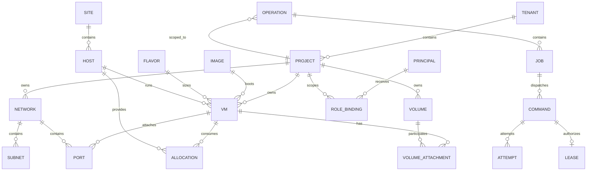
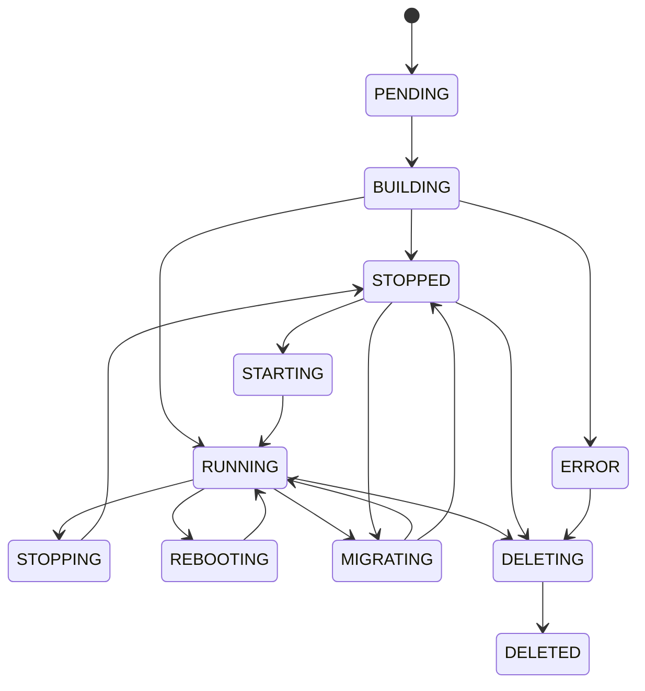
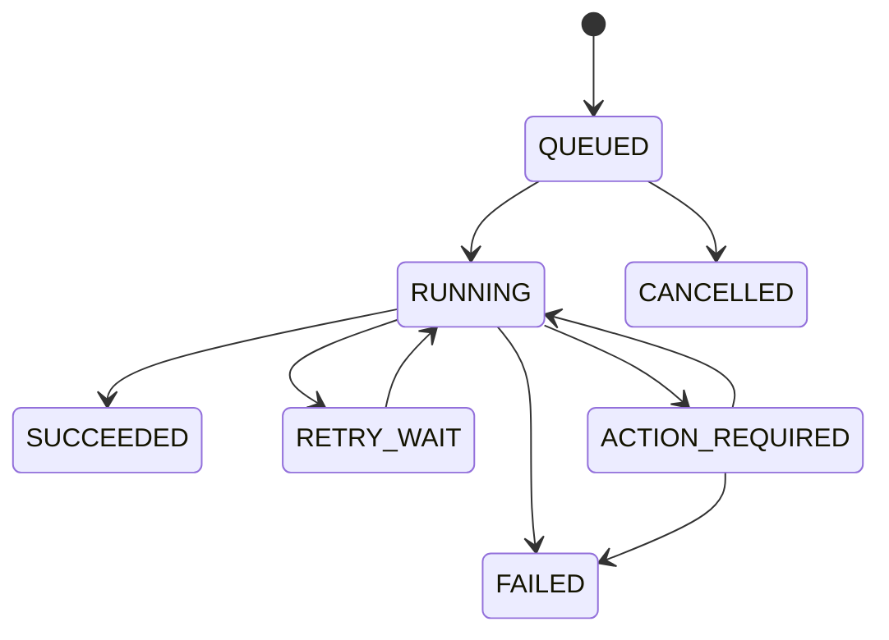
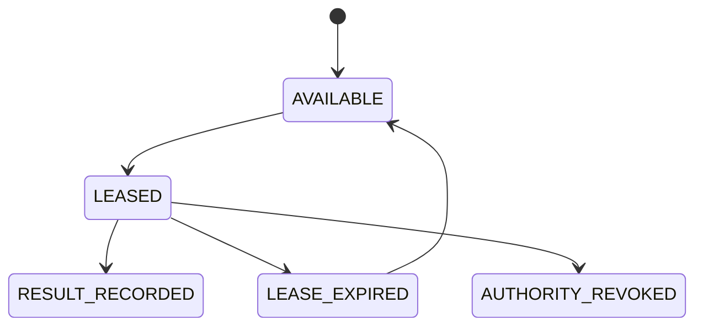

# ドメインモデル

- 状態: Draft
- 更新日: 2026-08-09

## 1. 境界づけられたコンテキスト

| Context | 主な責務 |
|---|---|
| Tenancy and Authorization | Tenant、Project、Membership、Role Binding、Policy、Quota |
| Infrastructure Inventory | Site、Host、Device、Capacity、Trait |
| Compute | VM、Image、Flavor、Console、Migration |
| Placement | Resource Provider、Inventory、Eligibility、Admission、Score、Reservation |
| Network | Network、Subnet、Port、Router、Security Group |
| Storage | Storage Backend、Volume、Snapshot、Attachment |
| Operations | Operation、Step、Event、Notification |
| Execution | Job、Command、Lease、Attempt、Result |
| Assurance | Alarm、Metric、Audit Record、Diagnostic Bundle |

## 2. 主要エンティティ

## 3. 識別子と共通属性

- 外部公開 ID は推測困難な UUIDv7 を使用する候補とする。
- display name は一意性を要求せず、ID と区別する。
- Tenant 所有資源は `tenant_id` と `project_id` を必須とする。
- 更新可能資源は `generation` を持ち、楽観的並行制御に使用する。
- 削除は明確な完了まで `deleting` 状態を保持する。
- API resource には `created_at`、`updated_at`、`labels` を共通属性として持たせる。

## 4. 状態モデル

### VM lifecycle

API 上の lifecycle state と、libvirt の runtime state は別属性にします。たとえば lifecycle が `BUILDING` の間に runtime が `SHUTOFF` であっても矛盾とは限りません。

### Operation lifecycle

OperationはAPI利用者向けの集約状態です。Host実行の結果不明をOperationの一般的なFAILEDへ潰しません。

### Execution lifecycle

Attempt outcomeは`SUCCEEDED`、`FAILED`、`UNKNOWN`です。Lease expiry、executor interruption、backend outcome不明、rollback未確認は`UNKNOWN`としてappend-onlyに記録します。新Attemptが作られても旧Attemptのstale Resultが現在のauthorityを進めることはありません。

## 5. ETSI NFV 概念との対応

| ETSI NFV 概念 | KIM 内部概念 |
|---|---|
| NFVI-PoP / Infrastructure Domain | Site |
| Virtualised Compute Resource | VM と Allocation |
| Compute Flavour | Flavor |
| Software Image | Image |
| Virtualised Network Resource | Network、Subnet、Port、Router |
| Virtualised Storage Resource | Volume |
| Resource Group / Consumer scope | Tenant / Project |
| Resource Reservation | Reservation / Allocation Claim |
| Capacity Information | Inventory、Usage、Allocation |

内部モデルを ETSI 用語へ完全に固定せず、Northbound adapter で対応づけます。これにより製品 API の継続性と、仕様リリース間の差異を分離します。

## 6. 不変条件

- 一つの active VM は同時に一つの Host allocation のみ持つ。
- Port および Volume Attachment は Project 境界を越えない。
- Quota 消費と Allocation claim は VM dispatch より前に確定する。
- Host が maintenance または disabled の場合、新規 Allocation を作らない。
- 同じ idempotency scope/key の要求は同じ Operation または同じ結果を返す。
- observed generation が desired generation を超えることを許可しない。
- backend で結果不明の操作に対して、破壊的な逆操作を自動実行しない。
- Identity ProviderがUser/Service credentialを所有し、KIMはPrincipal bindingだけを所有する。
- eligibility=falseのHostをscoreで選択可能にしない。
- final admissionと全resource claimは一つのtransactionでcommitする。
- Commandごとにactive Leaseは最大一つで、Attemptは上書きしない。
- Agent Resultの成功だけではJobを成功にせず、後続observationを必要とする。
