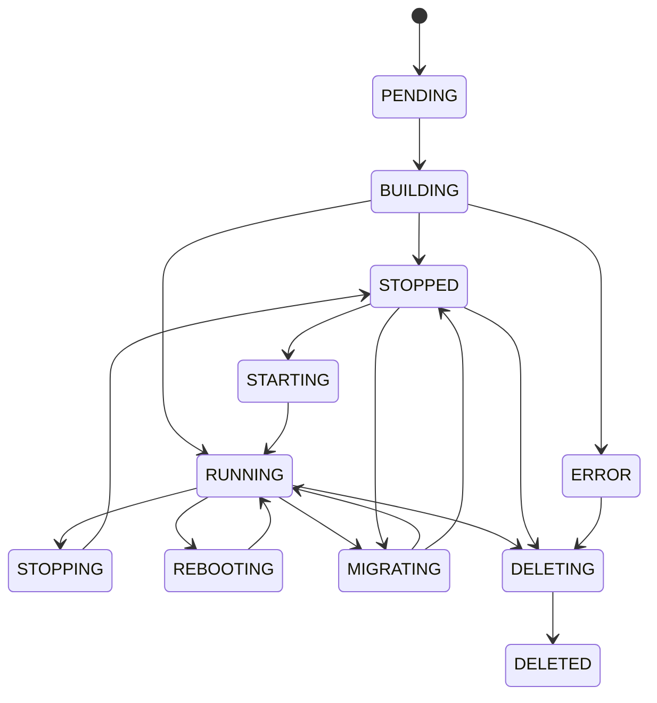
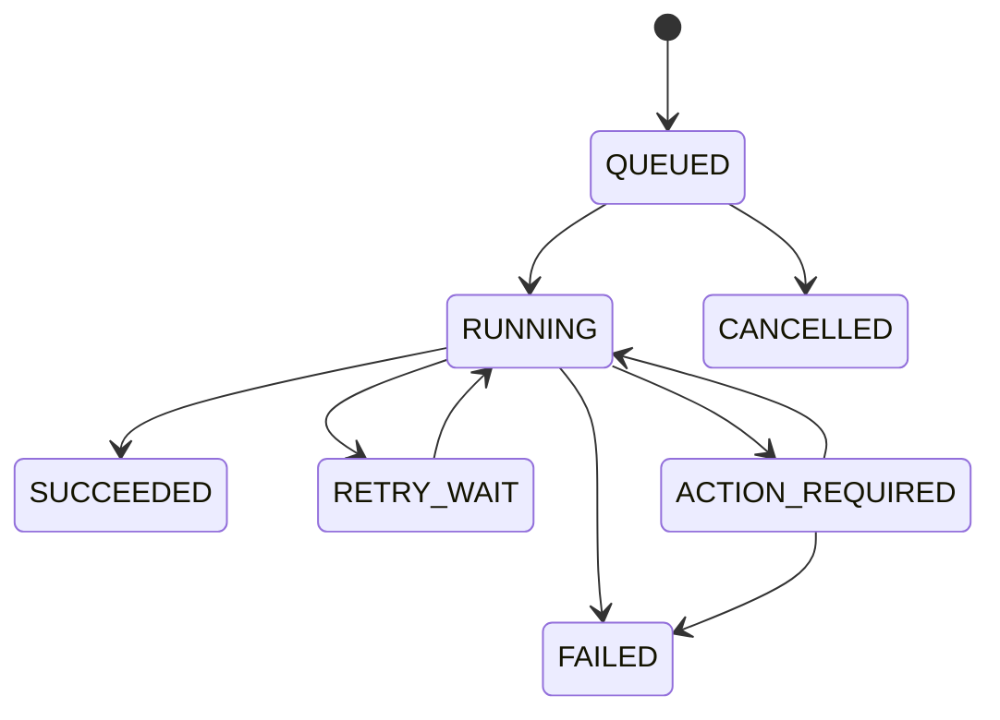
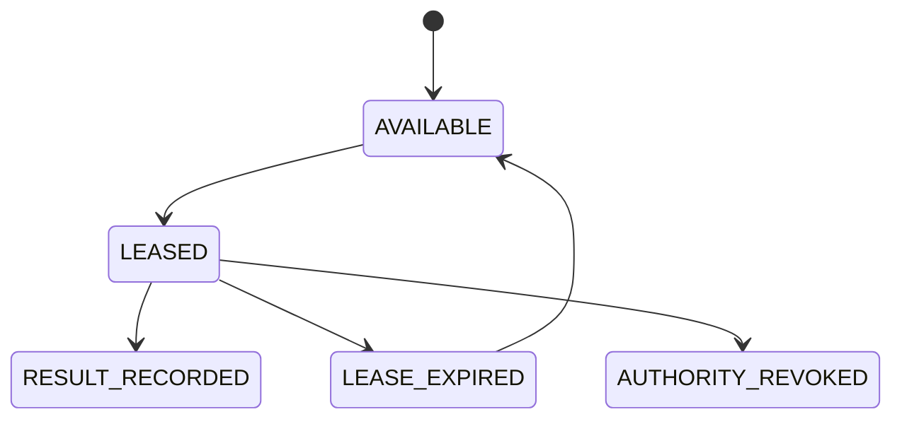

# ドメインモデル

- 状態: Draft
- 更新日: 2026-08-09

## 1. 境界づけられたコンテキスト

| Context | 主な責務 |
|---|---|
| Tenancy and Authorization | Tenant、Project、Membership、Role Binding、Policy、Quota |
| Infrastructure Inventory | Site、Host、Device、Capacity、Trait |
| Host Lifecycle and Compliance | Hardware Identity Evidence、Enrollment Policy、Host Profile、Baseline、Control、Evaluator、Assignment、Compliance、External Remediation、Maintenance |
| Host Grouping | Host Group、Dimension、Membership、Hierarchy、Policy Binding、Membership Snapshot、Placement Scope |
| Availability and Recovery | Availability Policy/Binding、Host Failure Epoch、Failure Campaign/Membership、Recovery Campaign Claim、Recovery Plan/Operation、Budget Queue/Lease/Consumption、Manual Recovery Decision |
| Workload Resilience | Resilience Group、Member Slot、Failure Domain Constraint、Domain Claim |
| Data and Persistence | Schema Catalog、Retention Policy、Outbox、Inbox/Receipt、GC Snapshot/Lease/Receipt、Migration、Backup Manifest、Restore Epoch |
| Upgrade and Compatibility | Release Manifest、Compatibility Decision、Upgrade Campaign/Plan/Wave/Target、Feature Gate、Rollback Boundary |
| Time and Clock Semantics | Clock Observation/Health Policy/Decision、Time Envelope、Calendar Window Materialization |
| Compute | VM、Image、Flavor、Console、Migration |
| Placement | Resource Provider、Inventory、Eligibility、Admission、Score、Reservation |
| Network | Network、Subnet/IP Pool、IP/MAC Claim、Segment Pool/Claim、Port/Binding/Handoff、Router/Gateway、Floating IP/NAT、DHCP、Security Policy |
| NFV Dataplane | Dataplane Runtime、PMD Core、DPDK Memory、Dataplane Port、Rx Queue、VM Dataplane Binding |
| Storage | Storage Backend/Class、Volume、Backend Binding、Snapshot/Clone、Attachment Intent/Claim/Observation、Fencing Proof、Handoff |
| Operations | Operation、Step、Event、Notification |
| Execution | Job、Command、Lease、Attempt、Result |
| Assurance | Alarm、Metric、Audit Record、Diagnostic Bundle |

## 2. 主要エンティティ

```mermaid
erDiagram
    SITE ||--o{ HOST : contains
    HOST_GROUP ||--o{ HOST_GROUP_MEMBERSHIP : contains
    HOST_GROUP ||--o{ HOST_GROUP_RELATION : relates
    HOST ||--o{ HOST_GROUP_MEMBERSHIP : joins
    HOST_GROUP ||--o{ GROUP_POLICY_BINDING : binds
    HOST_GROUP ||--o{ GROUP_MEMBERSHIP_SNAPSHOT : snapshots
    HOST_GROUP ||--o| PLACEMENT_SCOPE : exposes
    HOST_GROUP ||--o{ AVAILABILITY_POLICY_BINDING : binds
    AVAILABILITY_POLICY ||--o{ AVAILABILITY_POLICY_BINDING : referenced_by
    AVAILABILITY_POLICY ||--o{ AVAILABILITY_BINDING : resolves_to
    VM ||--o{ AVAILABILITY_BINDING : governed_by
    VM ||--o| RUNTIME_COMPATIBILITY_BINDING : preserves
    HOST ||--o{ HOST_FAILURE_EPOCH : fails_in
    HOST_FAILURE_EPOCH ||--o{ VM_RECOVERY_OPERATION : plans
    VM ||--o{ VM_RECOVERY_OPERATION : recovers
    RECOVERY_BUDGET_POLICY ||--o{ AVAILABILITY_POLICY : referenced_by
    HOST_FAILURE_EPOCH ||--o{ RECOVERY_QUEUE_ENTRY : queues
    RECOVERY_QUEUE_ENTRY ||--o{ RECOVERY_BUDGET_LEASE : leases
    VM_RECOVERY_OPERATION ||--o{ RECOVERY_BUDGET_CONSUMPTION : consumes
    PROJECT ||--o{ WORKLOAD_RESILIENCE_GROUP : owns
    WORKLOAD_RESILIENCE_GROUP ||--o{ RESILIENCE_MEMBER_SLOT : contains
    WORKLOAD_RESILIENCE_GROUP ||--o{ FAILURE_DOMAIN_CONSTRAINT : constrains
    RESILIENCE_MEMBER_SLOT ||--o| VM : binds
    FAILURE_DOMAIN_CONSTRAINT ||--o{ RESILIENCE_DOMAIN_CLAIM : claims
    VM ||--o{ RESILIENCE_DOMAIN_CLAIM : occupies
    HOST_PROFILE ||--o{ HOST : classifies
    HOST_BASELINE ||--o{ BASELINE_CONTROL : contains
    HOST ||--o{ HARDWARE_IDENTITY_EVIDENCE : identified_by
    BASELINE_CONTROL ||--o{ EVALUATOR_ARTIFACT : evaluated_by
    HOST ||--o{ BASELINE_ASSIGNMENT : receives
    HOST_BASELINE ||--o{ BASELINE_ASSIGNMENT : assigns
    BASELINE_ASSIGNMENT ||--o{ COMPLIANCE_RESULT : evaluates
    BASELINE_ASSIGNMENT ||--o{ EXTERNAL_REMEDIATION_REQUEST : requests
    TENANT ||--o{ PROJECT : contains
    PROJECT ||--o{ VM : owns
    PROJECT ||--o{ NETWORK : owns
    PROJECT ||--o{ VOLUME : owns
    PRINCIPAL ||--o{ ROLE_BINDING : receives
    PROJECT ||--o{ ROLE_BINDING : scopes
    IMAGE ||--o{ VM : boots
    FLAVOR ||--o{ VM : sizes
    HOST ||--o{ VM : runs
    VM ||--o{ PORT : attaches
    NETWORK ||--o{ SUBNET : contains
    NETWORK ||--o{ PORT : contains
    NETWORK ||--o| SEGMENT_CLAIM : segments
    SUBNET ||--o{ IP_POOL : allocates
    PORT ||--o{ NETWORK_IDENTITY_CLAIM : identifies
    PORT ||--o{ PORT_BINDING : binds
    PORT_BINDING ||--o{ PORT_BINDING_OBSERVATION : observes
    ROUTER ||--o{ ROUTER_INTERFACE : connects
    ROUTER ||--o{ GATEWAY_BINDING : exits
    FLOATING_IP ||--o| NAT_BINDING : translates
    HOST ||--o{ DATAPLANE_RUNTIME : runs
    DATAPLANE_RUNTIME ||--o{ PMD_CORE_ALLOCATION : owns
    DATAPLANE_RUNTIME ||--o{ DPDK_SOCKET_MEMORY : reserves
    PORT ||--o| VM_DATAPLANE_BINDING : provides
    VM ||--o{ VM_DATAPLANE_BINDING : uses
    VM ||--o{ VOLUME_ATTACHMENT : has
    VOLUME ||--o{ VOLUME_ATTACHMENT : participates
    STORAGE_BACKEND ||--o{ VOLUME_BACKEND_BINDING : hosts
    VOLUME ||--o{ VOLUME_BACKEND_BINDING : binds
    VOLUME_ATTACHMENT ||--o| ATTACHMENT_CLAIM : authorizes
    VOLUME_ATTACHMENT ||--o{ ATTACHMENT_OBSERVATION : observes
    VOLUME_ATTACHMENT ||--o{ STORAGE_FENCING_PROOF : fences
    VOLUME_ATTACHMENT ||--o{ ATTACHMENT_HANDOFF : migrates
    VM ||--o{ ALLOCATION : consumes
    HOST ||--o{ ALLOCATION : provides
    OPERATION }o--|| PROJECT : scoped_to
    OPERATION ||--o{ JOB : contains
    JOB ||--o{ COMMAND : dispatches
    COMMAND ||--o{ ATTEMPT : attempts
    COMMAND ||--o| LEASE : authorizes
    OPERATION ||--o{ OUTBOX_RECORD : emits
    INBOX_RECORD ||--o| DELIVERY_RECEIPT : returns
    BACKUP_MANIFEST ||--o{ RESTORE_EPOCH : restores
    RELEASE_MANIFEST ||--o{ UPGRADE_CAMPAIGN : targets
    UPGRADE_CAMPAIGN ||--o{ UPGRADE_PLAN : plans
    UPGRADE_PLAN ||--o{ UPGRADE_WAVE : batches
    UPGRADE_WAVE ||--o{ UPGRADE_TARGET : upgrades
    UPGRADE_CAMPAIGN ||--o{ COMPATIBILITY_DECISION : gates
    UPGRADE_CAMPAIGN ||--o{ FEATURE_GATE : activates
    SITE ||--o{ CLOCK_OBSERVATION : observes
    HOST ||--o{ CLOCK_OBSERVATION : observes
    CLOCK_HEALTH_POLICY ||--o{ CLOCK_HEALTH_DECISION : evaluates
```

## 3. 識別子と共通属性

- 外部公開 ID は推測困難な UUIDv7 を使用する候補とする。
- display name は一意性を要求せず、ID と区別する。
- Tenant 所有資源は `tenant_id` と `project_id` を必須とする。
- 更新可能資源は `generation` を持ち、楽観的並行制御に使用する。
- 削除は明確な完了まで `deleting` 状態を保持する。
- API resource には `created_at`、`updated_at`、`labels` を共通属性として持たせる。

## 4. 状態モデル

### VM lifecycle

API 上の lifecycle state と、libvirt の runtime state は別属性にします。たとえば lifecycle が `BUILDING` の間に runtime が `SHUTOFF` であっても矛盾とは限りません。

### Operation lifecycle

OperationはAPI利用者向けの集約状態です。Host実行の結果不明をOperationの一般的なFAILEDへ潰しません。

### Execution lifecycle

Attempt outcomeは`SUCCEEDED`、`FAILED`、`UNKNOWN`です。Lease expiry、executor interruption、backend outcome不明、rollback未確認は`UNKNOWN`としてappend-onlyに記録します。新Attemptが作られても旧Attemptのstale Resultが現在のauthorityを進めることはありません。

### Host lifecycle and compliance

Host lifecycle stateとCompliance statusは別の軸です。`READY`はactive Baseline Assignment、current evidence、blocking Controlなしを必要とします。Compliance Resultは評価ごとにimmutableで、current summaryが最新valid resultを参照します。

## 5. ETSI NFV 概念との対応

| ETSI NFV 概念 | KIM 内部概念 |
|---|---|
| NFVI-PoP / Infrastructure Domain | Site |
| Virtualised Compute Resource | VM と Allocation |
| Compute Flavour | Flavor |
| Software Image | Image |
| Virtualised Network Resource | Network、Subnet、Port、Router |
| Virtualised Storage Resource | Volume |
| Resource Group / Consumer scope | Tenant / Project |
| Resource Reservation | Reservation / Allocation Claim |
| Capacity Information | Inventory、Usage、Allocation |

内部モデルを ETSI 用語へ完全に固定せず、Northbound adapter で対応づけます。これにより製品 API の継続性と、仕様リリース間の差異を分離します。

## 6. 不変条件

- 一つの active VM は同時に一つの Host allocation のみ持つ。
- Port および Volume Attachment は Project 境界を越えない。
- SINGLE_WRITER Volumeはcurrent active Attachment Claimを最大一つだけ持ち、Claim release前に実世界I/O停止を検証する。
- watcher/lock/device observationだけでAttachment authorityを作成・譲渡・解放しない。
- IP/MAC/VLAN/VNI/Floating IP Claimはscope内で一意で、network-side UNKNOWN中に再利用しない。
- OVN NB/SB/Host/dataplane observationだけでPort Binding/ownership authorityを作成・解放しない。
- Quota 消費と Allocation claim は VM dispatch より前に確定する。
- Host が maintenance または disabled の場合、新規 Allocation を作らない。
- authenticatedだけのHostをenrolled/ready/armedとして扱わない。
- Baseline versionとCompliance historyを上書きしない。
- Critical NON_COMPLIANT/UNKNOWN HostまたはcapabilityをPlacement eligibleにしない。
- Enrollment decisionはHardware Identity Evidence setとPolicy generationへbindし、単一可変identifierをauthorityにしない。
- Compliance ResultはEvaluator Artifact/input evidence digestへbindし、外部completion claimをResultへ直接変換しない。
- HostGroup membershipはgeneration付きPostgreSQL authorityで、GroupはHost eligibility/capacity authorityを上書きしない。
- rollout/maintenanceはimmutable Group Membership Snapshotへbindし、Group変更だけで既存workloadを変更しない。
- placement可能なHost/request contextはeffective Availability Policyを一意に解決し、VMはFinal Admission時のAvailability Binding revisionを保持する。
- WORKLOAD_MANAGED/MANUAL VMをKIMが自動restartせず、INFRASTRUCTURE_MANAGEDもfencing/admission/verificationを迂回しない。
- Resilience Domain ClaimはFinal Admissionでresource claimsと不可分commitし、opaque roleをVNF lifecycle authorityに使用しない。
- Recovery budget/queue/leaseはdispatch authorityだけを持ち、capacity/fencing/Command authorityを兼ねない。
- 全budget scopeはcanonical key順で不可分取得し、deadlock/serialization retryで部分authorityを残さない。
- Failure Epochを改変せずversioned Failure Campaignへ相関付け、VM単位のRecovery Campaign Claimで重複dispatch/consumptionを防ぐ。
- Current Authority、Immutable Decision/Evidence、Delivery Journal、Derived Projectionを分類し、projectionやdelivery状態をresource authorityにしない。
- retention/GCはactive reference、UNKNOWN、legal hold、tombstoneを検証し、DB cleanupからbackend mutationを開始しない。
- PITR後はrestore epochで旧Lease/session/claimをfenceし、read-only reconciliation前にmutation authorityを再開しない。
- 同じ idempotency scope/key の要求は同じ Operation または同じ結果を返す。
- observed generation が desired generation を超えることを許可しない。
- backend で結果不明の操作に対して、破壊的な逆操作を自動実行しない。
- pCPUとHugePageのworkload/dataplane roleを同一allocation ledgerで排他的に管理する。
- PMD/RxQ統計をallocation authorityとして使用しない。
- Identity ProviderがUser/Service credentialを所有し、KIMはPrincipal bindingだけを所有する。
- eligibility=falseのHostをscoreで選択可能にしない。
- final admissionと全resource claimは一つのtransactionでcommitする。
- Commandごとにactive Leaseは最大一つで、Attemptは上書きしない。
- Agent Resultの成功だけではJobを成功にせず、後続observationを必要とする。
