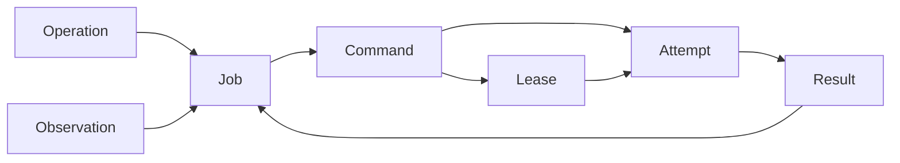

# Execution Architecture

- 状態: Draft
- 更新日: 2026-08-09

## 1. 目的

ユーザーに見えるOperationと、Hostへ安全に処理を配送するExecutionを分離します。at-least-once delivery、process crash、network partition、lease expiry、stale result、結果不明を第一級のモデルとして扱います。

横断的な検出・封じ込め・復旧規則は [System-wide Failure Model](failure-model.md) に従います。



## 2. エンティティ

### Operation

API利用者が追跡する長時間処理です。複数Jobを束ね、最終的なresource outcomeを示します。

### Job

一つのdesired revisionを収束・検証するController側の作業単位です。terminal Jobはimmutableです。

### Command

特定Hostへ配送するimmutable、typed、versioned instructionです。shell、argv、任意libvirt method/XML/pathを含みません。

### Lease

Commandを実行・報告できる一時的authorityです。authenticated Host identity、random token、attempt index、期限、authority generationへbindします。同時に有効なLeaseはCommandごとに一つです。

### Attempt

一回のCommand delivery/execution履歴です。上書きせずappend-onlyに保持します。

## 3. 状態とOutcome

Job stateとExecution outcomeを分離します。

```text
ExecutionOutcome = SUCCEEDED | FAILED | UNKNOWN
```

`UNKNOWN` は「操作が失敗した」ことを意味しません。実行されたか、完了したか、安全に逆操作できるかをControllerが証明できない状態です。

代表的reason:

- `lease_expired`
- `executor_interrupted`
- `result_delivery_exhausted`
- `backend_outcome_unknown`
- `rollback_unverified`

UNKNOWNをFAILEDへ自動変換せず、backend observation、read-back、reconciliation、またはoperator actionで解決します。

## 4. Durable Transaction Boundaries

### API acceptance

Desired、Operation、Job、Command intent、allocation、idempotency recordを同じtransactionでcommitし、Hostへ同期接続しません。

### Lease acquisition

Command rowをlockし、owner、token、expiry、attempt indexを設定し、Attempt startedを同じtransactionでcommitします。

### Result acceptance

Host identity、token、attempt、expiry、authority generationを検証し、Result、Attempt outcome、Job transition、Eventを同じtransactionでcommitします。

## 5. Agent Journal

Agentはbackend mutation前にCommand ID、Command digest、target identity、attemptに必要な非秘密情報をdurable journalへwrite-before-executeします。

- 完了済みCommandを再実行しない。
- 同じCommandで異なるpayload digestは拒否する。
- journalにはlease token、credential、raw secretを保存しない。
- process restart後のstarted recordはread-backで解決し、証明不能ならUNKNOWNを報告する。

## 6. Lease Expiry と Stale Result Fencing

- Lease expiry時、旧Attemptを`UNKNOWN/lease_expired`で閉じてから新Attemptを作る。
- 再配送ごとに新しいtokenとattempt indexを使用する。
- Lease失効前にResultがdurably acceptedされ、responseだけが失われた場合に限り、同じHost identity、token、attempt、Result digestの再送へ同じreceiptを返す。
- Result未受理のままLeaseが失効しAttemptがUNKNOWNで閉じられた場合、その後届く旧AttemptのResultは、内容がもっともらしくてもstaleとして拒否する。
- 新AttemptがLeaseされた後、旧AttemptのResultが現在のJob/Command authorityを進めることはない。
- 受理済みResultと異なる再送、token/attempt/authority generation不一致はconflictとする。
- authority generation変更、Host disarm、resource supersedeは未完Leaseを失効させる。

Controllerのwall clockだけで「実行されなかった」と推測しません。Lease expirationは配送authorityの終了であり、実世界のmutation outcomeの証明ではありません。

## 7. Verification

Agentの`SUCCEEDED` Resultはbackend callの完了を示すだけです。Jobは`verifying`へ進み、後続Inventoryが同じresource identity、desired revision、generationに対する一致を示した時だけ`succeeded`になります。

### UNKNOWN Resolution

UNKNOWNはCommand typeごとのtyped resolverで処理します。汎用retryや汎用rollbackは行いません。

| Observation | Resolution |
|---|---|
| desired effectが同じresource identity/revisionで確認できる | AttemptはUNKNOWNのまま保持し、Jobをverification evidence付きで収束させる |
| mutation未適用をauthoritative read-backで証明できる | policyが許可する場合だけ新Attemptを作る |
| rollback完了をread-backで証明できる | bounded failureとしてJobを閉じる |
| resource不在だがdelete完了とidentityを一意に証明できる | delete verificationを完了する |
| observationが不完全、競合、identity不一致 | ACTION_REQUIREDまたはquarantineを維持する |

UNKNOWNのAttempt履歴をSUCCEEDED/FAILEDへ書き換えません。解決結果は新しいverification evidence、Job event、必要なら新Attemptとして追記します。

OVS-DPDKのrestart-required変更は通常VM Operationから分離したdisruptive typed Operationとし、impact set、drain、maintenance authority、read-backを必要とします。詳細は [NFV Dataplane Resource Architecture](nfv-dataplane-resource-architecture.md) に従います。

## 8. Retry

Retry policyはCommand typeとoutcome reasonごとに閉じて定義します。

- safe retryが証明できるtyped operationだけ再配送する。
- attempt、deadline、backoffに上限を設ける。
- UNKNOWNのまま反対操作を発行しない。
- newer desired revisionは旧Jobをsupersedeできるが、実世界のoutcome確認を省略しない。
