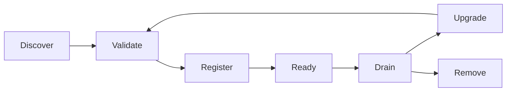

# Extensibility Architecture

- 状態: Draft
- 更新日: 2026-08-09

## 1. 目的

KIMを「何でもpluginにできる製品」にはしません。安定したCore authorityとfailure semanticsを維持しながら、明示されたContractを通じてOS、Network、Storage、Identity、Northbound integrationなどを追加できるようにします。

文書authorityは [設計文書の正本と変更規則](document-governance.md)、障害時の共通意味論は [System-wide Failure Model](failure-model.md) に従います。

## 2. CoreとExtensionの境界

Extensionが変更できないCore invariants:

- Tenant/Project ownershipとauthorization
- PostgreSQLのdesired/allocation/execution authority
- Operation / Job / Command / Lease / Attempt semantics
- idempotency、generation、fencing、UNKNOWNの意味
- audit、secret redaction、bounded error model
- arbitrary shell/XML禁止
- dry evaluationとtransactional final admissionの境界

ExtensionはCore DBへ直接書き込み、内部Message Busをauthorityとして利用し、独自Lease/credential/identityを暗黙追加できません。

## 3. Extension Points

| Extension Point | 例 | Contract |
|---|---|---|
| Host OS Integration | Ubuntu、RHEL-compatible、SUSE | discovery、preflight、bounded typed remediation |
| Baseline Control Evaluator | CPU/DPDK/Security/Agent controls | pure applicability/evaluation、bounded evidence |
| External Remediation Adapter | Ansible系、構成管理、ticket/workflow | scoped request/claim、authenticated correlation、no authority transfer |
| Agent Operation Module | VM power、CPU placement、Volume attach | closed Command type、narrow backend interface、read-back |
| Network Backend | OVN、将来のprovider adapter | plan/apply/observe capability、intent generation |
| NFV Dataplane Module | OVS-DPDK discovery/operation | PMD/DPDK memory/Port/RxQ capability、closed typed operation |
| Storage Backend | LVM、Ceph RBD | capability、Volume/Attachment、fencing、snapshot |
| Placement Rule | NUMA、PCI、locality、affinity | pure eligibility/scoring rule |
| HostGroup Selector | CMDB/asset/inventory facts | pure membership proposal、provenance、no direct DB write |
| Recovery Eligibility Rule | storage/device/failure-domain policy | pure bounded decision、no fencing/restart authority |
| Resilience Intent Mapper | NFVO/VNFM member/separation model | pure public-to-Core mapping、no Domain Claim write |
| Recovery Ordering Rule | priority/fairness/health facts | pure queue rank、no Budget/Operation authority |
| Identity Adapter | OIDC issuer/claim mapping | Principal verification/binding。credential発行はしない |
| Northbound Adapter | ETSI IFA 005 profile | external modelとCore resource mapping |
| Secret Provider | file/KMS/Vault系 | opaque reference、rotation、least privilege |
| Event/Audit Sink | webhook、SIEM、stream | durable outbox、redacted versioned event |
| Installer/Packaging | deb、rpm、offline bundle | support matrix、preflight、upgrade contract |

KVM/libvirtは製品identityのCoreです。任意hypervisorを同一抽象へ押し込むことは初期extension pointにしません。

### 3.1 Trust Classes

Extensionは一つのplugin interfaceへ統合せず、影響度と隔離境界で分類します。

- C0 Core Built-in
- C1 Certified Restricted Module
- C2 Isolated Adapter Service
- C3 Untrusted External Integration

Identity、Secret、Placementは高影響領域であり、Identity/Secret連携はC2の隔離service、Placement Ruleは副作用のないC1 moduleを基本とします。許可能力と検証項目は [Extension Conformance Contract](extension-conformance.md) を正本とします。

Storage adapterもhigh-impact C2 boundaryとして、stable backend identity、typed side effect/read-back、scoped secret、fencing evidenceだけを提供します。Attachment Claim/Generation、single-writer decision、Recovery authority、Core DBを所有しません。Host-local LVM/libvirt operation moduleはC1のclosed Command境界に従います。

OVS-DPDK Host moduleはC1の静的登録moduleを基本とし、generic OVSDB/EAL/PCI操作を公開しません。Control Plane側のDataplane orchestrationはC0 Coreとしてallocation authorityを保持します。

Baseline Control Evaluatorはpure C1 moduleとし、Host mutation、DB write、authority armingを行いません。Evaluatorはimmutable artifact digest、build provenance、compatible Control/evidence schema、fixture certificationを宣言し、shadow/canary rollout前にcurrent assignmentへしません。Remediation Moduleは別のclosed C1 CommandとしてExecution domainを通ります。

外部Configuration Management連携はC2 serviceまたはC3 integrationです。scoped External Remediation Requestとappend-only claimだけを交換し、Core DB、Agent credential、Command Lease、Host Operation Authorityを渡しません。外部completion claimはKIMのCompliance Resultではなく、fresh observationとC1 Evaluatorによる再評価をtriggerするだけです。

HostGroup Selectorはpure C1 ruleまたはC2 external assertion adapterです。候補membershipとprovenanceだけを返し、Coreがcardinality/hierarchy/conflictを検証してPostgreSQLへmaterializeします。Selectorがmembership、Placement Scope、Group policyを直接writeしません。

Recovery Eligibility Ruleはpure C1 ruleとし、VM Availability Binding、fencing/storage/device evidence、candidate snapshotからbounded eligibility/reasonだけを返します。responsibility変更、fencing完了宣言、Recovery Operation/Lease作成、backend mutationを行いません。

Resilience Intent MapperはNorthbound C2/C3境界で外部member/constraintをCore schemaへmapしますが、Domain ClaimやVM Allocationを直接writeしません。Recovery Ordering Ruleはpure C1としてbounded priority/rankだけを返し、Budget Lease、queue state、Recovery Operationを変更しません。

## 4. Contract Shape

すべてのextension contractは以下を明示します。

- contract/schema versionとcompatibility range
- capability IDs、constraints、limits
- input/output sizeとtimeout
- idempotency keyまたはoperation identity
- typed error code、retryability、UNKNOWN可能性
- side-effect boundaryとread-back/verification
- security identity、required permission、secret handling
- health/readiness、metrics、audit events
- upgrade、drain、rollback、removal behavior

未知field、未知Command、未知capability semanticsは黙って受理しません。

## 5. In-processとOut-of-process

### Agent Modules

- compile-timeまたは署名済みrelease bundleで静的登録する。
- arbitrary runtime plugin loadingを初期リリースで許可しない。
- Controller credential、Lease token、journal、generic libvirt handleをmoduleへ渡さない。
- narrow typed backend interfaceと対象resourceだけを渡す。

### Control Plane Adapters

- failure isolation、credential分離、独立upgradeが必要な外部連携はout-of-processを優先する。
- in-process adapterはpure mapping/evaluationなど副作用のない小さな境界に限定する。
- どちらの場合もpublic/internal versioned contractとconformance testを必要とする。

## 6. Capability Negotiation

Capabilityは単なるbooleanではなく、version、limits、constraints、evidenceを持ちます。

```text
capability_id
contract_version
implementation_version
limits
constraints
observed_generation
health
support_tier
```

Scheduler/APIはdistribution名やbackend製品名で分岐せず、capabilityとconstraintを評価します。Capability消失時は新規利用を停止し、既存resourceを暗黙変更しません。

## 7. Extension Lifecycle



- Discover: manifest、identity、versionを検出。
- Validate: contract/conformance/security/support matrixを検証。
- Register: capability generationを永続化。
- Ready:新規resourceで利用可能。
- Drain:新規選択を停止し、依存resourceを列挙。
- Upgrade:互換範囲とstate migrationを検証。
- Remove:依存resourceがないことを証明後に削除。

extensionの接続復旧だけでReadyへ戻さず、capability generationとpreflightを再検証します。

## 8. Failure Isolation

- extension timeoutはCore workerを無期限blockしない。
- circuit breakerは新規操作を止めるが、成功を推測しない。
- crash/restart後にin-flight side effectをread-backできなければUNKNOWNを返す。
- backend固有errorはbounded Core codeへmapし、生errorを外部へ漏らさない。
- 一つのextension障害を無関係なTenant/backendへ伝播させない。
- extensionがaudit/authorization/fencingを迂回するfallbackを提供しない。

## 9. Conformance

各extensionは共通test kitを通過します。

- schema/version/unknown field tests
- idempotencyとduplicate delivery
- timeout、crash、response loss、UNKNOWN
- read-backとverification
- authorization、secret redaction、audit
- capability add/remove/generation change
- upgrade、drain、rollback
- unsupported combinationのfail-closed behavior

Validated製品サポートへ含めるには、contract conformanceに加えて対象version組合せのrelease certificationを必要とします。

## 10. 禁止される拡張

- generic shell/argv/script executor
- arbitrary libvirt method/XML passthrough
- arbitrary SQL、DB table、Message Bus subject access
- extension独自のUser/Credential authority
- auditを残さないmutation
- UNKNOWNをFAILED/SUCCEEDEDへ丸めるadapter
- unversioned payloadまたはsilent capability fallback
- security機構を無効化することで互換性を得るadapter
