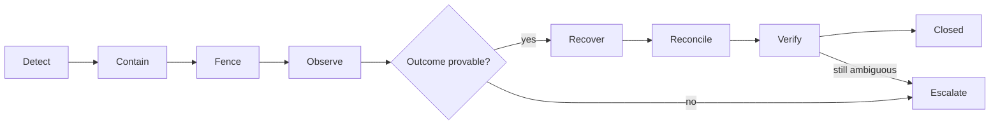

# System-wide Failure Model

- 状態: Draft
- 更新日: 2026-08-09

## 1. 目的

KIM全体で障害を同じ意味論により扱います。目的は障害を隠すことではなく、不確実な状態を正しく表現し、authorityの拡散と誤った破壊操作を防ぎ、証拠に基づいて収束させることです。

## 2. System-wide Invariants

1. 通信成功をbackend mutation成功と同一視しない。
2. timeoutを未実行または失敗の証明として扱わない。
3. UNKNOWNをFAILEDへ変換せず、履歴を上書きしない。
4. stale identity、generation、Lease、Result、observationはcurrent authorityを進めない。
5. desired state、allocation、attachment、execution authorityはPostgreSQL commitだけで確定する。
6. backend observationだけで未知resourceを自動adoptまたは自動削除しない。
7. 認証・認可・audit authorityが不明なmutationはfail closedとする。
8. Control Plane障害中も既存workload/dataplaneを不用意に変更しない。
9. recoveryはDetect、Contain、Fence、Observe、Recover、Reconcile、Escalateの順序と証拠を保持する。
10. upgrade/rollback中も同じauthority、UNKNOWN、stale generation、禁止操作を維持する。

## 3. Failure Handling Lifecycle

### Detect

bounded health、deadline、generation gap、lease expiry、backend error class、missing heartbeat、integrity checkで検出します。

### Contain

影響scopeへの新規mutationを停止し、既存workloadを維持します。障害を別Tenant/Host/backendへ拡散させません。

### Fence

credential、authority generation、Lease、leader token、attachment generationなどを失効させ、stale actorがauthorityを進めることを防ぎます。

### Observe

read-back、Inventory full resync、backend native state、journal、accepted Result、audit evidenceを収集します。単一の観測だけで結論を出さない場合があります。

### Recover

Command typeごとのtyped recoveryだけを行います。汎用retry、汎用rollback、推測ベースのcleanupは行いません。

### Reconcile

current authorityとtrusted observationを比較し、新しいevidence/eventとして収束を記録します。

### Escalate

安全な自動判断ができない場合、resourceをblocked/quarantinedに保ち、operator action、診断情報、許可された選択肢を提示します。

## 4. Failure Record

横断的なFailure/Alarm表現は最低限以下を持ちます。

- failure ID、class、scope、severity
- detected at、last observed at
- request/operation/job/command/attempt correlation
- resource identity、desired/observed generation、authority generation
- bounded reason codeとevidence reference
- containment/fencing state
- safe automatic actionsとprohibited actions
- recovery state、verification evidence、operator action requirement

秘密情報、生backend error、他Tenantのresource identityを公開表現へ含めません。

### Failure Campaign

`FailureEpoch`は個別Host/source authorityの障害履歴として不変に保ちます。rack、power feed、site、shared backend等の同一物理事故に由来する複数Epochは、別のdurable/versioned `FailureCampaign`へ関連付けます。

Campaignは`campaign_id/generation`、typed correlation class、member epoch、affected domain snapshot、evidence/provenance、first/last observed、状態、canonical recovery planを持ちます。相関は設備/topology identityとbounded time evidenceを必要とし、単なる同時刻発生やTenant申告だけではauthorityにしません。

Campaign membershipはappend-only evidenceとgeneration付きdecisionで更新します。後着evidenceによるmergeでも元Epoch、開始済みOperation、Consumptionを改変せず、VM単位のunique Recovery Campaign Claimで追加Queue/dispatchをfenceします。相関がUNKNOWNなら安全側に新規dispatchを停止し、二つの独立事故とみなしてbudgetを二重利用しません。

## 5. Failure Classes

### 5.1 Client Failure

例: timeout、再送、切断、stale ETag、応答喪失。

- Detect: request cancellation、duplicate idempotency key、precondition failure。
- Contain/Fence: idempotency scope、ETag、request digest。
- Recover:元Operation/receiptを返す。新しいmutationを暗黙作成しない。
- Escalate:同じkeyで異なるpayloadはconflict。

### 5.2 API / Control Plane Failure

例: process crash、worker interruption、partial service outage。

- Detect: health/readiness、started workの期限超過、leader lease。
- Contain/Fence: stateless replica、fencing token、started AttemptをUNKNOWNとして追記。
- Recover: PostgreSQL authorityから未完workを再駆動。
- Prohibited: memory上の進捗だけを根拠にsuccessへ進めない。

### 5.3 Database Failure

例: failover、commit応答喪失、quorum喪失、corruption。

- Detect: transaction error class、primary generation、integrity/replication health。
- Contain/Fence: mutation受付停止、old primary fencing。
- Recover:同じidempotency keyでcommit済みか照会。HAはRPO 0を維持。
- Escalate:corruption/site lossはDR recovery modeへ移行。

schema compatibility failure、migration/backfill interruption、missing partition、GC/reference conflict、Outbox/Inbox backlog、backup/WAL gapもDatabase/Persistence failureとして扱います。

- migration/GC worker lossはLease/checkpoint/Receiptから再開し、部分処理をsuccessへ丸めない。
- DDL lock timeoutまたはN/N-1 incompatibilityではswitch/contractを停止し、authority semanticsを混在させない。
- retention期限超過だけでactive reference、UNKNOWN、legal hold、dedupe evidenceを削除しない。
- PITR後はrestore epochで旧actorをfenceし、旧database writer/Control Plane/credentialの外部fencing proofとread-only classification前にmutationを再開しない。
- Outbox/Inbox/Command再送はstable ID/Receiptへ収束させ、外部side effectを未実行と推測しない。

### 5.4 Internal Message Failure

例: duplicate、delay、reordering、consumer crash、Bus outage。

- Detect: delivery metadata、work age、consumer health。
- Contain/Fence: Bus messageをexecution authorityにしない。
- Recover:PostgreSQL authorityから再駆動し、handlerを冪等化。
- Prohibited:Bus ackだけでJobを成功にしない。

### 5.5 Agent Gateway / Transport Failure

例: session断、Gateway replica障害、Result response loss。

- Detect: session/heartbeat、delivery deadline。
- Contain/Fence:新Leaseを発行せず、失効LeaseのResultをstale拒否。
- Recover:受理済み同一Resultだけreceiptを再送。Agentはobservation/journal evidenceを再送。
- Prohibited:接続復旧だけでHost authorityをarmしない。

### 5.6 Agent Failure

例: process crash、journal write failure、credential expiry、adapter panic。

- Detect:heartbeat、health file、journal started record、credential status。
- Contain/Fence:capabilityをunavailableにし新Commandを停止。
- Recover:write-before-execute journalとbackend read-backで解決。
- Escalate:実行有無を証明できなければAttempt outcomeをUNKNOWNとする。

### 5.7 Host Failure

例: power loss、kernel panic、management partition、clock異常。

- Detect:Agent/Host heartbeat、BMC/外部evidence、network observation。
- Contain/Fence:Hostをineligibleにし、新規配置とmutationを停止。
- Recover:再起動後full inventory。再作成はsource fencingとstorage/network条件を必須とする。
- Prohibited:heartbeat lossだけで同じdiskを別Hostへattachしない。

Host failure confirmed後はVM Availability Bindingで責任を分岐します。`WORKLOAD_MANAGED`はFault/Eventを送るが自動restartしません。`MANUAL`は明示Decisionを待ちます。`INFRASTRUCTURE_MANAGED`だけがfencing proof、single-writer、restart-on-other-host eligibility、Failure Domain、transactional admissionを満たしてRecovery Operationを開始できます。Policy/Binding/fencing/attachmentがUNKNOWNならBLOCKEDを維持します。

NF側HAのmember Placementではrack/power等のDomain Claimをtransactionalに競合制御し、domain不足/UNKNOWNをsilent relaxしません。domain driftはVIOLATED/UNKNOWNとして通知し、既存VMを暗黙migrationしません。

相関Host/Failure Domain障害のRecoveryはFailure Campaignへ正規化し、durable Campaign Claim/budget/queueでdeduplicate/backpressureします。worker lossやBudget Lease expiryを未実行証明にせず、backend circuit breaker復旧後もfencing/Placement generationを再検証します。queue saturationはAlarm/Escalationであり、安全条件やresponsibilityを変更しません。

Host lifecycle固有のbootstrap response loss、duplicate identity、Baseline conflict、Compliance evaluator failure、decommission partitionも同じ原則に従います。identity conflictはquarantine、stale evidenceはUNKNOWN、remediation結果不明はtyped read-backで解決します。

identity evidenceの一部一致をHost同一性の証明へ格上げせず、source間conflictはEnrollmentを停止します。Evaluator revision間の判定差はrollout failureとして封じ込め、旧Resultを改変しません。外部remediation callbackの偽装/replay/expiryは拒否し、正当なcompletion claimでもKIMのfresh observationとcurrent Evaluatorが一致しなければNON_COMPLIANT/UNKNOWNとplacement blockを維持します。

HostGroup selector/source failure、exclusive membership conflict、hierarchy cycle、stale generationはaffected scopeをfail closedにします。Placementは再評価し、rollout/maintenanceは開始時snapshotを改変しません。Group binding conflictからBaselineをlast-winsで選ばず、active referenceを持つGroupを削除しません。

### 5.8 libvirt / QEMU Failure

例: synchronous error、daemon restart、QEMU crash、operation timeout。

- Detect:typed adapter result、libvirt event、domain read-back。
- Contain/Fence:resource identity/domain UUID/generationを固定。
- Recover:command-specific read-backとverification。
- Escalate:mutation outcomeやrollbackを証明できなければUNKNOWN。

### 5.9 Network / NFV Dataplane Backend Failure

例: OVN DB quorum loss、transaction conflict、controller lag、dataplane drift、PMD/RxQ停止、OVS-DPDK restart結果不明、PCI binding不明。

- Detect:KIM Claim/Intent、OVN NB/SB transaction、chassis/binding、Host OVS/NIC、Gateway/NAT/Security、PMD/RxQ/Port/runtime/dataplane observation。
- Contain/Fence:affected network/gateway/dataplane resourceへの新規binding/exposureを停止し、IP/MAC/Segment/Binding/PCI/PMD generationをblock。
- Recover:KIM所有intentとtyped network/dataplane resolverだけをgeneration付きで適用し、NB/SB/Host/dataplaneとPMD/RxQ/Port/PCIを検証。
- Escalate:identity、binding、gateway、security realizationのいずれかを証明できなければ`UNKNOWN/BLOCKED`を維持。
- Prohibited:未知OVN objectや物理networkの自動adopt/delete、identity/segment再利用、blind rebind/OVS restart/PCI rebind、default-allow/kernel datapathへのsilent fallbackを行わない。

### 5.10 Storage Backend Failure

例: Ceph timeout、attachment結果不明、local volume loss、fencing failure。

- Detect:backend result、Attachment Claim/generation、libvirt device、Ceph watcher/lock/client、LVM holder、backend health、Host observation。
- Contain/Fence:Volume/Attachment generationをblockし、反対操作と別Host write attachを停止。
- Recover:stable backend identity、DB Claim、compute source fencing、storage client fencing、attachment authority fencingを証明後にtyped resolverを実行。
- Escalate:いずれかのI/O ownership evidenceを証明できなければ`UNKNOWN/FENCE_REQUIRED`を維持。
- Prohibited:detach timeout、heartbeat loss、watcher/lock absenceのいずれか単独でClaimをreleaseまたは別Hostへattachしない。Local LVMを別Hostの同名LVへ置換しない。

### 5.11 Split-brain / Stale Authority

例:old DB primary、old leader、old Host authority、stale Lease/Result、stale inventory。

- Detect:generation、term、token、certificate/credential generation。
- Contain/Fence:単調増加generationとfencing tokenを全mutation/resultで検証。
- Recover:current authorityから再同期。
- Prohibited:wall clockまたは接続状態だけでauthorityを選ばない。

### 5.12 Identity / Audit Failure

例:IdP unavailable、JWKS stale、certificate失効状態不明、audit sink unavailable。

- Detect:token/certificate validation、trust generation、audit outbox health。
- Contain/Fence:新規privileged mutationをfail closed。
- Recover:last-known-good trustは明示された期限内の既存sessionにだけ使用する。
- Escalate:audit durabilityを確保できない管理操作は受付けない。

### 5.13 Upgrade / Compatibility Failure

例: Manifest/artifact不一致、mixed-version contract違反、canary failure、schema/feature switch interruption、Agent update response loss、rollback境界違反。

- Detect: Release Manifest/digest/provenance、Compatibility Decision、schema/protocol/Command/Event range、wave threshold、artifact observation。
- Contain: later wave、Feature Gate、schema contract、影響scopeのdispatchを停止し、serving old replicaと既存workloadを維持する。
- Fence: Upgrade Lease、target/feature generation、adapter writer ownership、old session/Command eligibility。
- Observe: DB Campaign/Attempt/Receipt、deployed artifact、service readiness、Agent journal、schema/backfill、backend/Host capabilityをread-backする。
- Recover: reversible boundary内だけ新Plan/Attemptでrollbackし、それ以外はforward repairする。
- Reconcile: source/target/observed artifactとcurrent compatibilityを再評価し、過去Attempt/UNKNOWNを改変しない。
- Prohibited: version文字列だけのready、unknown Command down-convert、destructive contract後の旧binary復帰、automatic PITR、既存VM mutation。

### 5.14 Time / Clock Failure

例: DB/Control Plane/Host clockのstep/skew/source loss、monotonic reset、未来timestamp、DST ambiguity、PITR time travel。

- Detect: Clock Observation/Health、offset/uncertainty、boot/authority generation、source/received timestamp conflict。
- Contain: new Lease/renewal、time-sensitive Command、privileged auth、GC/finalization、ambiguous schedule/correlationをscope別停止する。
- Fence: DB/restore/Host boot/session/Lease generationでpre-event timerとauthorityを失効する。
- Observe: independent time source、DB sample、Agent monotonic exchange、journal、received/verified timeを収集する。
- Recover: current healthy clock decisionとnew generationからtimer/Leaseを再導出し、既存expiryをreviveしない。
- Prohibited: timestamp-only ordering、expiryから未実行推測、clock jumpによるmass GC/catch-up、同時刻だけのcampaign merge。

### 5.15 PKI / Trust Lifecycle Failure

例: issuer/Secret Provider outage、unknown profile、issuance response loss、revocation stale/partial、Host/Control Plane key compromise、CA compromise、offline Bundle replay。

- Detect: TrustBundle/Profile/Binding/revocation/trust/session generation、chain/SAN/EKU、distribution receipt、incident evidence。
- Contain: affected new session/privileged mutationを停止し、credential/session/Host/service authorityをscope別にfenceする。
- Fence: trust/Binding/session/Host/DB/Bus/backend/Lease generationを対象ごとに進め、certificate revoke単独へ依存しない。
- Observe: issuer/revocation/Secret Provider、active session、Host/resource/backend ownership、out-of-band recovery authorityをread-backする。
- Recover: normal rolloverまたはindependent emergency rollover、new identity/session、current authorization/preflightから再開する。
- Prohibited: certificate validityだけのauthority、revoke=Host/storage fence、compromised chainによる自己rollover、TOFU/trust rollback。

## 6. Failure Matrix

| Scope | Existing workload | New mutation | Automatic recovery | Escalation condition |
|---|---|---|---|---|
| API replica loss | 継続 | healthy replicaで受付 | authorityから再駆動 | quorum/DB unavailable |
| DB quorum loss | 継続 | 停止 | quorum復旧 | corruption/old primary unfenced |
| Bus loss | 継続 | durable acceptance後に待機 | DBから再駆動 | work age上限超過 |
| Gateway loss | 継続 | Host配送停止 | session再確立 | in-flight outcome unknown |
| Agent loss | 継続 | 対象Host停止 | journal/read-back | mutation証明不能 |
| Host loss | 不明または停止 | 対象Host停止 | fencing後に限定 | storage/device ownership不明 |
| Managed workload recovery | responsibilityにより維持/停止/不明 | bound Policyで分岐 | Infrastructure Managedのみ全gate後 | Policy/Binding/fencing/attachment不明 |
| Recovery storm / budget exhaustion | 既存workload状態を維持 | durable queueで待機 | budget/fair queueからbounded dispatch | queue age/backend degradation/insufficient capacity |
| Workload resilience constraint failure | 既存memberを維持しVIOLATED/UNKNOWN | affected member placement停止 | source/hierarchy再評価 | distinct domain不足、member ownership不明 |
| Host enrollment/compliance failure | 既存workloadはpolicy依存 | enrollment/placement/remediation停止 | evidence再取得/明示approval | 自動merge/arm/推測compliance |
| HostGroup membership/hierarchy failure | 既存workloadを維持 | affected placement/snapshot作成停止 | source再取得/再materialize | Group推測選択、snapshot改変、暗黙migration |
| Network/dataplane backend loss | compute継続、connectivity degradedの可能性 | 対象network/dataplane停止 | intent/typed resolver | external object、PMD/PCI ownership不明 |
| Storage backend loss | I/O影響の可能性 | attachment停止 | typed resolver | single-writer証明不能 |
| Upgrade/compatibility failure | 既存workloadとserving old replicaを維持 | later wave/feature/affected dispatch停止 | reversibleなら新Planでrollback、それ以外forward repair | artifact/schema/protocol/rollback outcome不明 |
| Time/clock failure | 既存workload/dataplane維持 | auth/placement/dispatch/GC等をscope別停止 | healthy clock+new generationから再評価 | offset/uncertainty/continuityまたはside effect不明 |
| PKI/trust failure | 既存workload/dataplane維持 | affected session/privileged mutation停止 | current trust/revocation/identity evidenceからreissue/rejoin | issuer/key/session/resource fencing不明 |

## 7. Verification and Fault Injection

Phase 0で各failure classに以下を関連付けます。

- detection signalとbounded error code
- containment/fencing assertion
- prohibited action assertion
- recovery preconditionとverification evidence
- automated test、fault injection、runbook owner

最低限、commit応答喪失、Lease expiry後の遅延Result、Agent crash before/after journal、Gateway partition、DB failover、Host loss、libvirt timeout、OVN conflict、Ceph attachment timeout、stale authorityをsystem testへ含めます。
