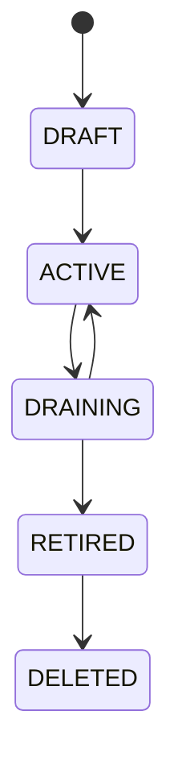

# Host Grouping Architecture

- 状態: Baseline
- 更新日: 2026-08-09

## 1. 目的

HostをPlacement scope、failure domain、Baseline rollout、maintenance wave、運用上のcohortとして扱う第一級`HostGroup` resourceを定義します。

HostGroupは自由形式tagの別名ではありません。membership authority、generation、cardinality、hierarchy、policy binding、snapshot、failure semanticsを持つSystem scope resourceです。

## 2. 基本原則

1. HostGroup membershipはPostgreSQL authorityであり、Agent自己申告labelから直接確定しない。
2. Placement Pool、Failure Domain、Operational Cohortの意味をgroup typeで分離する。
3. Group membershipはHost capability、Compliance、Enrollment、mutation authorityを上書きしない。
4. Placement dry evaluationとfinal admissionは同じGroup membership/policy generationを検証する。
5. Baseline rolloutとMaintenance waveは開始時のimmutable membership snapshotへbindする。
6. Groupはcapacityを所有せず、capacityはHost/Resource Providerにだけclaimする。
7. hierarchy、selector、binding conflict、stale membershipはfail closedにする。
8. Group変更だけで既存workloadを暗黙移動・停止・再構成しない。
9. infrastructure groupとTenant向け公開Placement Scopeを分離する。
10. active referenceを持つGroupを直接削除しない。
11. READY/placement可能なHostはactive Placement Pools全体から一つのeffective Availability Policyを解決できなければならない。

## 3. Resource Model

```text
HostGroup
├─ group_id / name / description
├─ group_type
├─ dimension / namespace
├─ level
├─ membership_mode
├─ selector_or_membership_source
├─ cardinality_policy
├─ lifecycle_state
├─ generation / policy_generation
├─ exposure_policy
└─ labels / audit metadata

HostGroupMembership
├─ group_id / host_id
├─ membership_generation
├─ source / provenance
├─ selector_evaluation_id
├─ effective_from / effective_until
├─ state
└─ actor / reason / audit

HostGroupRelation
├─ parent_group_id / child_group_id
├─ dimension / parent_level / child_level
├─ hierarchy_generation
└─ actor / reason / audit
```

### Group Types

| Type | 用途 | 許される効果 |
|---|---|---|
| `PLACEMENT_POOL` | Host candidate scope、AZ相当の公開scope | eligibility filter、placement/Availability policy binding、capacity集約表示 |
| `FAILURE_DOMAIN` | Site/Rack/Chassis/Power/Fabric等の相関障害境界 | spread/anti-affinity、risk/impact分析 |
| `OPERATIONAL_COHORT` | Baseline rollout、maintenance、support/owner単位 | rollout/maintenance target、alarm/operation scope |

同じHostが異なるdimensionの複数Groupへ所属できます。意味の異なるtypeを一つのGroupへ兼用しません。たとえばRack failure domainを、そのままmaintenance承認scopeやTenant公開poolにしません。必要なら同じHost集合を参照する別Groupを作り、relationを監査可能に保持します。

## 4. Dimension and Cardinality

`dimension`は同じ意味軸、`level`はその軸内の階層または分類位置です。例:

```text
PLACEMENT_POOL: service-class / pool
FAILURE_DOMAIN: physical-location / site
FAILURE_DOMAIN: physical-location / rack
FAILURE_DOMAIN: physical-location / chassis
FAILURE_DOMAIN: power-path / feed
OPERATIONAL_COHORT: host-owner / team
OPERATIONAL_COHORT: baseline-ring / ring
```

dimension+levelは次のcardinalityを定義します。

- `EXACTLY_ONE`: enrolled/ready Hostは必ず一つへ所属。
- `ZERO_OR_ONE`:任意だが同時に複数へ所属不可。
- `MANY`:複数所属可能。

`EXACTLY_ONE`違反、exclusive dimension+levelの多重所属、required failure domain欠損は`MembershipConflict`または`UNKNOWN`です。自動的に任意Groupを選びません。

## 5. Membership Authority

membership mode:

- `EXPLICIT`: authorized operator/APIがHost IDを指定。
- `SELECTOR`: approved inventory/CMDB factsに対するversioned selector。
- `EXTERNAL_ASSERTION`: authenticated inventory/asset authorityのgeneration付きassertion。

selector inputはapproved factsだけです。Agent自己申告hostname/label、Tenant metadata、未検証external claimをprivileged Group membershipのauthorityにしません。

selector評価はpureで、`SelectorEvaluation`としてinput generation、selector version、result set、reasonを保存します。resultをPostgreSQL transactionでmembership generationへmaterializeして初めてauthorityになります。selector engineや外部sourceの停止時にlast resultを無期限でcurrentにせず、freshness policy超過後はstale/UNKNOWNにします。

membership add/removeはETag、authorization、audit、idempotencyを必要とします。同じHost集合でも順序に依存しないcanonical digestを持ちます。

## 6. Hierarchy

Hierarchyは同じgroup type/dimension内の異なるlevel間に明示されたparent relationだけを許可します。

- cycleを禁止する。
- parent membership inheritanceはdimension policyで明示し、暗黙継承しない。
- 一つのchildを複数parentへ接続する場合はDAG対応を明示したdimensionだけに限定する。
- hierarchy generationをsnapshotとfinal admissionで検証する。
- parent変更中に不整合なpartial graphを公開しない。

Failure Domainでは`physical-location: site > rack > chassis`のような階層を表現できますが、異なるfailure dimension（physical-locationとpower-path等）は別graphです。

## 7. Placement Integration

Placement Request Snapshotは次を追加で固定します。

- requested Placement Scope/Group ID
- candidate Hostのmaterialized membership generation
- Group policy/hierarchy generation
- required failure-domain path
- exposure policy generation

評価順序:

```text
Requested Placement Scope
  -> Group membership eligibility
  -> Host lifecycle/compliance/capability eligibility
  -> Resource admission
  -> Failure-domain/affinity rules
  -> Scoring
  -> Selection
  -> Transactional Final Admission
```

Groupに所属していてもHost固有Eligibilityを満たさなければ選択しません。Group weightやoperator preferenceはscoreだけを変え、eligibilityを上書きしません。

READY/placement可能なHostはactive Placement Poolへ所属し、全active Pool bindingsから一つのeffective Availability Policyを解決できなければなりません。Pool membershipが複数でも構いませんが、Policy欠損/stale/conflictはHostをBLOCKED/eligibility=falseとします。requested scopeはeffective Policyを変更できず、compatibleであることだけを追加検証します。

Final AdmissionはGroup membership/policy/hierarchy generationをHost/resource claimsと同じtransactionで再検証します。HostがGroupから外れた、GroupがDRAININGになった、failure-domain pathが変わった場合は部分予約を残さずreselectionへ戻ります。

Group aggregate capacityはHost inventory/allocationから導出する表示値です。Group rowへ独立capacity ledgerを持たず、二重予約authorityにしません。

### Failure Domain Placement

- workloadのspread/anti-affinityは明示したfailure dimensionとlevelを参照する。
- missing/stale/conflicting domain evidenceを独立domainとして楽観評価しない。
- same Host setでもrack diversityとpower-feed diversityを同一視しない。
- 既存workloadのdomain violationはdrift/action-requiredとして記録し、暗黙migrationしない。

## 8. Host Profile and Baseline Binding

HostGroupはHost Profile/Baselineの直接所有者ではなく、versioned `GroupPolicyBinding`を通じてAssignment候補を提供します。

binding可能なpolicy kindはgroup type/dimensionのallow-listで制限します。初期原則ではProfile/Baseline bindingは`OPERATIONAL_COHORT`だけ、placement policyと`AVAILABILITY_POLICY`は`PLACEMENT_POOL`だけに許可し、`FAILURE_DOMAIN`から構成/Availability policyを暗黙継承しません。

```text
GroupPolicyBinding
├─ group_id / group_generation
├─ policy_kind
├─ policy_reference / version
├─ priority
├─ applicability
├─ effective_from / expires_at
└─ actor / audit
```

effective Profile/BaselineはHost direct bindingとGroup bindingsを一つのresolverで決定します。highest priorityが一意なら選択し、同priorityで互換でないbindingが競合した場合は`ASSIGNMENT_CONFLICT`としてHostをBLOCKEDにします。作成時刻やDB取得順のlast-winsを使いません。

Group membership変更は新しいeffective assignment evaluationをtriggerしますが、Baselineを同期的にHostへ適用しません。Host LifecycleのPreflight、Convergence、Verificationを通ります。

Availability Policyは別resolverで一意性を評価し、Final Admission時にVM/Allocationのimmutable Availability Bindingへ固定します。Group/Policy変更だけで既存VMのHost failure responsibilityを変更しません。詳細は [Availability Responsibility and Managed Recovery Architecture](availability-responsibility-architecture.md) に従います。

## 9. Baseline Rollout Scope

Rollout開始時に`GroupMembershipSnapshot`を作成します。

```text
snapshot_id
group_id / group_generation
resolved_host_ids / canonical_digest
selector/hierarchy generations
created_at / created_by
rollout_id / policy version
```

- 実行中rolloutへ後から加入したHostを自動追加しない。
- 実行中に離脱したHostは勝手に履歴から除外せず、`MEMBERSHIP_CHANGED`としてpause/skip/continue policyを評価する。
- retry/resumeは同じsnapshotを使う。
- scope拡張は新snapshot/new rollout generationを必要とする。
- canary/batch/max unavailable/failure thresholdはsnapshot内で評価する。

## 10. Maintenance Wave

Maintenance PlanもGroup snapshotへbindします。

- failure domainを跨ぐconcurrency limit
- max unavailableとminimum ready capacity
- workload drain/exception policy
- Group membership drift handling
- authority/Lease fencingとpost-maintenance verification

同じfailure domain内Hostの同時maintenanceをpolicy上限より増やしません。snapshot作成後のGroup変更だけで新Hostへmaintenance authorityを発行しません。

## 11. Public Placement Scope and Authorization

HostGroupはSystem/Infrastructure scope resourceです。Tenant/Project Principalはraw Host membership、failure topology、operator/owner Groupを変更・列挙しません。

Tenant向けAZ/poolは`exposure_policy`で許可された`PLACEMENT_POOL`の安定した公開projectionです。公開名から内部rack/power/Host identityを推測できないようにし、Projectごとの利用可否はPlacement Policyで管理します。

Group mutation、membership、hierarchy、policy binding、exposureには別permissionを持たせ、すべて監査します。

## 12. Lifecycle



- `DRAFT`: reference/placement不可。membershipとpolicyを検証。
- `ACTIVE`:新規scope/binding/snapshotで利用可能。
- `DRAINING`:新規placement/rollout target作成を停止。既存referenceは保持。
- `RETIRED`:membership変更不可。履歴/reference解消待ち。
- `DELETED`:active membership、workload reference、rollout/maintenance、policy bindingがない場合だけ論理削除。

Group delete/retireはHost、VM、Reservationを暗黙削除・移動しません。

## 13. Failure Semantics

- stale membership generation: dry result/final admissionを拒否して再評価。
- selector/source unavailable: freshness expiry後にUNKNOWN、privileged membershipを推測更新しない。
- exclusive membership conflict: affected scopeをblockし、自動選択しない。
- hierarchy cycle/partial graph:変更transactionを拒否しold committed graphを維持。
- rollout/maintenance中のmembership drift:snapshotを改変せずpolicy decisionを記録。
- Group policy binding conflict: effective assignmentを発行せずHostをBLOCKED。
- Group retirement中のactive reference:DRAINING/RETIREDを維持し削除しない。
- response loss: idempotency keyとmembership/snapshot digestで同じOperationを回収。

## 14. API Resources

```text
/api/v1/host-groups
/api/v1/host-groups/{id}/memberships
/api/v1/host-groups/{id}/hierarchy
/api/v1/host-groups/{id}/policy-bindings
/api/v1/host-groups/{id}/snapshots
/api/v1/host-group-dimensions
/api/v1/placement-scopes
```

すべてのmutationはETag/If-Match、Idempotency-Key、Operation、Audit contractに従います。membership bulk updateは一つのgenerationとして不可分にcommitします。
