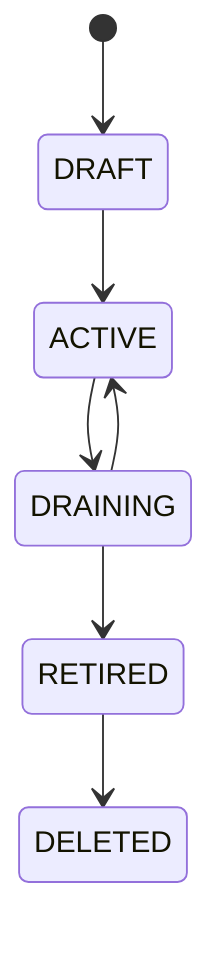

# Host Grouping Architecture

- 状態: Baseline
- 更新日: 2026-08-11

## 1. 目的

HostをPlacement scope、failure domain、Baseline rollout、maintenance wave、運用上のcohortとして扱う第一級`HostGroup` resourceを定義します。

HostGroupは自由形式tagの別名ではありません。membership authority、generation、cardinality、hierarchy、policy binding、snapshot、failure semanticsを持つSystem scope resourceです。

## 2. 基本原則

1. HostGroup membershipはPostgreSQL authorityであり、Agent自己申告labelから直接確定しない。
2. Placement Pool、Failure Domain、Operational Cohortの意味をgroup typeで分離する。
3. Group membershipはHost capability、Compliance、Enrollment、mutation authorityを上書きしない。
12. HostGroup semantic/lifecycle generationとwhole-group membership set generationを分離する。
13. 個別membership evidenceやpartial bulk writeではなく、validated complete setのatomic current switchだけをmembership authorityとする。
4. Placement dry evaluationとfinal admissionは同じGroup membership/policy generationを検証する。
5. Baseline rolloutとMaintenance waveは開始時のimmutable membership snapshotへbindする。
6. Groupはcapacityを所有せず、capacityはHost/Resource Providerにだけclaimする。
7. hierarchy、selector、binding conflict、stale membershipはfail closedにする。
8. Group変更だけで既存workloadを暗黙移動・停止・再構成しない。
9. infrastructure groupとTenant向け公開Placement Scopeを分離する。
10. active referenceを持つGroupを直接削除しない。
11. READY/placement可能なHostはactive Placement Pools全体から一つのeffective Availability Policyを解決できなければならない。

## 3. Resource Model

```text
HostGroup
├─ group_id / name / description
├─ group_type
├─ dimension / namespace
├─ level
├─ membership_mode
├─ selector_or_membership_source
├─ cardinality_policy
├─ lifecycle_state
├─ generation / policy_generation
├─ exposure_policy
└─ labels / audit metadata

HostGroupMembership
├─ group_id / host_id
├─ membership_generation
├─ source / provenance
├─ selector_evaluation_id
├─ effective_from / effective_until
├─ state
└─ actor / reason / audit


HostGroupMembershipSet
├─ membership_set_generation
├─ based_on_host_group_generation
├─ source_type / source_revision
├─ selector_evaluation_generation (optional)
├─ hierarchy_id / hierarchy_generation (current graphが存在する場合は必須)
├─ canonical_member_set_digest / member_count
├─ validation_state
└─ immutable set member evidence

HostGroupMembershipSetCurrent
└─ accepted set generationへのatomic pointer
HostGroupRelation
├─ parent_group_id / child_group_id
├─ dimension / parent_level / child_level
├─ hierarchy_generation
└─ actor / reason / audit

HostGroupHierarchySet
├─ hierarchy_id / hierarchy_generation
├─ group_type / dimension / scope
├─ ordered level evidence
├─ HostGroup generation-bound node evidence
├─ parent/child relation evidence
├─ canonical node/relation digests
└─ accepted current pointer
```

### Group Types

| Type | 用途 | 許される効果 |
|---|---|---|
| `PLACEMENT_POOL` | Host candidate scope、AZ相当の公開scope | eligibility filter、placement/Availability policy binding、capacity集約表示 |
| `FAILURE_DOMAIN` | Site/Rack/Chassis/Power/Fabric等の相関障害境界 | spread/anti-affinity、risk/impact分析 |
| `OPERATIONAL_COHORT` | Baseline rollout、maintenance、support/owner単位 | rollout/maintenance target、alarm/operation scope |

同じHostが異なるdimensionの複数Groupへ所属できます。意味の異なるtypeを一つのGroupへ兼用しません。たとえばRack failure domainを、そのままmaintenance承認scopeやTenant公開poolにしません。必要なら同じHost集合を参照する別Groupを作り、relationを監査可能に保持します。

## 4. Dimension and Cardinality

`dimension`は同じ意味軸、`level`はその軸内の階層または分類位置です。例:

```text
PLACEMENT_POOL: service-class / pool
FAILURE_DOMAIN: physical-location / site
FAILURE_DOMAIN: physical-location / rack
FAILURE_DOMAIN: physical-location / chassis
FAILURE_DOMAIN: power-path / feed
OPERATIONAL_COHORT: host-owner / team
OPERATIONAL_COHORT: baseline-ring / ring
```

dimension+levelは次のcardinalityを定義します。

- `EXACTLY_ONE`: enrolled/ready Hostは必ず一つへ所属。
- `ZERO_OR_ONE`:任意だが同時に複数へ所属不可。
- `MANY`:複数所属可能。

`EXACTLY_ONE`違反、exclusive dimension+levelの多重所属、required failure domain欠損は`MembershipConflict`または`UNKNOWN`です。自動的に任意Groupを選びません。

cardinalityはHostGroup単体のmember数ではなく、次のclass/scope keyに対するmembership constraintです。

~~~text
group_type + dimension + level + scope_type + scope_id
~~~

Phase 1の最初のauthority profileはSYSTEM/systemです。policy revision evidenceはimmutable、current policyはgeneration付きprojectionです。異なるsibling Groupへのcomplete-set publisherも同じcardinality scope advisory lockを取得し、proposed setと他のcurrent ACTIVE sibling setsを同一transactionで検証します。policy generationが変わった既存setは書き換えず、current policyに対するnew complete-set publishまでsnapshot/Placement authorityとしてfail closedにします。

EXACTLY_ONEのminimum-oneは、この増分ではpublishにより影響を受けるmaterialized Host populationに対して強制します。Site/Project/全managed Hostなどのpopulation authorityが未実装のため、集合外Hostを含むglobal completenessは後続gateです。ZERO_OR_ONEとEXACTLY_ONEの多重所属防止はcurrent sibling membership全体に適用します。

## 5. Membership Authority

membership mode:

- `EXPLICIT`: authorized operator/APIがHost IDを指定。
- `SELECTOR`: approved inventory/CMDB factsに対するversioned selector。
- `EXTERNAL_ASSERTION`: authenticated inventory/asset authorityのgeneration付きassertion。

selector inputはapproved factsだけです。Agent自己申告hostname/label、Tenant metadata、未検証external claimをprivileged Group membershipのauthorityにしません。


### Whole-set publication

`HostGroup generation`はGroup自体のsemantic/lifecycle incarnation、`membership_set_generation`はGroupに現在誰がどのstateで所属するかという完全な集合のincarnationです。個別member generationはset内のprovenanceとして保持しますが、個別rowの存在だけではaccepted set authorityになりません。

```text
complete set proposal
  -> member/provenance validation
  -> canonical digest
  -> immutable set + member evidence
  -> current set pointer + current member projection
```

最後のpublishは一つのPostgreSQL transactionです。unknown Host、digest/request conflict、stale Group/set generation、invalid lifecycle、transaction failureのいずれでもold current set全体を維持し、mixed generationを公開しません。同じrequest identity/semantic digestのreplayは元のset evidenceへ収束します。

member除外は過去evidenceを削除せず、new set内の`REMOVED` tombstoneとして保持します。hierarchy authorityが存在するclassではcomplete setをcurrent hierarchy ID/generationへ必ずbindします。hierarchy更新やnode HostGroup generation drift後は、new hierarchyに対するcomplete set再publishまでsnapshot/Placement authorityをfail closedにします。

### Selector proposal and materialization

Phase 1のSelectorは`kim.host-group.selector/v1`というclosed typed schemaです。任意SQL、JSONPath、shell、Go expression、filesystem path、backend commandを受け付けません。predicateはAND-onlyの`EQUALS`で、allow-listされたHost identity、Compute architecture、normalized capability availabilityだけを参照します。capability `UNKNOWN`は`NOT_MATCHED`へ縮退せず、default `FAIL_CLOSED` policyによりproposal全体を`UNKNOWN`にします。

```text
Selector revision/current authority
  -> pure evaluation over explicit Host population
  -> immutable evaluation + per-Host input/result evidence
  -> proposed canonical candidate-set digest
  -> materialization transaction
       current HostGroup generation
       current Selector generation
       current inventory/capability generation and digest
       current Cardinality policy generation
       current Hierarchy generation
       expected Membership Set generation
  -> accepted complete Membership Set
```

Selector evaluationはmembership projectionを更新しません。`selector match != membership authority`であり、Agent label、Inventory observation、external assertionも同様です。materialization時に一つでもgeneration/digestが変化していればold accepted Setを維持してrejectします。Set publish後のobservation driftも既存evidenceを自動変更せず、new evaluationとnew Setを必要とします。

Selector-bound Setはselector ID/generationとevaluation ID/generationをimmutable provenanceとして保持します。current Selector generationが変化した時点でold Set evidenceは保存したまま、新規SnapshotとPlacement authorityはnew Selectorに対するSet再materializationまでfail closedです。同expected generationのparallel evaluatorはPostgreSQL advisory authority下で同semantic resultなら一つのevaluationへ収束し、異なるcandidate setなら一方だけがcurrent decisionを進めます。

membership add/removeはETag、authorization、audit、idempotencyを必要とします。同じHost集合でも順序に依存しないcanonical digestを持ちます。

## 6. Hierarchy

Hierarchyは同じgroup type/dimension内の異なるlevel間に明示されたparent relationだけを許可します。

- cycleを禁止する。
- parent membership inheritanceはdimension policyで明示し、暗黙継承しない。
- 一つのchildを複数parentへ接続する場合はDAG対応を明示したdimensionだけに限定する。
- hierarchy generationをsnapshotとfinal admissionで検証する。
- parent変更中に不整合なpartial graphを公開しない。

Failure Domainでは`physical-location: site > rack > chassis`のような階層を表現できますが、異なるfailure dimension（physical-locationとpower-path等）は別graphです。

Phase 1の最初のmaterialized profileは`SYSTEM/system + TREE`です。TREEは一つのrootだけを強制する意味ではなく、各non-root nodeがちょうど一つのparentを持つsingle-parent forestです。DAGを暗黙許可しません。publisherはcomplete ordered levels、complete node set、complete relation setを提示し、shared hierarchy scope lock下でcurrent generationを比較してimmutable evidenceを作成後、current pointerを一度だけ切り替えます。cycleはstrict level-rank increaseにより不可能で、level inversion、missing parent、multi-parent、cross type/dimension、inactive/stale HostGroup nodeを拒否します。

同一publish requestのresponse loss replayはcaller proposal identityから元のimmutable evidenceを回収し、後続HostGroup generation driftを理由に過去のaccepted responseを作り直しません。一方、新しいmembership/snapshot/Placement authorityはcurrent graph全nodeがcurrent HostGroup generation/level/lifecycleと一致する場合だけ進めます。

## 7. Placement Integration

Placement ScopeはHostGroup membershipの別名ではなく、Placement consumerへ公開するpopulation authorityです。Phase 1のclosed profileは `VM_PLACEMENT` consumerが明示された `PLACEMENT_POOL` HostGroup generationsを参照します。ScopeはHost IDを保存せず、Hierarchy child、Selector proposal、Group Policy Bindingからexposureを暗黙継承しません。Projectは現時点のcompatibility identifierでありgeneration fencingは後続です。

```text
Placement Request + placement_scope_id
  -> current ACTIVE Scope generation
  -> explicit PLACEMENT_POOL generations
  -> current accepted Membership Sets/members
  -> visible Host union (multi-Group provenanceを保持してdeduplicate)
  -> existing Eligibility/Scoring
  -> transactional Final Admission
```

`ACTIVE`だけがnew dry/Final sourceです。`DRAINING`と`RETIRED`はhistoryを保持してnew authorityをBLOCKします。Dryはread-only repeatable-readで `NO_SCOPE`、`SCOPE_BLOCKED`、`NO_VISIBLE_HOST`、`VISIBLE_BUT_NO_ELIGIBLE_HOST`、`READY` を区別します。Final AdmissionはScopeと全provenance Groupをserializeし、Scope/Group/Set/memberとHost/resource authorityを一transactionで再検証します。drift時はnew Scopeでre-selectionせずnew Dryを要求し、全claimをrollbackします。


Placement Request Snapshotは次を追加で固定します。

- requested Placement Scope/Group ID
- current accepted membership set generationとcandidate member evidence generation
- Group policy/hierarchy generation
- required failure-domain path
- exposure policy generation

評価順序:

```text
Requested Placement Scope
  -> Group membership eligibility
  -> Host lifecycle/compliance/capability eligibility
  -> Resource admission
  -> Failure-domain/affinity rules
  -> Scoring
  -> Selection
  -> Transactional Final Admission
```

Groupに所属していてもHost固有Eligibilityを満たさなければ選択しません。Group weightやoperator preferenceはscoreだけを変え、eligibilityを上書きしません。

READY/placement可能なHostはactive Placement Poolへ所属し、全active Pool bindingsから一つのeffective Availability Policyを解決できなければなりません。Pool membershipが複数でも構いませんが、Policy欠損/stale/conflictはHostをBLOCKED/eligibility=falseとします。requested scopeはeffective Policyを変更できず、compatibleであることだけを追加検証します。

Final AdmissionはHostGroup generation、accepted membership set generation、candidate member generation、policy/hierarchy generationをHost/resource claimsと同じtransactionで再検証します。HostがGroupから外れた、setが切り替わった、GroupがDRAININGになった、failure-domain pathが変わった場合は部分予約を残さずreselectionへ戻ります。

Group aggregate capacityはHost inventory/allocationから導出する表示値です。Group rowへ独立capacity ledgerを持たず、二重予約authorityにしません。

### Failure Domain Placement

- workloadのspread/anti-affinityは明示したfailure dimensionとlevelを参照する。
- missing/stale/conflicting domain evidenceを独立domainとして楽観評価しない。
- same Host setでもrack diversityとpower-feed diversityを同一視しない。
- 既存workloadのdomain violationはdrift/action-requiredとして記録し、暗黙migrationしない。

## 8. Host Profile and Baseline Binding

HostGroupはHost Profile/Baselineの直接所有者ではなく、versioned `GroupPolicyBinding`を通じてAssignment候補を提供します。

binding可能なpolicy kindはgroup type/dimensionのallow-listで制限します。初期原則ではProfile/Baseline bindingは`OPERATIONAL_COHORT`だけ、placement policyと`AVAILABILITY_POLICY`は`PLACEMENT_POOL`だけに許可し、`FAILURE_DOMAIN`から構成/Availability policyを暗黙継承しません。

```text
GroupPolicyBinding
├─ group_id / group_generation
├─ policy_kind
├─ policy_reference / version
├─ priority
├─ applicability
├─ effective_from / expires_at
└─ actor / audit
```

effective Profile/BaselineはHost direct bindingとGroup bindingsを一つのresolverで決定します。highest priorityが一意なら選択し、同priorityで互換でないbindingが競合した場合は`ASSIGNMENT_CONFLICT`としてHostをBLOCKEDにします。作成時刻やDB取得順のlast-winsを使いません。

Group membership変更は新しいeffective assignment evaluationをtriggerしますが、Baselineを同期的にHostへ適用しません。Host LifecycleのPreflight、Convergence、Verificationを通ります。

Availability Policyは別resolverで一意性を評価し、Final Admission時にVM/Allocationのimmutable Availability Bindingへ固定します。Group/Policy変更だけで既存VMのHost failure responsibilityを変更しません。詳細は [Availability Responsibility and Managed Recovery Architecture](availability-responsibility-architecture.md) に従います。

### Implemented Phase 1 resolution authority

HostGroup membership is not a policy association, and hierarchy is not policy inheritance. A Binding fixes one exact HostGroup semantic generation, one closed policy/consumer type, and one exact Policy revision/digest. Membership Set changes alone do not invalidate it.

The initial implemented combination is `MAINTENANCE` / `MAINTENANCE_PLAN`. Higher numeric priority wins. Equal highest-priority assignments resolve only when their typed policy identity, revision, and digest are identical; otherwise the result is `ASSIGNMENT_CONFLICT` and Maintenance Plan publication is blocked. A stale highest-priority assignment produces `STALE_ASSIGNMENT` and never silently falls back.

Membership Snapshots and Policy Resolution evidence are separate immutable provenance inputs. Later Binding, Policy, or membership changes do not rewrite an accepted Plan.

## 9. Baseline Rollout Scope

Rollout開始時に`GroupMembershipSnapshot`を作成します。

```text
snapshot_id
group_id / group_generation
membership_set_generation / membership_set_digest
resolved_host_ids / canonical_digest
selector/hierarchy generations
created_at / created_by
rollout_id / policy version
```

- 実行中rolloutへ後から加入したHostを自動追加しない。
- 実行中に離脱したHostは勝手に履歴から除外せず、`MEMBERSHIP_CHANGED`としてpause/skip/continue policyを評価する。
- retry/resumeは同じsnapshotを使う。
- scope拡張は新snapshot/new rollout generationを必要とする。
- canary/batch/max unavailable/failure thresholdはsnapshot内で評価する。

## 10. Maintenance Wave

Maintenance PlanもGroup snapshotへbindします。

- failure domainを跨ぐconcurrency limit
- max unavailableとminimum ready capacity
- workload drain/exception policy
- Group membership drift handling
- authority/Lease fencingとpost-maintenance verification

同じfailure domain内Hostの同時maintenanceをpolicy上限より増やしません。snapshot作成後のGroup変更だけで新Hostへmaintenance authorityを発行しません。

## 11. Public Placement Scope and Authorization

HostGroupはSystem/Infrastructure scope resourceです。Tenant/Project Principalはraw Host membership、failure topology、operator/owner Groupを変更・列挙しません。

Tenant向けAZ/poolはfirst-class Placement Scope revisionがexact `PLACEMENT_POOL` HostGroup generationsを明示公開します。ScopeはHost listをコピーせず、dry時にcurrent accepted Membership Setsからvisible populationを導出します。公開名から内部rack/power/Host identityを推測できないようにし、現profileはProject compatibility identifierをexact照合します。Project generation authorityは後続です。

Group mutation、membership、hierarchy、policy binding、exposureには別permissionを持たせ、すべて監査します。

## 12. Lifecycle



- `DRAFT`: reference/placement不可。membershipとpolicyを検証。
- `ACTIVE`:新規scope/binding/snapshotで利用可能。
- `DRAINING`:新規placement/rollout target作成を停止。既存referenceは保持。
- `RETIRED`:membership変更不可。履歴/reference解消待ち。
- `DELETED`:active membership、workload reference、rollout/maintenance、policy bindingがない場合だけ論理削除。

Group delete/retireはHost、VM、Reservationを暗黙削除・移動しません。

## 13. Failure Semantics

- stale membership generation: dry result/final admissionを拒否して再評価。
- selector/source unavailable: freshness expiry後にUNKNOWN、privileged membershipを推測更新しない。
- exclusive membership conflict: affected scopeをblockし、自動選択しない。
- hierarchy cycle/partial graph:変更transactionを拒否しold committed graphを維持。
- rollout/maintenance中のmembership drift:snapshotを改変せずpolicy decisionを記録。
- Group policy binding conflict: effective assignmentを発行せずHostをBLOCKED。
- Group retirement中のactive reference:DRAINING/RETIREDを維持し削除しない。
- response loss: idempotency keyとmembership/snapshot digestで同じOperationを回収。

## 14. API Resources

```text
/api/v1/host-groups
/api/v1/host-groups/{id}/memberships
/api/v1/host-groups/{id}/hierarchy
/api/v1/host-groups/{id}/policy-bindings
/api/v1/host-groups/{id}/snapshots
/api/v1/host-group-dimensions
/api/v1/placement-scopes
```

すべてのmutationはETag/If-Match、Idempotency-Key、Operation、Audit contractに従います。membership bulk updateは一つのgenerationとして不可分にcommitします。
