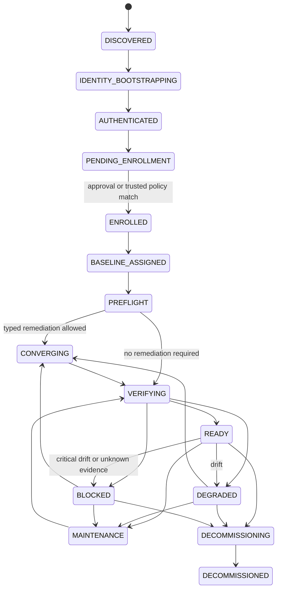
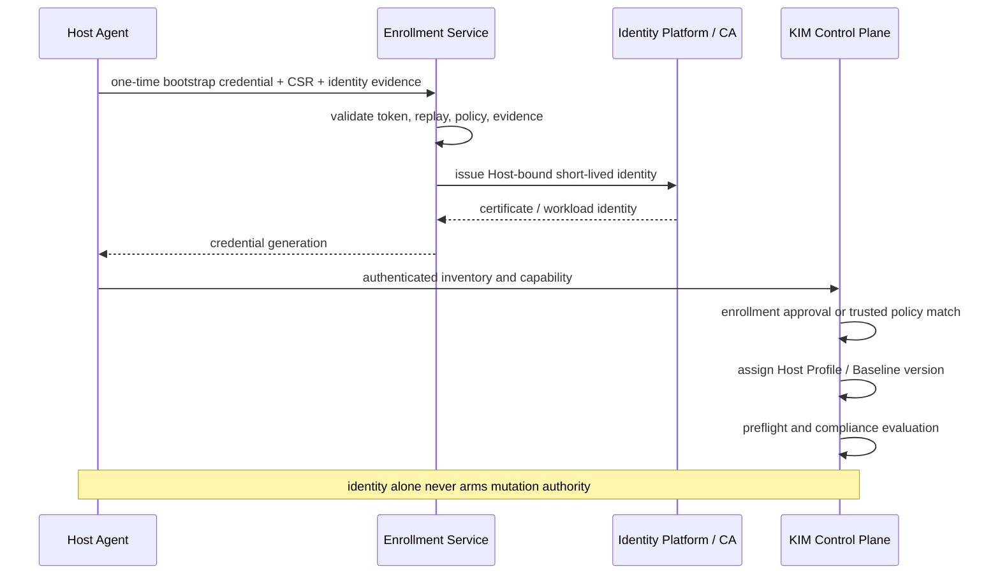

# Host Lifecycle and Compliance Architecture

- 状態: Baseline
- 更新日: 2026-08-09

## 1. 目的

Host discovery、identity bootstrap、enrollment、baseline assignment、preflight、typed convergence、continuous compliance、maintenance、decommissionを一つのHost Lifecycleとして管理します。

ZTPは単発のOS構築機能ではなく、Zero Touch Enrollment + Continuous Complianceです。KIMはHostが要求状態を満たすかを継続評価し、policyで許可されたclosed typed remediationだけを実行します。汎用Configuration Managementは提供しません。

## 2. 基本原則

1. credentialはHost identityを証明するがmutation authorityではない。
2. authenticated Hostを自動的にtrusted/ready/armedへ昇格させない。
3. Enrollment approvalまたは信頼済みPolicy MatchをBaseline Assignmentより前に必要とする。
4. Baselineはimmutable versioned desired stateとして保持する。
5. observed state、compliance result、remediation resultを分離する。
6. Compliance historyとevidenceをappend-onlyに保持する。
7. Critical control違反またはevidence不明をPlacement Eligibilityへ反映する。
8. typed remediationをobserve-only、safe、maintenance-required、externalに分類する。
9. Baseline変更とHost convergenceを同一API transactionのように扱わない。
10. decommissionはauthorityを段階的に除去し、証拠を保持する。

## 3. Lifecycle



Lifecycle stateとCompliance statusは別です。Hostが`READY`になるには、active Baseline Assignment、current evidence、placement-blocking controlがないことに加え、active Placement Pool membershipと一意なHost Effective Availability Policyが必要です。

## 4. Identity Bootstrap and Enrollment



Enrollment Policyは以下をversioned ruleとして持ちます。

- approved bootstrap issuer/credential class
- Site/PoP、hardware identity、expected owner
- allowed OS/agent/capability constraints
- required approval mode: manual、policy-auto、deny
- Host Profile/Baseline selection
- enrollment expiry、maximum matches、replay policy

Agent自己申告のhostname/labelだけでPolicy Matchしません。stable identity evidence、credential binding、approved inventory factsを使用します。

bootstrap material、CSR proof-of-possession、Credential Binding、renewal/revocation/session generationは [PKI and Trust Lifecycle Architecture](pki-and-trust-lifecycle-architecture.md) に従います。credential issuanceだけでEnrollment、READY、Host Operation Authorityへ進めません。

同一Host identityの重複enrollmentは同じHostへ冪等収束させ、異なるhardware identityやactive Hostとの衝突はquarantineします。

### Hardware Identity Evidence

Host identityをMAC address、hostname、単一serialのような一つの可変値へ縮退させません。Enrollmentは複数sourceの`HardwareIdentityEvidence`を正規化して評価します。

```text
evidence_id
host_candidate_id
source_class
source_identity / issuer
subject_type / normalized_claims
collector_identity / collection_path
observed_at / expires_at
nonce / request_binding
integrity_or_attestation_state
provenance_reference / payload_digest
confidence_contribution
conflict_flags
```

source classの例:

- cryptographically-bound platform evidence: TPM等のattestation/鍵binding。利用可否と検証強度はsupport matrixで定義。
- management-plane evidence: BMC identity、chassis/asset inventory、provisioning system record。
- platform inventory evidence: SMBIOS UUID/serial、system/product/board facts。
- network/device evidence: permanent NIC/device identity。単独ではEnrollment authorityにしない。
- operator/CMDB assertion: authorized Principalとsource generation付きの期待Host情報。

`confidence`はAgentの自己申告値ではなく、versioned Enrollment Policyがsource independence、freshness、issuer trust、challenge binding、conflictを評価したdecisionです。Policyは最低証拠class、必要な独立source数、許容conflict、manual review条件を定義します。

- MAC、hostname、IP addressだけでpolicy-auto enrollmentしない。
- 同じcredential/CSR/requestと同じhardware evidenceの再送は冪等に扱う。
- trusted/currentと判定されたevidenceが既存authorityと一件でも矛盾すれば自動merge/replaceしない。
- raw serial、attestation payload、management credentialを通常log/eventへ出さず、digestとaccess-controlled referenceを保持する。
- unsupported/unverifiable/stale evidenceは捨てず`UNKNOWN`としてdecision evidenceへ残す。

## 5. Host Profile and Baseline

### Host Profile

Host Profileは運用上の役割とBaseline選択をまとめます。

- profile ID/version
- Site/AZ/Host Aggregate/role
- Baseline reference/version selection policy
- placement traitsとcapacity policy
- maintenance/drain policy
- enrollment policy reference

例: `general-compute`、`nfv-sriov`、`nfv-ovs-dpdk`、`edge-small`。

### Host Baseline

Host Baselineはimmutable versioned resourceです。

- baseline ID、version、digest、status
- applicable Profile/Host constraints
- ordered Baseline Controls
- evaluator/contract versions
- rollout policy、grace period、supersedes
- created/approved identityと時刻

Baseline versionを上書きしません。変更は新versionとして発行し、Assignment rolloutを別Operationで進めます。

### Baseline Control

```text
control_id
control_version
category
requirement
applicability
severity
placement_impact
remediation_mode
disruption_class
evidence_requirements
evidence_max_age
dependencies
```

代表category:

- OS/kernel capability
- libvirt/QEMU/Agent version
- CPU isolation/housekeeping/emulator policy
- HugePages/NUMA/IOMMU/SR-IOV
- OVS/OVS-DPDK/PMD/socket memory/Port mapping
- storage client/backend access
- network/provider mapping
- security module、certificate、time synchronization

Baselineは任意package command、shell、file content、kernel argument文字列を含みません。外部Configuration Managementが必要なControlはrequirementとevidenceだけを持ちます。

## 6. Compliance Model

### Control Status

- `COMPLIANT`: required stateをcurrent evidenceが証明。
- `NON_COMPLIANT`: trusted evidenceが違反を証明。
- `DEGRADED`: minimum safetyは満たすがperformance/redundancy/推奨条件を満たさない。
- `UNKNOWN`: evidence欠損、stale、conflict、evaluator failureで判断不能。
- `NOT_APPLICABLE`: applicability ruleにより対象外。

### Control Result

```text
control_id / control_version
baseline_id / baseline_version
host_id
status
severity
placement_impact
remediation_mode
desired_summary
observed_summary
inventory_generation
evaluator_version
evaluated_at
evidence_references
bounded_reason_code
```

Control Resultは評価ごとのimmutable evidenceです。current summaryは最新のvalid resultを参照しますが、過去結果を書き換えません。

### Evaluator Artifact and Versioning

`evaluator_version`は自由形式の表示文字列ではなく、immutableな`Evaluator Artifact`を参照します。

```text
evaluator_id / evaluator_revision
artifact_digest / build_provenance
contract_schema_version
supported_control_versions
supported_evidence_versions
determinism / side_effect_class
support_tier / certification_result
released_at / revoked_at
```

Control ResultはControl versionに加え、Evaluator Artifact digest、input evidence digest、Inventory generation、policy generationへbindします。同じ入力と同じEvaluator Artifactで再評価した結果は決定的でなければなりません。

Evaluator更新は通常のbinary差し替えで判定authorityを切り替えず、次のrolloutを通します。

1. conformance/fixture CIで旧・新Evaluatorを同じevidence corpusへ実行する。
2. shadow evaluationで判定差、reason code差、performanceを記録する。
3. canary Host/ProfileへEvaluator Assignment generationを発行する。
4. failure/change threshold内ならbatch rolloutし、超過時はpauseする。
5. current result pointerだけを新しいvalid resultへ進め、旧Resultを改変しない。

未知/revoked/incompatible Evaluator Artifact、crash、timeout、nondeterministic resultは`UNKNOWN`です。旧Evaluatorへ戻す場合も新しいAssignment generationと再評価を必要とし、過去判定を書き換えません。

### Aggregate Compliance

- Critical `NON_COMPLIANT/UNKNOWN`: Hostまたは該当capabilityを`BLOCKED`。
- High: policyによりblockまたは`DEGRADED`。
- Medium/Low: alertまたはgrace period付き`DEGRADED`。
- 全applicable blocking controlが`COMPLIANT`: compliance summary `COMPLIANT`。
- 全Controlが`NOT_APPLICABLE`: summary `NOT_APPLICABLE`だが、READY条件はProfile policyで判断。

status集約時に`UNKNOWN`を`NON_COMPLIANT`や`COMPLIANT`へ丸めません。

## 7. Preflight, Convergence, and Verification

### Preflight

- Baseline applicabilityとevaluator availability
- evidence completeness/freshness
- typed remediation capability
- required maintenance/drain/reboot/external action
- active workload、Allocation、Lease、Host authority
- remediation dependency/conflict

Preflightは副作用を持ちません。

### Remediation Modes

| Mode | KIM behavior |
|---|---|
| observe-only | evaluate/alert/blockだけ。自動変更しない |
| auto-remediate-safe | bounded online typed operationをpolicy条件内で自動実行可能 |
| maintenance-required | drain/impact approval/maintenance authority後にtyped operation |
| external-remediation | 外部Configuration Management向けrequirement/evidenceを提示し、KIMは変更しない |

`auto-remediate-safe`でもEnrollment/Baseline/Authority generation、precondition、idempotency、Command Lease、journal、read-backを必要とします。

### Convergence

Compliance差分からRemediation Planを生成します。PlanはBaseline Assignment generationとInventory generationへbindし、Control dependency順にclosed typed Operationを作ります。

一つのControlが成功してもHost全体をREADYにせず、後続Inventoryと全blocking Controlの再評価を必要とします。UNKNOWN outcome時は反対operationを自動実行しません。

### External Remediation Contract

外部Configuration Management連携は、KIMがHostを操作する抜け道ではありません。KIMはversioned `ExternalRemediationRequest`をoutbox/eventまたはscoped APIで渡します。

```text
request_id / idempotency_key
host_id / control_id / control_version
baseline_assignment_generation
desired_summary / evidence_requirements
maintenance_window / disruption_constraints
issued_by / integration_identity / contract_version
issued_at / expires_at
callback_scope / correlation
```

外部systemは`ACKNOWLEDGED / IN_PROGRESS / COMPLETION_CLAIM / FAILED / CANNOT_REMEDIATE`を返せますが、これらは外部actorのclaimでありHost observationではありません。受信時にservice identity、contract version、request binding、expiry、nonce/idempotency、payload integrityを検証し、raw claimをappend-only evidenceとして保存します。

`COMPLETION_CLAIM`を受けてもKIMは次だけを行います。

1. current request/Assignment generationとのbindingを検証する。
2. Agentまたは承認済みread-only collectorからfresh inventory/evidenceを要求する。
3. assigned Evaluator ArtifactでControlを再評価する。
4. KIMが観測した結果が一致した場合だけcurrent Compliance summaryを進める。

外部systemはCore DB、Host Operation Authority、Agent Gateway credential、Command Leaseを受け取りません。callbackだけで`COMPLIANT`、`READY`、authority armed、maintenance exitへ遷移できません。期限切れ、response loss、source不明、観測不一致は`UNKNOWN`またはaction-requiredとして保持し、自動再実行や成功推測をしません。

## 8. Host Operation Authority

Authority arming条件:

- current authenticated Host identity
- Enrollmentがapproved/enrolled
- active Host Profile/Baseline Assignment
- preflight current generationで成功
- requested remediation capabilityがAgentから通知済み
- control remediation modeとmaintenance policyが許可
- Critical security/identity controlがCOMPLIANT
- actor/policyが`host_operations.arm`を許可

Policy-auto armingを許す場合も、上記条件を一つのtransactionで検証し、authority generation、policy ID/version、Baseline Assignment generation、evidence generationを監査します。

credential renewal、Agent reconnect、Gateway recovery、Baseline assignmentだけではarmしません。

Critical identity/security drift、decommission開始、Host disableはauthorityをdisarmしactive Leaseをfenceします。performance-only driftは新規placementだけをblockし得ます。

## 9. Placement Integration

Placement snapshotは以下を含みます。

- Host lifecycle state
- active Profile/Baseline ID/version
- compliance summary generation
- required Control IDs/status/evidence age
- capability-scoped blocks

```text
critical host-wide violation
  -> eligible=false / host_baseline_non_compliant

required evidence unknown/stale
  -> eligible=false / host_compliance_unknown

DPDK-only control violation
  -> ovs-dpdk capability ineligible
  -> general computeはProfile policyにより利用可能
```

Baseline違反をscore低下だけで処理しません。blocking ControlはEligibilityで除外します。Final AdmissionではCompliance generationとevidence freshnessを再検証します。

## 10. Continuous Compliance and Drift

評価trigger:

- Inventory/capability generation更新
- Baseline/Profile/Assignment変更
- Agent/credential/version変更
- maintenance完了
- periodic evidence expiry
- security/advisory policy更新

Drift検出後のaction:

- alert only
- capability-scoped placement block
- Host-wide placement block
- maintenance request
- policy-authorized safe typed remediation
- external remediation ticket/event

短期telemetry変動だけでBaseline違反にせず、Controlごとにwindow/hysteresis/evidence contractを定義します。

Host time synchronization、offset/uncertainty、source health、boot/monotonic continuityはBaseline Control/Clock Observationとして評価します。Agentの`observed_at`だけでfreshnessを延長せず、time-sensitive Commandやcapability scopeへの影響は [Time and Clock Semantics Architecture](time-and-clock-semantics.md) に従います。

## 11. Baseline Rollout

Baseline version rolloutはHost単位のAssignment Operationです。

HostGroupをtargetにする場合、rollout開始時のimmutable Group Membership Snapshotへbindします。実行中のGroup加入を自動追加せず、離脱Hostも履歴から除去しません。scope変更は新snapshot/new rollout generationを必要とします。詳細は [Host Grouping Architecture](host-grouping-architecture.md) に従います。

- canary、batch、max unavailable、failure threshold
- dry compliance impact analysis
- workload/maintenance impact set
- pause/abort/rollback-to-previous-assignment
- per-Host verification gate

rollbackは過去Baseline rowを書き換えず、以前のversionを参照する新Assignment generationを作ります。既に行われたHost mutationを自動的に元へ戻せるとは仮定しません。

## 12. Maintenance

Maintenance entry:

1. 新規placement停止。
2. active Operation/Leaseを確認・fence。
3. workload drain/exceptionを完了。
4. impact setとauthority generationを確定。
5. disruptive typed remediationを実行。
6. Host再接続、full inventory、compliance verification。
7. READY条件確認後にplacement再開。

Group maintenanceは開始時snapshotとfailure-domain concurrency/minimum-ready policyへbindし、Group変更だけで追加Hostへmaintenance authorityを発行しません。

rebootやOS package upgradeそのものをKIMが汎用実行しません。external-remediationの場合、KIMはmaintenance/fencing/evidence boundaryを管理します。

## 13. Decommission

1. Hostをdisableし新規placementを停止。
2. Host Operation AuthorityをdisarmしLeaseをfence。
3. workload/Volume/Port/PCI/DPDK allocationをdrainまたは明示例外化。
4. active Operation/UNKNOWN outcomeを解決。
5. Baseline Assignmentをterminal化。
6. Agent credentialを失効。
7. final inventory/compliance/audit evidenceを保持。
8. Hostを`DECOMMISSIONED`へ遷移。

KIMはdecommission時にOS wipe、firmware reset、物理破棄を暗黙実行しません。

## 14. Failure Semantics

- bootstrap response loss:同じcredential/CSR/request digestだけを冪等回収。
- duplicate identity/hardware conflict:両方をquarantineし自動mergeしない。
- Baseline assignment競合:stale generationを拒否。
- remediation result loss:Attempt UNKNOWN、read-back/compliance evidenceで解決。
- evaluator crash/unknown version:evidence UNKNOWN、blocking policyを適用。
- stale evidence:grace policy後にUNKNOWN/DEGRADEDへ遷移。
- rollout threshold超過:新規Assignmentをpauseし、既存Hostを推測rollbackしない。
- decommission partition:credential/authority fencingを確認できるまでterminalにしない。

## 15. Security and Audit

- Enrollment Policy/Baseline/Profileはversioned、authorized、digest付きresource。
- Hostは自身のapproval、Profile、Baseline、Control severity/remediation modeを変更できない。
- bootstrap credentialは一回用途、短寿命、Host identity/CSR/requestへbind。
- Baseline evidenceはsource、generation、freshness、evaluator versionを保持。
- 自動arming/remediationはpolicy decisionとactorを監査。
- secret、raw config、kernel args、certificate materialをCompliance resultへ含めない。

## 16. API Resources

```text
/api/v1/host-profiles
/api/v1/host-baselines
/api/v1/host-baselines/{id}/versions
/api/v1/compliance-evaluators
/api/v1/enrollment-policies
/api/v1/host-enrollments
/api/v1/hosts/{id}/baseline-assignment
/api/v1/hosts/{id}/compliance
/api/v1/hosts/{id}/remediation-plans
/api/v1/hosts/{id}/external-remediation-requests
/api/v1/hosts/{id}/maintenance
/api/v1/hosts/{id}/decommission
```

すべてのmutationはETag/If-Match、Idempotency-Key、Operation、Audit contractに従います。
Failure Epoch consumerはHost identity、current session/credential、Host Operation Authority generationをevidence provenanceとして参照できますが、それらのloss/stale/fenced stateをphysical Host fencing proofへ昇格させません。Migration 050はfailure observationと`SUSPECTED` incident trackingを行い、Migration 051はtyped Confirmation Decisionによる`CONFIRMED` factまでを行います。どちらもEnrollment、readiness、Host authority、VM/runtime stateを変更しません。

Migration 052のclosed fencing proofは既存Host authority mutationを代替しません。explicit Host authority `FENCED` eventとstandard libvirt VM `SHUTOFF/MATCHED` evidenceを別々に参照し、その組合せが満たすKIM execution boundaryだけを証明します。これはBMC power-offやstorage fencingの証明ではなく、Proof materialization自体もHost authority/session/readinessを変更しません。
