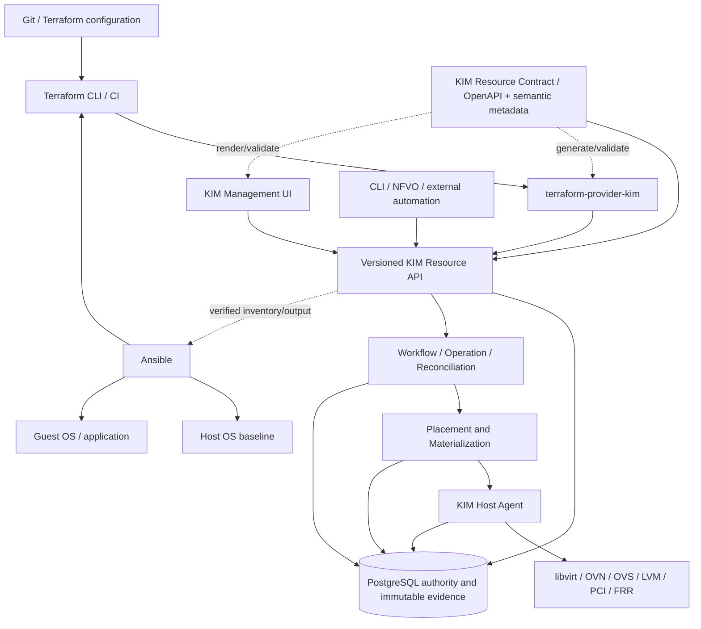
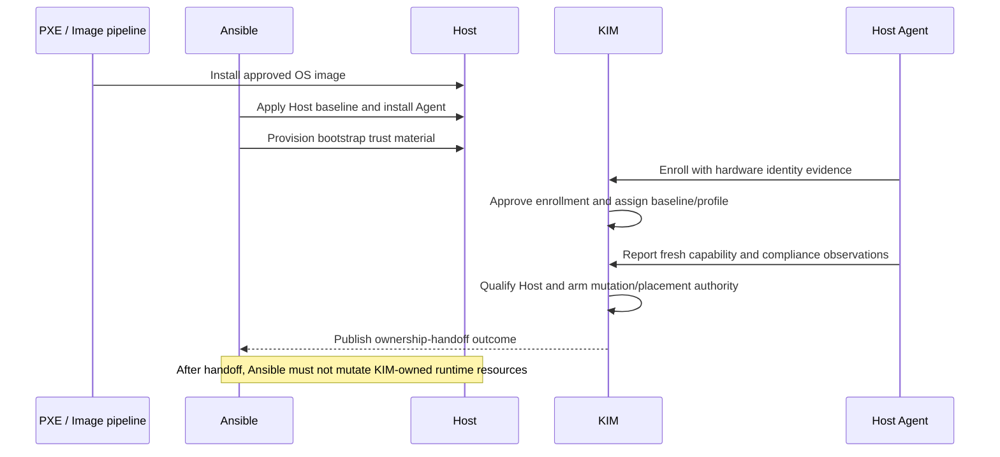

# Infrastructure Lifecycle and IaC Architecture

- 状態: Proposed
- 更新日: 2026-08-15
- 対象: Terraform、Ansible、KIM Northbound API、管理 UI、Host lifecycle handoff

## 1. 目的

本書は KIM を IaC-first な KVM Infrastructure Control Plane として利用するための将来設計 SSOT です。Terraform、Ansible、管理 UI、KIM、Host Agent、各 backend の責務を分離し、同じ resource lifecycle contract から API、Terraform Provider、UI を構成します。

`Current` は repository で確認できる現状、`Proposed` は実装前に ADR、API contract、security review、qualification が必要な目標を表します。Migrations 073–076 の Project、Flavor、SYSTEM Availability Policy、Image と Migration 081 が接続する Network、Subnet、unattached Port、backend-neutral Volume は Northbound API / Terraform Providerまでqualifiedです。VM aggregate、UI、Router/Floating IP、Security Policy は引き続きproposedまたはblockedです。

## 2. 中核原則

### 2.1 Authority の所在

1. KIM の PostgreSQL current authority と immutable evidence が managed infrastructure の正本です。
2. Terraform configuration は利用者が宣言した desired intent、Terraform state は client-side mapping/cache です。どちらも KIM の runtime authority ではありません。
3. Ansible は Host baseline と guest OS/application convergence を担当します。KIM resource の current authority を直接変更しません。
4. UI、Terraform Provider、CLI、外部 automation は同じ versioned Northbound Resource API を使用します。
5. libvirt、OVN、OVS、LVM、PCI、FRR 等の backend observation は KIM が検証して採用する evidence であり、backend 自体を Northbound resource authority にしません。

### 2.2 IaC-first

永続的な利用者 intent が Terraform の resource として自然に表現できない場合、まず KIM resource model と lifecycle contract を再検討します。UI 専用の隠れた永続モデルや、Provider 内だけの lifecycle semantics は作りません。

例外は、read-back、diagnostic、recovery、evacuation、retry、cancel request 等の時間を持つ administrative operation です。これらは resource desired state と分離した Operation として扱い、Terraform resource に擬装しません。

### 2.3 Desired identity と physical incarnation の分離

利用者が宣言する logical identity と、KIM が Placement/Materialization で決める physical realization を分離します。

```text
logical requirement != physical realization
logical Port identity != Host datapath incarnation
persistent resource != long-running operation
Terraform state != KIM authority
backend success response != verified convergence
```

次の値は原則として computed/read-only です。Terraform configuration、UI export、drift ownership の対象にしません。

- current Host、exact pCPU、NUMA node、HugePage allocation
- OVS-DPDK PMD core、RxQ、vhost-user socket path、Host interface name
- OVS UUID、OVN binding/materialization generation
- PCI BDF、VF/PF physical identity、IOMMU group
- Local LVM VG/LV UUID、device path、storage attachment incarnation
- Placement Admission、Materialization、Recovery、EVACUATE、Cleanup の generation と evidence ID

Recovery A→B、planned EVACUATE A→B、再 Materialization によるこれらの変更は、persistent desired resource が変わらない限り Terraform drift ではありません。

### 2.4 Existing architecture invariants

本設計は既存の次の関係を維持します。

```text
Control Plane = authority
Agent = constrained actuator + observer
Backend observed state = evidence

desired state != observed realization
failure observed != failure confirmed
command success != convergence
history is immutable
```

## 3. Target Architecture



KIM Resource Contract は JSON shape だけでなく、identity、revision、mutability、replacement、computed field、asynchronous convergence、import、delete protection、authorization を含む機械可読 contract です。OpenAPI 3.1 は HTTP contract の SSOT ですが、Provider/UI generation に不足する lifecycle metadata も OpenAPI extension または同一 versioned schema package で管理します。

Project、Flavor、Availability Policy reference implementation は `api/openapi/kim-v1.json` の `x-kim-resource` と `x-kim-field-class` をSSOTとします。共通HTTP layerはauthentication、request context、JSON bound、ETag/If-Match、cursor、Problem Detailsを提供し、resource-specific service/storeがrevision、dependency、delete、consumer semanticsを保持します。

## 4. Responsibility Boundaries

| Component | 所有する責務 | 所有しない責務 |
|---|---|---|
| Ansible / PXE | Day 0 OS provisioning、package/repository、kernel/module、service、sysctl、certificate bootstrap、Host baseline、guest OS/application convergence | KIM VM/Network/Volume の current authority、Placement、runtime incarnation、Recovery decision |
| KIM | resource desired/current authority、capability inventory、Placement、Admission、Materialization、typed execution、observation、Recovery、EVACUATE、Cleanup、audit | 汎用 OS configuration management、guest application deployment、arbitrary shell execution |
| Terraform Provider | Terraform schema と KIM contract の mapping、CRUD request、Operation polling、refresh/import、diagnostic | Placement algorithm、backend access、KIM state の代替、runtime operation orchestration |
| Terraform module | reusable policy/profile composition、organization convention、resource dependency | Provider/API lifecycle semantics、hidden mutation、physical identity selection |
| UI | 同じ contract の visual authoring、operation/status表示、troubleshooting、desired configuration export | hidden resource model、backend direct mutation、computed incarnation の desired 化 |
| Host Agent | typed command execution、local inventory/observation、immutable attempt/result evidence | Northbound principal、arbitrary API payload の実行、resource policy decision |
| Backend | effect と observed fact の提供 | KIM resource identity、Tenant authorization、terminal decision |

### 4.1 KIM の target resource surface

KIM は最終的に次を logical resource、policy/profile、または KIM-internal authority として表現します。すべてを同じ種類の Terraform resource にするという意味ではありません。

- VM、Image、Flavor、Volume、Volume Attachment、Storage Class
- Project、Site、Host Group、Placement Pool、Failure Domain、Availability/Resilience Policy
- Network、Subnet、Port、Router、Floating IP、Security Policy
- STANDARD、HIGH_PERFORMANCE、DIRECT_IO の Datapath Profile
- CPU pinning、NUMA、HugePages、PMD/RxQ、vhost-user、PCI/SR-IOV の logical requirements
- OVN/OVS/OVS-DPDK realization policy、FRR、BGP/OSPF/IS-IS/BFD、VRF/route-policy intent
- Placement、Admission、Materialization、Recovery、EVACUATE、Cleanup の operation/evidence

physical Host resource の exact selection は Placement と Materialization が行います。Provider や UI が Host-local UUID/path/BDF を arbitrary に指定する interface は設けません。例外的な pinning が必要な場合も、公開面では stable capability/affinity policy として表し、physical binding は KIM authority とします。

## 5. Day 0 Bootstrap and Ownership Handoff

### 5.1 Flow



### 5.2 Handoff contract

Handoff は単なる Agent 接続成功ではありません。最低限、stable Host identity、Enrollment approval、current trust credential、assigned baseline/profile、fresh capability inventory、required compliance result、Host authority generation が KIM に存在し、Host が明示的な managed state へ遷移した時点です。

Handoff 後の ownership は次のとおりです。

- Ansible は OS package、kernel、service、sysctl 等の baseline を管理できます。ただし変更前に Maintenance/Compliance contract を満たします。
- KIM が所有する libvirt domain、OVS/OVN binding、LVM attachment、PCI binding、FRR realization、Agent journal を Ansible が直接修復しません。
- Ansible が runtime drift を検出した場合は KIM API へ observation/remediation request を提出し、fresh KIM observation と policy evaluation を待ちます。
- Host の reprovision/decommission は KIM の drain/fence/decommission authority を先に取得し、PXE/Ansible の完了 claim だけで KIM current authority を消しません。

### 5.3 Capability enablement and resource ownership

Ansible は capability を使用可能な Host baseline に収束させ、KIM は qualification 済み capability を resource として所有・配分・制御します。

Ansible-managed baseline の例は OS install/upgrade、package repository、user/SSH/sudo、NTP/resolver、logging、monitoring agent、generic security/certificate/trust/kernel/sysctl/filesystem/systemd baseline、required package、KIM Host Agent install/enrollment bootstrap です。OVS、DPDK、FRR package の install と service prerequisite もここに含められます。

KIM-owned runtime の例は exact pCPU/NUMA/HugePages/PMD/RxQ claim、vhost-user Port、OVS-DPDK resource、OVN realization、BGP peer/VRF/route-map、VF workload assignment、storage allocation/attachment です。Ansible はこれらを package installation の延長として直接構成しません。

## 6. Terraform Architecture

### 6.1 Provider と module の分離

`terraform-provider-kim/` は versioned KIM Resource API の thin lifecycle clientとして、Project、Flavor、closed SYSTEM Availability Policy、Imageに加えて、Phase 2のNetwork、Subnet、unattached Port、backend-neutral Volumeを公開します。Migration 081とpublic serviceはRBAC/idempotency/audit/OpenAPI/list/import/Operation projectionを提供し、Providerはverified terminalまでOperationをpollします。Provider は KIM の Placement、Recovery、evidence verification を再実装しません。VM、Port attachment、Router/Floating IP、Volume resize/Cephは引き続き未公開です。VMの次期aggregate contractは [VM Aggregate Resource Architecture](vm-aggregate-resource-architecture.md) に定義します。

Terraform module は organization の標準 VM、network、storage、availability、datapath profile の組み合わせを提供できます。module は physical Host identity、LV UUID、PCI BDF 等を入力に要求せず、Provider の lifecycle rule を上書きしません。

### 6.2 State boundary

Terraform state に保存してよいものは、KIM stable resource ID、last-read resource revision、利用者 desired fields、API が明示した computed outputs、関連 Operation ID 等です。credential、raw guest content、backend secret、immutable evidence body は保存しません。

`terraform refresh` は KIM Resource API の current projection を読みます。backend を直接読まず、KIM DB と矛盾する backend fact を独自採用しません。KIM の verified observation が更新されるまで eventual consistency を diagnostics として表示できますが、Provider が authority を推測しません。

### 6.3 Drift semantics

Terraform drift の対象は、利用者が管理する persistent desired fields と resource existence/revision です。次は drift ではありません。

- scheduler が選んだ Host または exact resource binding の変更
- Recovery/EVACUATE による destination Materialization
- retry/Lease/Attempt/Command/Observation generation の変更
- reconciler が同一 desired state へ収束させるための一時 state
- computed capacity、health、compliance、power observation の更新

UI または別 client が desired fields を変更した場合は実 drift です。`ETag`/`If-Match` と revision を使って silent overwrite を拒否します。UI は Terraform-managed metadata がある resource に warning を表示できますが、その metadata は authority ではなく audit/coordination hint です。管理主体を移す場合は import、state removal、または明示 handoff を行います。

### 6.4 Plan and apply

- `plan` は schema、reference、permission、known policy constraints を検証できます。
- `plan` は final Host、pCPU、BDF、LV UUID、Admission を予約または保証しません。
- dry feasibility を data source として公開する場合、snapshot revision、expiry、non-reserving nature を表示し、apply-time Final Admission を置き換えません。
- `apply` は Idempotency-Key を付けて desired mutation を行い、返された Operation を追跡します。
- client timeout/connection loss は Operation failure や rollback を意味しません。Provider は同じ idempotency identity と resource/Operation read-back で再収束します。
- Provider timeout 時に backend を直接 cancel、delete、recreate しません。

### 6.5 Import and replacement

Import は KIM stable resource ID を受け、Read API から desired/computed fields を再構築します。backend-only object を KIM resource として暗黙 adopt しません。

immutable field の変更が replacement を必要とするか、in-place asynchronous transition を許すかは KIM contract が宣言します。Provider の `ForceNew` 相当 rule を手書きで発明しません。replacement は create-before-destroy、delete protection、dependent resource、capacity double-booking の可否を resource ごとに contract 化します。

### 6.6 Phase 1 runtime profile

Phase 1 ProviderはTerraform Plugin Framework v1.19.0を使用し、Bearer automation token、TLS trust、request timeout、Problem Details、ETag/If-Match、cross-process Create idempotency、authorized refresh、contract importを共通clientへ集約します。provider `client_id`とresourceごとのwrite-only `client_reference`からstable Idempotency-Keyを再構成し、KIMがcanonical desired digestへbindします。display nameはrecovery identityではなく、client referenceもKIM resource authorityではありません。Imageだけはmetadata commit後にseparate ingestion Operationを作り、`UNKNOWN`をnon-terminalとしてverified `SUCCEEDED`までbounded pollします。Operation/Attempt/evidence identityはresource stateへ保存しません。

Terraform CLI acceptanceはlocal filesystem mirrorからprovider binaryをロードし、実HTTP KIM handlerとPostgreSQL 17へ接続します。Phase 1はProject/Flavor/Availability/Image、Phase 2はNetwork/Subnet/unattached Port/backend-neutral Volumeについてcreate、no-op、revision update、remote drift、stale ETag fail-closed、import no-op、destroy、async read-back、physical-state非漏洩を検証済みです。VMおよびproduction Registry releaseはqualifyしていません。

## 7. Persistent Resource and Operation Separation

### 7.1 Persistent resources

Terraform resource に適するものは、stable identity、利用者 desired state、read/update/delete semantics を持ち、複数 session を越えて存続する対象です。例は VM、Network、Port、Volume、Security Policy、Placement Policy、Datapath Profile です。

### 7.2 Operations

Operation は時間を持つ execution authority であり、進行状態、terminal outcome、retryability、evidence link を持ちます。例は次です。

- VM create/update/delete の materialization operation
- power action、snapshot、image import
- Host drain、Recovery、EVACUATE、Cleanup
- enrollment verification、compliance evaluation、typed remediation
- diagnostic collection、read-back、explicit retry/cancel request

Terraform は resource mutation に付随する Operation を待てますが、Operation 自体を永続 desired resource として管理しません。管理者が開始する one-shot action は専用 action API、CLI/UI workflow、または明示的な operation data source で扱い、通常 resource の field toggle にしません。

### 7.3 Delete semantics

Delete request は即時 backend deletion と同義ではありません。API は delete Operation と deleting/tombstone projection を返し、dependency、protection、fencing、cleanup verification を完了して terminal にします。Provider は verified terminal outcome または contract-defined not-found/tombstone を確認するまで state から resource を除去しません。

## 8. Resource Lifecycle Contract

すべての Terraform 対象 resource は実装前に次の contract を持たなければなりません。

### 8.1 Identity and revision

- globally/stably addressable な KIM resource ID と scope
- create-time client token/idempotency identity
- monotonic resource revision/generation と `ETag`
- display name と identity の分離、rename semantics
- parent/project/site ownership と authorization inheritance
- tombstone、retention、ID reuse prohibition

### 8.2 CRUD and convergence

- Create/Read/Update/Delete の availability と非対応理由
- create/update/delete の idempotency scope と retention
- synchronous validation と asynchronous Operation の境界
- accepted、in-progress、converged、failed、operator-action-required の状態
- read-after-write guarantee と current/desired/observed projection の区別
- partial failure、compensation、retry、cancel の意味
- terminal outcome 後も保持する immutable evidence/reference

### 8.3 Field behavior

各 field は最低限、required/optional、default、mutable、immutable、replace-triggering、computed、sensitive、write-only、deprecated のいずれかを機械可読に宣言します。

computed physical incarnation を `ignore_changes` で隠す設計にはしません。そもそも desired schema に入れず read-only status/reference として返します。backend raw config、arbitrary XML、shell、device path を persistent public field にしません。

### 8.4 Concurrency, import, and drift

- stale `If-Match` を `412 Precondition Failed` で拒否
- internal allocation conflict と client revision conflict の分類
- stable ID import と non-adoptable resource の明示
- desired drift、computed observation change、operation progress の分類
- external deletion、degraded/orphaned、quarantined state の refresh mapping
- remote change を overwrite せず plan に提示する rule

### 8.5 Dependencies and deletion protection

- strong/weak reference と lifecycle ordering
- delete protection、retention、legal/audit hold
- dependent resource conflict と cascade 非対応の明示
- create-before-destroy の可否と一時 capacity/quota requirement
- cross-resource transaction が必要な操作の aggregate API

### 8.6 Collection and compatibility

- cursor pagination、stable sort key、documented filters
- field selection と permission-aware existence hiding
- API/resource schema version、feature gate、deprecation
- unknown enum/field に対する client behavior
- Provider/KIM compatibility range と release manifest

### 8.7 Security contract

- OIDC principal/service principal、scope、action、resource、attribute authorization
- secret reference と secret value の分離
- audit actor、request ID、idempotency identity、change source
- Tenant に開示可能な desired/computed field と redaction
- impersonation/delegation と break-glass operation の別 contract

### 8.8 Retry and eventual consistency

- retryable/non-retryable error
- server retry hint、rate limit、backoff/jitter
- response loss 後の read-back key
- Operation polling/event stream と timeout behavior
- status projection の staleness/freshness metadata
- server DB time を authority とし、client clock を Lease/expiry authority にしない rule

### 8.9 Stable error taxonomy

| Class | HTTP example | Provider behavior |
|---|---:|---|
| Validation / unsupported field | 400 / 422 | configuration diagnostic。自動 retry しない |
| Unauthenticated / forbidden | 401 / 403 | credential/scope diagnostic。存在秘匿時は 404 を尊重 |
| Not found / tombstone | 404 / 410 | contract に従い external deletion、retention、terminal delete を区別 |
| Stale revision | 412 | refresh して conflict を plan に提示。silent retry update しない |
| Allocation/dependency conflict | 409 | stable code と retryability に従う。arbitrary recreate しない |
| Protected / policy denied | 409 / 423 | protection/policy reference を診断し、明示解除を要求 |
| Quota/capability unavailable | 409 / 422 | requirement と candidate exclusion summary を表示 |
| Operation uncertain / response lost | 202 / 409 / 503 | Operation/resource read-back first。同じ key で収束 |
| Rate limited / unavailable | 429 / 503 | `Retry-After` と bounded backoff を使用 |
| Internal error | 500 | request ID を保持し、backend detail/secret を表示しない |

RFC 9457 Problem Details に stable KIM error code、retryable、resource/operation reference を加えます。Provider は message text を解析して lifecycle decision を行いません。

## 9. UI Architecture and Terraform-compatible Authoring

UI は別の resource model を持たず、KIM Resource Contract から form、validation、field mutability、computed status、operation display、permission を構成します。

### 9.1 Modes

- Interactive mode: API mutationを即時要求し、Operation の進行と verified outcome を表示します。
- IaC authoring mode: desired fields を編集し、Terraform HCL/module input として export します。KIM を変更しません。
- Troubleshooting mode: desired/current/observed/Operation/evidence の関係を表示します。backend direct mutation を提供しません。

### 9.2 Export equivalence

UI export は stable logical resource ID/reference、利用者 desired fields、explicit policy/profile selection だけを含めます。computed physical incarnation、credential、evidence ID、temporary Operation state、backend path は除外します。

同じ schema version で `UI desired model → Terraform export → Provider plan` が semantic no-op になることを contract test で保証します。field default、set ordering、unit、null/absent、reference syntax の canonicalization を共通 schema で定義します。

UI は HCL を唯一の保存形式にせず、Terraform module の arbitrary expression を完全 round-trip できると主張しません。既存 HCL の構文保持/editing は Terraform toolchain の責務です。UI は KIM desired model の等価な export と import preview を提供します。

## 10. Ansible End-to-End Workflow

Ansible は全体 workflow の orchestration shell として次を実行できますが、各 authority boundary を維持します。

1. PXE/OS install 後に Host baseline と KIM Host Agent を配備する。
2. Enrollment request を開始し、KIM Agent/readiness、approval、capability qualification outcome を待つ。
3. `terraform init` と `terraform plan` を実行し、review/approval 後に `terraform apply` する。
4. Terraform は KIM API へ persistent desired state を送り、KIM が Placement、Network/Storage/VM Materialization、read-back verification を完了する。
5. Terraform/KIM の verified outputs から guest inventory を生成する。
6. guest 到達性と identity を検証して guest OS/middleware/application role を converge する。
7. application health を外部 workflow result として記録する。

Terraform apply より前に guest inventory を static physical Host/IP/BDF から組み立てません。Recovery/EVACUATE 後は KIM の logical Port/IP/VM identity から inventory を refresh し、physical Host 変更を application drift と扱いません。

Ansible の task success は KIM materialization、power、network、storage、compliance の verified authority を代替しません。逆に KIM は guest application convergence を inferred success にしません。

## 11. Security Policy Abstraction

Security Policy は backend-independent な Project scope resource とし、subject selector、direction、protocol、port range、remote selector/address set、action、priority、logging policy、revision を logical intent として持ちます。

Proposed initial compiler は Security Policy を OVN ACL、Port Group、Address Set へ materialize します。compiler revision、input policy revision、target network/port set、generated OVN identity、apply/read-back verification を KIM evidence として保持します。UI/Provider は raw OVN match/action syntax を通常 resource field として公開しません。

将来、hardware ACL、external firewall、service insertion 等の backend を追加する場合も同じ logical policy から capability-aware に compile します。ただし複数 backend の semantic intersection、ordering、stateful behavior、failure atomicity は未設計です。初期 OVN target の semantics を他 backend が満たせない場合、silent degradation せず Placement/materialization または policy apply を拒否します。

## 12. Recovery, HA, and EVACUATE Implications

- Recovery/EVACUATE は KIM-internal Operation であり、Terraform が destination Host を選び直しません。
- source/destination Admission、materialization generation、network/storage/PCI binding は immutable historical evidence と current projection で追跡します。
- logical VM、Port、MAC、IP、Volume role、Security Policy の stable identity は維持します。
- destination realization が verified terminal に達する前に Provider/UI が desired convergence を成功と表示しません。
- Recovery terminal 後の Terraform refresh は同じ logical resource ID と desired fields を返し、新 Host/LV/BDF 等を computed status として更新します。
- cleanup と capacity reclamation は relocation/recovery success と別 Operation です。Terraform resource existence を cleanup 完了に依存させません。

## 13. Security and Trust Boundaries

- Northbound User/Service Principal、Host Agent mTLS identity、backend credential を別 trust domain とします。
- Terraform Provider は Northbound token だけを使用し、Host Agent/backend credential を受け取りません。
- UI backend は user delegation と CSRF/session protection を適用し、browser に long-lived infrastructure credential を置きません。
- Ansible bootstrap credential は Enrollment 後の Host runtime credential と分離し、短寿命化・失効可能にします。
- Provider/UI/Ansible は PostgreSQL、internal Message Bus、Host Agent internal endpoint を直接利用しません。
- KIM API は tenant boundary、attribute authorization、field redaction、request audit を resource と operation の両方へ適用します。
- Terraform plan/state/log、Ansible output、UI diagnostics に secret、raw guest content、private key、backend credential を出しません。

## 14. Observability and Audit

最低限、次を correlation 可能にします。

- actor/service principal、request ID、Idempotency-Key、Terraform run/workspace hint、UI session action
- resource ID/revision、desired change digest、Operation ID/generation、terminal outcome
- Placement/Materialization/Recovery/EVACUATE の decision/evidence link
- API latency/error、Operation queue/duration/retry/unknown、Provider polling/timeout/read-back
- Host enrollment/handoff/compliance status、Ansible external remediation reference
- Security Policy compiler revision、target count、apply/read-back mismatch

Terraform workspace/run metadata は audit hint であり authorization/authority に使用しません。Volume ID、VM ID 等の high-cardinality identity を metrics label にせず、trace/log/audit record へ置きます。

## 15. Current vs Proposed

| Area | Current repository state | Proposed target |
|---|---|---|
| Northbound API | Project/Flavor/SYSTEM Availability/Image/Network/Subnet/unattached Port/backend-neutral VolumeのCRUD/list、RBAC、ETag/If-Match、idempotency、Problem Details、cursor、audit、OpenAPIがMigration 081までで実装 | VM aggregate、Router/Floating IP、Security Policyをauthority gap closure後に追加 |
| Resource persistence | Phase 1/2 logical resourcesはpublic contractまで実装。VMはinternal runtime/Placement/materialization authorityのみ | VM logical revision/dependency snapshot/aggregate terminalを追加 |
| Terraform | ProviderがPhase 1/2の8 resourceでCRUD/import/Operation pollingを実装 | `kim_vm`、official modules、registry release |
| UI | product UI resource editor/runtime console は未実装 | common contract に基づく interactive、authoring、troubleshooting UI |
| Host lifecycle | Enrollment、identity、capability、compliance、typed convergence の architecture と authority がある | PXE/Ansible から KIM への machine-readable handoff API/status |
| Ansible boundary | KIM は generic configuration management ではなく external remediation を検証する方針がある | supported collections/workflow contract と禁止 mutation surface |
| Physical realization | Placement/Materialization/Recovery/EVACUATE の内部 authority に exact identity/generation がある | public desired schema から physical incarnation を一貫して排除 |
| Network dataplane | OVN/OVS と一部 authority が存在。DPDK/FRR/Direct-I/O の target は別設計で Proposed | profile/policy resources と capability-aware realization |
| Security Policy | API/resource architecture 上の概念はあるが、current persistence/compiler authority は確認できない | backend-independent resource と OVN compiler/read-back |
| Project | first-class stable ID、immutable revision/current projection、owner ADMIN binding、delete protection/dependency guard、public CRUD/list contractが実装済み。quota/policy/tenant hierarchyは未実装 | quota/policy bindingと拡張scope model |
| Flavor | Project-owned immutable shape revision、current projection、Placement exact-revision consumer、CRUD/list/dependency fenceが実装済み。exact pCPU/Host/NUMA realizationは非公開 | Provider import/conformanceとcatalog visibility拡張 |
| Image | logical metadataとtyped artifact ingestion/read-backを分離し、Northbound/Providerまでqualified | distribution/cache profileと追加artifact sourceを段階開放 |
| Availability Policy | closed SYSTEM non-automatic profileをNorthbound/Providerまでqualified。existing VM Bindingはexact revisionを維持 | infrastructure-managed authoringとadditional scopeはsubordinate policy gap closure後に追加 |

## 16. Capability Gaps Before Implementation

### 16.1 Phase 3 VM aggregate API

- immutable logical VM revision/current/tombstone authority
- exact dependency snapshotとruntime intent generation
- existing Placement/Materialization/Power terminalを束ねるaggregate verification
- Recovery/EVACUATE後のlogical association/no-drift projection
- safe delete quiescence/detach/absence contract
- VM OpenAPI lifecycle metadata、import、common Operation projection

### 16.2 Phase 3 Provider and modules

- `kim_vm` desired/computed schemaとOperation waiter
- VM importer、timeouts、response-loss read-back、diagnostics
- Recovery/EVACUATE no-drift、concurrent desired update、partial failure tests
- official modules と version compatibility policy

### 16.3 UI schema and export

- contract-driven form/status renderer
- desired-only canonical Terraform export と semantic round-trip tests
- management-source warning、revision conflict、operation troubleshooting UX
- sensitive field redaction、permission-aware field visibility

### 16.4 Security Policy abstraction

- first-class schema/persistence/revision
- selector semantics、priority/conflict、stateful behavior
- OVN compiler、immutable decision/evidence、read-back verification
- capability failure、rollback、multi-backend future boundary

### 16.5 Host handoff and Ansible boundary

- bootstrap credential lifecycle と explicit ownership state
- supported Ansible baseline inputs/outputs、Maintenance integration
- external remediation request/result reference と fresh re-observation
- decommission/reprovision ordering と failure recovery

### 16.6 Physical detail exposure

- Phase 1/2のlogical/public DTO と internal realization DTO の分離をVM aggregateでも維持
- current internal Placement requirements に含まれる `VGUUID`、PCI/network `DeviceAddress`、`HostMappingGeneration` 等をVM public persistent desired fieldsへそのまま昇格させないreview
- Host-local path/UUID/BDF/generation の read-only projection/redaction policy
- exact pinning requirement と arbitrary physical selection の境界

### 16.7 Resource/operation separation

- action inventory と Operation cancellation/retry semantics
- Terraform waitable mutation と non-Terraform administrative action の分類
- delete/tombstone/cleanup independence

## 17. Migration Path

1. Project、Flavor、closed SYSTEM Availability Policy、ImageのPhase 1 contractを実装・qualificationする（完了）。
2. Network、Subnet、unattached Port、backend-neutral VolumeのPhase 2 contractを実装・qualificationする（完了）。
3. [VM Aggregate Resource Architecture](vm-aggregate-resource-architecture.md) のlogical revision、dependency snapshot、aggregate Operation/terminalをreviewする。
4. VM internal aggregateをzero-Port/one root/no-PCI profileから実装・qualificationする。
5. VM Northbound API/OpenAPIと`kim_vm` CRUD/import/response-lossを追加する。
6. Recovery/EVACUATE後のTerraform no-driftをqualificationする。
7. read-only status projection と UI troubleshooting viewでauthority bypassがないことを確認する。
8. UI IaC authoring/export と Provider semantic equivalence を qualification する。
9. Day 0 Ansible collection/workflow と Host ownership handoff を qualification する。
10. Security Policy、DPDK、Direct-I/O、FRR等は各authority/capability gate後に追加する。

各段階で current implementation と proposed contract の差を release note/API feature gate へ明示します。Provider/UI が未実装 authority を先に current resource として見せません。

## 18. Future Qualification Plan

Phase 1/2 resourceはvalidation reportでqualification済みです。Phase 3 VM以降も最低限、次のevidence-based qualificationを継続します。

- API contract/replay/idempotency/ETag/response-loss/error compatibility
- Provider create/read/update/delete/import、state upgrade、partial failure、timeout/read-back
- Recovery/EVACUATE/cleanup 後の no-drift と logical identity continuity
- UI export と Provider plan の semantic no-op
- UI/Provider concurrent update conflict と explicit ownership handoff
- Ansible bootstrap/enrollment/capability qualification/maintenance/decommission
- guest inventory refresh と guest convergence の authority separation
- Security Policy compile/apply/read-back/drift/rollback/tenant isolation
- secret/state/log redaction、OIDC authorization、audit correlation

## 19. Explicitly Out of Scope

- VM aggregate、Router/Floating IP、Security Policy、UIの実装
- official module、registry release の実装
- 本architecture更新だけを根拠にしたqualification gateの昇格
- Ansible collection/playbook、PXE server、OS image pipeline の実装
- Terraform state backend の選定・運用
- arbitrary HCL の完全な visual round-trip editor
- guest application lifecycle を KIM resource authority にすること
- backend direct API、arbitrary shell/XML/path/BDF を public escape hatch にすること
- OVN 以外の Security Policy backend の具体実装
- DPDK、SR-IOV、FRR、shared storage の未 qualification capability を current と宣言すること

## 20. Phase 3 Review Decisions

- boot Imageとroot Volume source authorityのexact compatibility rule
- attached Port/single-writer Volumeを含むreplacementで`create_before_destroy`を許可しないexact condition
- active Recovery/EVACUATEとdesired power/Delete競合時のstable error/action-required contract
- VM tombstone retentionとTerraform state removalのexact boundary
- physical diagnostic statusのpermission/redaction/Provider exclusion metadata
- aggregate Operation cancellation、retry、operator-action-requiredのinitial supported subset

これらは実装時に黙って決めず、必要な ADR と security/API review を行います。

## 21. Related Documents

Migration 076でImageはTerraform-safe logical resourceになりました。Migration 081まででNetwork/Subnet/unattached Port/backend-neutral Volumeもpublic contractへ接続済みです。physical incarnationはdesired driftではなく、content changeやlogical revision changeだけがresource contractに従う変更です。VM readinessはこの事実から推測せず、Phase 3 aggregate authorityを別途要求します。

- [KIM Northbound API / Terraform Readiness Review](reviews/kim-terraform-api-readiness-review-20260814.md)
- [System Architecture](architecture.md)
- [API Design Principles](api-principles.md)
- [Domain Model](domain-model.md)
- [Responsibility Boundaries](responsibility-boundaries.md)
- [Host Lifecycle and Compliance Architecture](host-lifecycle-and-compliance-architecture.md)
- [Extension Conformance](extension-conformance.md)
- [Network and Dataplane Target Architecture](network-dataplane-target-architecture.md)
- [Network Resource Architecture](network-resource-architecture.md)
- [VM Aggregate Resource Architecture](vm-aggregate-resource-architecture.md)
- [Placement Architecture](placement-architecture.md)
- [Execution Architecture](execution-architecture.md)
- [Data Persistence Architecture](data-persistence-architecture.md)
- [Upgrade and Compatibility Architecture](upgrade-and-compatibility-architecture.md)
