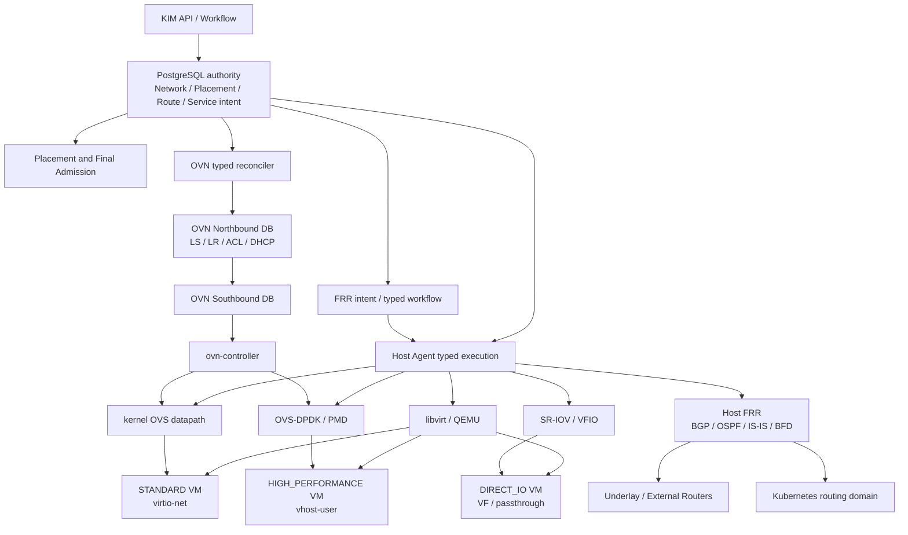

# Network and Dataplane Target Architecture

- 状態: Proposed Target Architecture
- 更新日: 2026-08-13
- 対象: KIM の次期 Network、Routing、Dataplane、Direct-I/O 設計
- 変更範囲: 設計文書のみ。Migration、実装、Qualification gate は追加しない

## 1. 目的と文書 authority

本書は、標準 VM、高性能 VM、Direct-I/O VM を同じ KIM Network identity model で扱いながら、Host 上の realization を workload profile ごとに分離する将来設計です。実装時に Network、Placement、Materialization、Recovery、EVACUATE が共有する target contract を一か所にまとめます。

本書は [ADR-0012](adr/0012-nfv-dataplane-resource-model.md) と [ADR-0020](adr/0020-kim-network-intent-and-layered-realization.md) の Accepted decision を変更しません。両 ADR と既存 Requirements に一致する部分は target implementation の設計 SSOT として扱います。Host FRR、Kubernetes Route Reflector、formal workload profile、route exchange authority は新しい提案です。irreversible な実装を始める前に Accepted ADR と検証可能な Requirements へ昇格させます。

本書で `current` は Migration 001–072 と commit `ecc45e419343922cb266b1cf5720da216a338d3f` の repository 実装、`proposed` は将来の target architecture を意味します。backend capability を実装・qualification せずに `proposed` を current capability として公開してはいけません。

## 2. 設計原則

1. `logical requirement != physical realization` とする。
2. logical Port、MAC、IP、Network、Subnet identity は datapath profile に依存させない。
3. logical Port identity と Host datapath incarnation を別 generation、別 evidence とする。
4. Placement が exact capability と capacity を決定し、Materialization が選択済み Host resource を実現する。
5. Recovery と EVACUATE は logical identity を維持し、destination に新しい physical realization incarnation を作る。
6. source と destination の historical incarnation、handoff、retirement、observation は immutable に残す。
7. requested profile を満たせない場合に別 profile へ silent fallback しない。
8. OVN、OVS、FRR、libvirt、NIC の observed state を KIM allocation authority へ暗黙昇格させない。
9. backend response、route presence、link state、BFD down、Host lossのいずれも、単独では side effect の存在または不在を証明しない。
10. arbitrary OVSDB、FRR configuration、EAL argument、PCI address、device path、shell、argv を Tenant/API または generic Command として受け付けない。

## 3. Current vs proposed

| 領域 | Current repository | Proposed target | 移行時の扱い |
|---|---|---|---|
| logical Network authority | Migration 077でNetwork desired revision、KIM VNI/VLAN allocation、standalone OVN Logical Switch terminalを独立実装。Subnet/Portは既存foundation/Admission consumer | 全 profile で同じlogical authorityを継続しSubnet/Portを順に分離 | Network internal contract-ready、public APIは未実装 |
| OVN | Logical Switch/Port、NB/SB、Chassis/Encap、logical flow、Geneve の typed realization/observation が存在 | Logical Router、distributed L2/L3、ACL、DHCP、route exchange まで拡張 | additive |
| standard datapath | `OVS` Binding、kernel OVS、libvirt NIC、post-boot OVS observation | `STANDARD` profile として formalize | current path を profile 化 |
| high-performance datapath | ADR/Requirements のみ。active schema/backend に PMD、DPDK socket memory、RxQ、vhost-user claim はない | `HIGH_PERFORMANCE` profile、OVS-DPDK、vhost-user、exact CPU/NUMA/HugePage/PMD claims | 未実装。fail closed |
| Direct-I/O | PCI/SR-IOV inventory、qualification、claim、typed realization、retirement/handoff/Recovery authority が synthetic PASS | `DIRECT_IO` exception profile として physical Network policy、strict locality、limited mobility を formalize | real VF と EVACUATE consumer は未qualification |
| CPU/NUMA | topology/HugePage inventory と aggregate admission は存在 | exact pCPU set、guest NUMA、HugePage node、emulator、PMD/service core realization evidence | 未実装 |
| dynamic routing | FRR/BGP/OSPF/IS-IS/BFD/VRF authority は存在しない | Host FRR を protocol control-plane とし、OVN routes、K8s routes、underlay/external routes を policy 分離 | 新規 ADR が必要 |
| gateway | OVN Gateway/NAT architecture は定義済み。標準 gateway VM/FRR lifecycle は current KIM authority ではない | OVN を標準 virtual routing の中心とし、FRR を routing protocol engine に限定 | gateway VM から段階移行 |
| DHCP | KIM desired model と OVN DHCP contract は文書化。Router/DHCP/Security multi-object realization は未完 | OVN DHCP を標準 target とする | Subnet 単位の ownership handoff |
| load balancing | HAProxy は Agent Gateway qualification fixture の文脈に限られ、Tenant Network Service model はない | routing から分離した独立 Network Service | 新規 service authority が必要 |
| HA storage | Local LVM の planned data-preserving relocation は synthetic PASS。Ceph backend は未実装 | HA 対象 VM は shared/external/distributed storage を要求。Local LVM は planned mobility 中心 | current safety boundary を維持 |

repository には「FRR VM が標準 gateway である」という current authority model はありません。既存環境が FRR VM gatewayを運用している場合、それはexternal operational baselineとしてinventoryし、本書の移行対象にします。KIM-owned resourceとして暗黙adoptせず、prefix、VRF、peer、NAT/DHCP/service dependency、traffic cutover、rollbackを明示した移行authorityが成立してから、OVN中心/Host FRR modelへ段階移行します。

## 4. Target architecture



Control Plane traffic、Agent control messages、guest block transport、Tenant dataplane、routing protocol session は別 traffic class とします。通常 Agent Gateway は Command/Observation を運びますが、Tenant packet または routing packet を中継しません。

## 5. Workload and datapath profiles

### 5.1 Profile identity

Workload は immutable Flavor/Workload revision に `datapath_profile` と profile-specific constraints を持ちます。概念上の profile は次の三つです。

| Profile | Guest interface | Host datapath | Network control | Required placement shape |
|---|---|---|---|---|
| `STANDARD` | virtio-net | kernel OVS | OVN | ordinary CPU/memory、OVS mapping、overlay/provider reachability |
| `HIGH_PERFORMANCE` | virtio-net via vhost-user | OVS-DPDK | OVN | dedicated pCPU、HugePages、NUMA alignment、vhost queues、PMD/service CPU、DPDK memory、DPDK Port/RxQ |
| `DIRECT_IO` | SR-IOV VF または PCI passthrough | NIC/VF direct path。qualified representor/offload は別 capability | provider/physical Network authority。OVN policy integration は qualified profile のみ | strict pCPU/NUMA/HugePage、qualified device/IOMMU、physical Network mapping |

Profile は performance hint ではなく hard Placement requirement です。`HIGH_PERFORMANCE` が不適格な Host へ `STANDARD` を割り当てたり、`DIRECT_IO` failure を virtio-net へ変換したりしません。変更には新しい explicit Workload revision、Placement、Admission、Materialization が必要です。

### 5.2 STANDARD

`STANDARD` は一般 VM の default target です。

- logical Port、MAC/IP、Security、DHCP、Network/Subnet は KIM authority とする。
- OVN が Logical Switch、Logical Router、distributed L2/L3、Geneve overlay、ACL、DHCP desired realization を担当する。
- Host の `ovn-controller` と kernel OVS が Port Binding を実現する。
- libvirt は exact Port/Binding generation に結び付いた virtio-net NIC を定義する。
- readiness は NB、SB、Host OVS、libvirt NIC の required evidence set から導出する。
- throughput/latency は qualification profile で公開するが、STANDARD を best-effort HIGH_PERFORMANCE として表示しない。

### 5.3 HIGH_PERFORMANCE

`HIGH_PERFORMANCE` は OVN logical identity を維持しながら Host datapath だけを OVS-DPDK/vhost-user に変えます。

```text
VM dedicated vCPU set
  ↕ exact guest/Host NUMA mapping
NUMA-local workload HugePages
  ↕ exact materialization generation
vhost-user Port and socket identity
  ↕ queue-pair / RxQ allocation
OVS-DPDK PMD core allocation
  ↕ DPDK Port / representor generation
physical NIC NUMA locality
```

この chain は一つの eligibility shape と Final Admission claim set です。一つでも exact/current でなければ Host は不適格です。

Required resources:

- dedicated workload pCPU set。SMT sibling policy と emulator thread allocation を含む。
- guest NUMA topology と Host NUMA node mapping。
- workload HugePage size、node、page count。
- DPDK socket memory と platform reserve。
- PMD core、service/lcore pool、polling policy。
- DPDK physical/representor Port、RxQ、queue pair、vhost-user Port identity。
- vhost-user mode、multiqueue、queue count、socket owner/mode/profile。
- NIC、PMD、vhost、VM memory の NUMA locality policy。
- exact OVS/DPDK/QEMU/libvirt/driver/firmware compatibility profile。

vhost-user socket path、Linux interface name、physical CPU numberを Tenant identity にしません。KIM stable resource identityとgenerationから Host-local adapter が closed profile に従って内部導出し、observation で照合します。

### 5.4 PMD operation profiles

| Operation profile | Policy | Intended use |
|---|---|---|
| `PRODUCTION_DEDICATED_POLLING` | qualified PMD cores を workload/housekeeping から排他し、continuous polling と NUMA-local RxQ assignment を要求 | production latency/throughput workload |
| `LAB_REDUCED_POLLING` | bounded PMD sleep または reduced PMD core allocation を明示許可 | lab、functional qualification、resource-constrained development |

lab profile を production support levelへ昇格させません。PMD sleep、core count、rebalance policy は versioned profile であり、arbitrary EAL/OVSDB value ではありません。profile change が `ovs-vswitchd` restart を必要とする場合は Host impact set、drain、maintenance authority、rollback/read-back を持つ disruptive operation とします。

### 5.5 DIRECT_IO

`DIRECT_IO` は物理 NIC または device を VM が直接扱う必要がある例外 profile です。

- binding mode は少なくとも `SRIOV_DIRECT` と `PCI_PASSTHROUGH` を区別する。
- physical Network/physnet、VLAN、MTU、PF/VF capability、link policy を explicit requirement にする。
- VF/device は current observation、qualification profile、validated operation set、IOMMU group、NUMA、driver、firmware generation に bindする。
- source physical BDF は portable workload identity ではない。destination は ordinary Placement で別の qualified VF/device claim を取得する。
- OVN ACL/DHCP/overlay が direct pathへ適用されると推測しない。representor/switchdev/hardware offload を使用する場合は独立した qualified binding profile と evidence contract を要求する。
- anti-spoof、VLAN、rate policy の enforcement point を PF/VF、representor、physical switch のどこに置くか profile ごとに固定する。
- live mobility は capabilityとして別途証明されない限り `none` とする。planned cold move または fenced restart だけを許可できる。

## 6. Network identity and realization model

### 6.1 Stable logical identity

次は profile 間、Recovery、EVACUATE で維持する logical identity です。

```text
Network / Network generation
Subnet / Subnet generation
Port / Port generation
MAC Claim / IP Claim
Security Policy reference
DHCP Profile reference
Route attachment intent
```

同じ Port が別 Host へ移動しても、IP/MAC を新規 allocation へ置き換えません。identity release は current Binding、OVN、Host datapath、NAT/DHCP/Security reference の verified absence と quarantine policy を必要とします。

### 6.2 Host realization incarnation

profile ごとに新しい physical realization を作ります。

```text
PortBinding
├─ binding ID / generation
├─ datapath profile / binding mode
├─ Host authority / capability / inventory generation
├─ OVN chassis and intent generation
├─ libvirt NIC incarnation
├─ kernel OVS interface incarnation, or
├─ vhost-user / PMD / RxQ incarnation, or
└─ VF / PCI / representor incarnation
```

Port handoff は source/destination binding generation と exact profile を保持します。destination realization成功はsource absenceを意味しません。source retirement と cleanup は別 authority で進め、logical Port historyを削除しません。

### 6.3 Layered status

最低限、次の状態を独立させます。

| Layer | 証明するもの |
|---|---|
| `INTENT_COMMITTED` | KIM logical authority と claims が commit 済み |
| `OVN_NB_APPLIED` | exact OVN desired objects を NB で観測 |
| `OVN_SB_REALIZED` | exact chassis/datapath/flow realization を SB で観測 |
| `HOST_PROGRAMMED` | profile-specific Host resource を観測 |
| `GUEST_ATTACHED` | exact libvirt/QEMU device incarnation を観測 |
| `ROUTE_PROTOCOL_CONVERGED` | exact FRR protocol/policy generationを観測 |
| `DATAPLANE_VERIFIED` | qualified probe/telemetry が exact generation と一致 |

上位状態を下位状態から推測しません。例えば BGP Established は Tenant packet reachability、SB realized は PMD polling、VM RUNNING は guest interface readiness を意味しません。

## 7. Host roles

Host role は HostGroup/Baseline/Capability の組合せで表し、OS 名や display label だけで決めません。

| Host role | Required capabilities | Prohibited inference |
|---|---|---|
| `COMPUTE_STANDARD` | KVM/libvirt、virtio-net、kernel OVS、ovn-controller、required overlay/provider mapping | DPDK capabilityを持つとはみなさない |
| `COMPUTE_HIGH_PERFORMANCE` | STANDARD base、OVS-DPDK、HugePages、isolated pCPU、PMD/service cores、vhost-user、qualified NIC locality | STANDARD Hostへfallbackしない |
| `COMPUTE_DIRECT_IO` | qualified PCI/SR-IOV/IOMMU、physical Network mapping、strict locality | VF discoveryだけでassignment capabilityにしない |
| `NETWORK_EDGE` | OVN gateway realization、Host FRR、external/underlay attachment、routing policy profile | general Compute placementを暗黙許可しない |
| `K8S_ROUTE_REFLECTOR` | dedicated FRR routing domain、RR policy、peer/auth profile、route scale capability | Tenant VM route domainと同一RIBへ無条件混在させない |

一つの Host が複数 role を持つ場合も claims と failure/maintenance impact set を合成します。production では `NETWORK_EDGE` と `K8S_ROUTE_REFLECTOR` の failure domain、CPU reserve、upgrade wave を Compute workload と別に管理することを推奨します。

## 8. OVN, OVS, OVS-DPDK, and FRR boundaries

| Component | Owns / realizes | Does not own |
|---|---|---|
| KIM PostgreSQL | Project ownership、Network identity、IP/MAC/Segment claims、PortBinding、Route/Service intent、Placement、generations | backend runtime truthそのもの |
| OVN | Logical Switch/Router、distributed L2/L3、Geneve overlay、ACL、DHCP、logical route realization | KIM ownership、physical routing protocol session、underlay lifecycle |
| kernel OVS | STANDARD Host packet forwarding、tunnel/Port realization | logical Network allocation、BGP policy |
| OVS-DPDK | HIGH_PERFORMANCE PMD/vhost/DPDK Port datapath | workload profile authority、physical route policy |
| FRR | BGP、OSPF、IS-IS、BFD、RIB/FIB protocol realization、route-policy application | Tenant Network ownership、OVN object authority、K8s object authority |
| physical Network/WIM | switch/router/fabric/WAN lifecycle、external capacity | KIM VM/Port/Claim authority |

FRR を標準 gateway VM の代替となる monolithic Network appliance にしません。標準 virtual routing、NAT、DHCP、ACL は OVN 中心とし、FRR は Host 上の physical/underlay/external routing protocol control-plane とします。centralized service appliance が必要な機能は別 Network Service として明示します。

ここで OVN が virtual Network を「担当する」とは、KIM の versioned intent に対する backend desired/realization/observation authorityを持つという意味です。Project ownership、logical identity、allocation、Admission の System of Record は既存 ADR-0020 どおり PostgreSQL の KIM authority に残します。OVN NB/SB row を discovery しただけで KIM Networkを作成またはadoptしません。

## 9. FRR and route exchange authority

### 9.1 Conceptual model

```text
RouteSourceSnapshot
├─ source domain: OVN | K8S | UNDERLAY | EXTERNAL
├─ source identity / generation
├─ address family / VRF
├─ prefix and bounded attributes
└─ observation digest / freshness

RouteExchangePolicy
├─ import/export direction
├─ source/destination routing domain
├─ prefix filters
├─ route-map policy revision
├─ community tagging/filtering
├─ maximum-prefix / default-route policy
└─ loop prevention / ownership marker

FRRRealization
├─ Host / FRR instance / generation
├─ VRF / protocol / neighbor group
├─ exact policy digest
├─ apply attempt / response state
└─ protocol and RIB/FIB observations
```

backendで学習した route をそのまま KIM authority にしません。KIM は source generation と policy revision から exact import/export intent を生成し、closed FRR adapter が apply/read-back します。FRR configuration response loss は same Host/VRF/protocol/policy digest を read-backして解決し、反対 operation を推測実行しません。

Host FRR mutation/observation は通常 Agent session、Host authority、typed Command/Lease/Attempt を通します。Control Plane が Host FRR socket、configuration file、CLIへ直接接続する product pathは作りません。OVN dynamic routing integrationは、exact OVN route source snapshotと`RouteExchangePolicy`を介して FRR import/export intentへ変換します。OVN-native mechanismまたは明示adapterのどちらを採用するかは support profileと将来 ADRで固定し、unbounded route scrapingや`redistribute`の暗黙設定に依存しません。

### 9.2 Protocol responsibilities

- BGP: external/underlay peer、Kubernetes node/pod/service route、OVN prefix の policy-controlled exchange。
- OSPF / IS-IS: certified underlay profileで必要な内部 reachability。KIM Tenant route authorityとして使用しない。
- BFD: bounded liveness observation と protocol convergence input。単独で Host fencing、Port release、Recovery success を決定しない。
- route-map / prefix-list / community: domain間のexport/import boundary。arbitrary text configurationではなくversioned policy schemaから生成する。

## 10. Kubernetes BGP Route Reflector integration

Kubernetes routes、OVN routes、underlay/external routes は同じ FRR processを使える場合も別 routing domain として扱います。

推奨分離:

| Domain | VRF/RIB boundary | Community namespace | Default export |
|---|---|---|---|
| Kubernetes cluster routes | clusterまたはcluster-group単位 | K8s ownership、cluster ID、route class | deny unless explicit |
| KIM OVN routes | OVN external/provider domain単位 | KIM Network/route class | deny unless explicit |
| Underlay infrastructure | infrastructure VRF | fabric/site/role | Tenant prefix export禁止 |
| External/WAN | provider/customer VRF | provider policy | explicit allow-list only |

Route Reflector は next-hop または workload ownershipを引き受けません。RR client set、cluster ID、AFI/SAFI、peer credential、maximum-prefix、graceful restart policy、route-policy generationを immutable authorityへbindします。

domain間 route leak は `RouteLeakPolicy` 相当の explicit authority を要求します。少なくとも source/destination VRF、prefix class、direction、community rewrite、next-hop policy、maximum routes、owner、revision、expiry、observationを固定します。`redistribute connected`、default route、service CIDR、pod CIDR の無条件相互redistributionは禁止します。

Kubernetes API/CRD が desired route sourceである場合も、KIM が Kubernetes object lifecycleを所有するとみなしません。external controller の snapshot/claim を generation、freshness、cluster identity とともに取り込み、accepted policyから FRR intentを生成します。

## 11. DHCP and Network Services

### 11.1 DHCP migration target

SubnetのIP allocation authorityは引き続き KIM が所有し、DHCP packet deliveryの標準 targetを OVN DHCP とします。

移行は Subnet 単位で行います。

1. current DHCP owner、options、reservation、lease observation boundaryをsnapshotする。
2. OVN DHCP intentを新 generationとしてplanする。
3. external DHCP と OVN DHCP の同時 authoritative servingを防ぐhandoffを実行する。
4. NB/SB/packet deliveryをread-backし、guest lease observationとKIM IP Claimを分離する。
5. old DHCP realization absenceを検証してからretireする。

DHCP timeout、guest lease欠損、OVN response lossでIP/MACを別 Portへ再割当しません。

### 11.2 HAProxy as an independent Network Service

HAProxy は routing protocol、virtual router、Host FRR の一部にしません。将来の Network Service は少なくとも次を別 authorityにします。

- Service/VIP identity、listener/profile revision。
- backend member identity と health observation。
- Placement、failure domain、capacity、certificate/secret reference。
- datapath profile と Network attachment。
- config generation、typed apply、read-back、drain、replacement。

BGP anycast VIP advertisementを使う場合も、HAProxy service readinessと FRR advertisement authorityを分離します。backend healthだけでroute advertisementを開始せず、route withdrawalだけでservice absenceを証明しません。

## 12. Placement and Final Admission requirements

Placement Request は logical Network requirement と datapath profile requirement を分けてsnapshotします。

Common claims:

- Network/Subnet/Port、IP/MAC、Segment、MTU、Security、DHCP、Route attachment generation。
- Host lifecycle/readiness、Agent session/capability、Host mapping、OVN chassis/overlay/provider reachability。
- compute、memory、storage、quota、Availability/Resilience policy。

Profile-specific claims:

| Profile | Additional atomic claims |
|---|---|
| STANDARD | kernel OVS mapping、virtio-net capability、required queue/MTU profile |
| HIGH_PERFORMANCE | exact pCPU/emulator set、guest/Host NUMA、workload HugePages、DPDK socket memory、PMD/service cores、DPDK Port/RxQ、vhost-user queues/binding |
| DIRECT_IO | qualified VF/PCI device、IOMMU、NUMA、PF/representor/physical Network mapping、validated operation set |

Dry evaluationはread-onlyであり、PMD core、VF、IP、Port、HugePageを予約しません。Final Admissionは同じ ruleを current generationへ再適用し、全 claimsを一つの PostgreSQL transactionでcommitします。このtransaction中に OVN、FRR、OVS、libvirt、NICへ接続しません。

ineligibility reason は bounded code と required/available summary を返し、raw BDF、CPU ID、socket path、FRR peer secret、他 Tenant routeを公開しません。

## 13. Materialization and readiness

Materialization は Final Admission が選んだ exact profile/resourcesだけを消費します。

```text
Final Admission
→ profile-specific Materialization Plan
→ OVN logical realization
→ Host datapath realization
→ libvirt device definition
→ profile-specific read-back
→ DB-derived readiness
→ power-on
→ post-boot observation
```

HIGH_PERFORMANCE の readiness は少なくとも exact pCPU/NUMA/HugePage、vhost-user、queue count、PMD/RxQ、DPDK Port/runtime generation を要求します。DIRECT_IO は exact domain hostdev、VF/device claim、IOMMU、driver/holder、physical Network policy evidenceを要求します。Command `SUCCEEDED` または VM `RUNNING` だけで Network readinessを成立させません。

## 14. HA, Recovery, and EVACUATE implications

### 14.1 Common rules

- logical Port/MAC/IP/Network/Subnet identityを維持する。
- source bindingをdestinationで再利用せず、新 binding/materialization generationを作る。
- destination Final Admissionで profile capability と全 resourcesを再claimする。
- old/new realizationを immutable handoffへbindする。
- destination successとsource retirement/cleanupを分離する。
- unavailable profileから別 profileへsilent fallbackしない。

### 14.2 STANDARD

shared/external/distributed storage と destination OVN/kernel OVS capabilityがcurrentなら、fenced Recovery、planned EVACUATE の標準 mobility profileにできます。OVN Portは同じlogical identityからdestination Bindingを作り、source artifactsは別 retirement/cleanup authorityで処理します。

### 14.3 HIGH_PERFORMANCE

destination は同じ support profile、page size、NUMA locality、queue count、PMD capacity、DPDK Port reachabilityを満たす必要があります。source PMD/vhost stateが `UNKNOWN` の場合はold bindingをreleasedとせず、destination activationとsource cleanupの安全 gateを分離します。

OVS-DPDK runtime restart、PMD rebalance、vhost socket recreationが response lossした場合は exact generationのread-back firstを要求します。performance profileを縮退させてRecovery successとしません。

### 14.4 DIRECT_IO

destination は別の qualified VF/deviceをordinary Final Admissionでclaimします。source VF retirement、physical policy removal、destination claim、hostdev realization、logical Port handoffを別 evidenceとして保持します。current synthetic Recovery authorityは実 VF capabilityのproduction qualificationではなく、planned EVACUATE PCI consumerも未実装です。

### 14.5 Storage dependency

Infrastructure-managed HA または unplanned restart-on-other-Host を要求する標準 VM は、source Host消失後もdata authorityがdestinationから利用可能な shared/external/distributed storage profileを必要とします。Ceph RBD等の実装は将来 capabilityです。

Local LVMは現在の bounded data-preserving copy/transport authorityを使う planned mobility中心とします。source SHUTOFF、holder absence、content identity verificationが必要であり、unexpected source loss時のdata HAを主張しません。

## 15. Security and trust boundaries

- KIM PostgreSQL authority、OVN credential、FRR peer credential、Host Agent credential、Tenant trafficを別 trust boundaryとして扱う。
- OVN/FRR/OVS adapterはscoped service identityとallow-listed typed operationだけを使用する。
- BGP TCP-AO/MD5、TLS、IPsec等のpeer protectionはdeployment profileで明示し、secret valueをKIM evidence/logへ保存しない。
- Tenantはraw FRR config、route-map text、community unrestricted value、BFD timer、OVSDB key、PMD mask、EAL argument、BDF、vhost pathを指定できない。
- accepted route community、prefix、VRF、peer groupはbounded schemaとpolicy allow-listで検証する。
- underlay、K8s、OVN、external routeのdefault import/exportをdenyとし、explicit policyだけでleakする。
- OVN ACLをDIRECT_IOへ適用済みと表示せず、実 enforcement pointをevidenceに記録する。
- Network/FRR backend-only object、foreign route、unknown OVS Portを自動adopt/delete/withdrawしない。
- raw topology、peer address、BDF、CPU ID、socket path、secret、other-Tenant prefixをTenant API/Eventからredactする。

## 16. Observability requirements

### 16.1 Layered health

dashboard/APIはaggregate `ACTIVE`だけでなく、logical intent、OVN NB、OVN SB、Host datapath、guest attachment、route protocol、probeを分離して表示します。状態は exact generation と bounded reason code を持ちます。

### 16.2 Metrics

最低限、次の low-cardinality metric familyを必要とします。

- profile別 Placement eligible/ineligible、Final Admission conflict。
- OVN work backlog、claim age、apply/read-back、NB/SB convergence latency。
- Host datapath runtime readiness、Port convergence、unknown/integrity failure。
- PMD utilization/sleep、RxQ load/drop、DPDK socket memory、HugePage pressure、vhost queue mismatch。
- FRR session state count、route import/export count、policy rejection、maximum-prefix、RIB/FIB convergence、BFD state。
- Recovery/EVACUATE profile別 duration、handoff unknown、source retirement backlog。

Host ID、VM/Port/Volume/Binding/session、prefix、peer addressを metric label にしません。per-resource detailはbounded diagnostic/eventで提供します。

### 16.3 Evidence and tracing

intent ID、generation、Operation/Command/Attempt、Host authority/session、backend observation digestを相関できるようにします。packet payload、guest data、secret、raw FRR configurationはevidenceに保存しません。

## 17. Migration path from current architecture

実装は次の順序を推奨します。各段階は先行段階の authorityを上書きせず additive に進めます。

1. 本書の新規 decision pointを ADR/Requirementsへ昇格し、profile vocabulary、route ownership、FRR boundaryを確定する。
2. current `OVS` pathを `STANDARD` profileへmapし、既存 zero-Port/OVN/Recovery/EVACUATE qualificationを維持する。
3. exact CPU pin-set、guest/Host NUMA、HugePage node、emulator CPU realization authorityを完成する。
4. OVS-DPDK inventory、support profile、PMD/service CPU、DPDK memory、Port/RxQ、vhost-user claimsを追加する。
5. closed OVS-DPDK/vhost materialization、read-back、readiness、cleanupを追加する。
6. OVN Logical Router、ACL、DHCP、distributed gateway/route realizationを current Network authorityへ追加する。
7. Host FRR inventory、route intent/policy、typed apply/read-back、VRF isolationを追加する。
8. Kubernetes RR integrationを専用routing domainで追加し、route leak policyをqualificationする。
9. DIRECT_IO physical policy、representor/offload variants、EVACUATE consumer、real VF qualificationを追加する。
10. HAProxyを独立 Network Serviceとして追加し、routing advertisementとservice readinessを分離する。
11. shared/distributed storage backendを追加し、STANDARD/HIGH_PERFORMANCEのunplanned HA profileをqualificationする。

既存 Network、Port、MAC/IP identityを profile移行のために再作成しません。current `OVS` Bindingは `STANDARD` compatibility mappingで読み、新しい physical realizationが必要な時だけ新 Binding generationを作ります。

## 18. Currently missing KIM capabilities

repository調査時点で、次は未実装または未qualificationです。

- formal `STANDARD` / `HIGH_PERFORMANCE` / `DIRECT_IO` workload profile authority。
- `VHOST_USER` Binding の active schema、Placement consumer、Agent backend、readiness、cleanup。
- OVS-DPDK runtime inventory、PMD/service core、DPDK socket memory、Dataplane Port/RxQ、vhost queue claims。
- exact pCPU-ID allocation、libvirt pinning、guest NUMA、NUMA-local HugePage realization evidence。
- FRR Host module、BGP/OSPF/IS-IS/BFD、VRF、route-map/community、route exchange authority。
- Kubernetes Route Reflector integration と external route source snapshot。
- OVN Router/DHCP/Security/Gateway multi-object production realizationのcomplete chain。
- HAProxy Tenant Network Service authority。
- real disposable SR-IOV/VF profile と planned EVACUATE PCI consumer。
- Ceph RBD または別 shared/distributed storage backend。
- production OVS-DPDK support matrix、performance envelope、upgrade/rollback qualification。
- mixed STANDARD/HIGH_PERFORMANCE/DIRECT_IO capacity and failure soak。

## 19. Future qualification plan

Qualification は parser/schema successではなく、exact authorityからrealization/read-back/terminalまでを profile別に証明します。

### Stage A: model and negative authority

- profile digest、no-fallback、capability generation、stale inventory/Admission rejection。
- pCPU/HugePage/PMD/VF二重claim、NUMA mismatch、foreign backend object、arbitrary input rejection。
- route policy cross-domain leak、wrong VRF/community、stale peer/Host/session、response loss negative。

### Stage B: STANDARD regression

- OVN logical Port、DHCP、ACL、distributed L2/L3、Geneve、kernel OVS、VM boot/read-back。
- RecoveryとEVACUATEで logical identity維持、新 Binding generation、source cleanup独立性。
- external DHCPからOVN DHCPへのone-Subnet handoff。

### Stage C: HIGH_PERFORMANCE synthetic and lab

- dedicated pCPU、NUMA、HugePage、vhost-user、PMD/RxQ、physical NIC localityのone-VM chain。
- PMD sleep lab profileとdedicated polling production profileの分離。
- OVS/Agent/process loss、duplicate apply、stale generation、wrong socket/queue/core、destination corruption相当のread-back negative。
- planned EVACUATE A→B と source cleanup。profile fallbackなし。

### Stage D: routing and Kubernetes

- OVN route export/import、Host FRR BGP、VRF/route-map/community isolation。
- K8s RR peer churn、maximum-prefix、graceful restart、BFD response loss、stale route withdrawal。
- OVN/K8s/underlay/external間のunauthorized route leakが0であること。
- route protocol convergenceとTenant dataplane reachabilityを別 evidenceで検証。

### Stage E: DIRECT_IO

- disposable real VF、exact qualification/claim/hostdev、physical Network policy、anti-spoof enforcement。
- Recovery/EVACUATEのsource retirement、destination replacement VF、logical Port handoff、ABA fencing。
- representor/offload profileを使う場合のOVN policy and packet-path verification。

### Stage F: production endurance

- mixed profile Placement race、Host drain、Recovery/EVACUATE、upgrade、restart、credential rotation。
- PMD saturation、HugePage pressure、OVN/FRR/PostgreSQL latency/failover、route storm、worker drain。
- performance envelope、packet loss/latency、route convergence、resource leakage、metrics cardinality。

## 20. Explicit out of scope

本 target architecture の範囲外は次のとおりです。

- physical switch/router、WAN、carrier transport、fabric controllerそのもののlifecycle。
- OVN cluster、FRR package、Kubernetes cluster、Ceph clusterの汎用installation/upgrade。
- arbitrary Network Function、VNF、CNF、service mesh、CNI lifecycle。
- guest OS内route、DHCP client、application configurationの所有。
- Internet-wide route optimization、full SD-WAN、MPLS control-plane、EVPN designの暗黙採用。
- arbitrary FRR/OVS/DPDK tuning API、shell/argv/config-file passthrough。
- DIRECT_IOで未qualificationのlive migrationまたはautomatic profile fallback。
- Local LVMをunplanned Host-loss HA storageとして扱うこと。
- HAProxyをrouter、BGP authority、OVN authorityへ統合すること。
- BFD、link down、route withdrawalだけをHost fencingまたはresource release proofとして使うこと。

## 21. Decision points before implementation

次の事項は実装前に新規 ADR で確定します。

1. workload/datapath profileのpublic/internal identityとcompatibility rule。
2. OVN routeとFRR route exchangeのownership、apply/read-back、UNKNOWN semantics。
3. Host FRR process topology、VRF model、peer credential/trust profile。
4. Kubernetes RR ownershipとKubernetes controller boundary。
5. HIGH_PERFORMANCEのvhost-user mode、PMD production/lab profile、restart boundary。
6. DIRECT_IO subprofile、physical Network enforcement、representor/offload policy。
7. OVN DHCP ownership handoffとHAProxy Network Service boundary。

これらが未決定の間、current KIMは既存 `OVS`、`SRIOV_DIRECT`、OVN、Local LVM authorityを継続し、提案 capabilityをadvertiseしません。

## 22. Related documents

- [System Architecture](architecture.md)
- [Responsibility Boundaries](responsibility-boundaries.md)
- [Network Resource Architecture](network-resource-architecture.md)
- [NFV Dataplane Resource Architecture](nfv-dataplane-resource-architecture.md)
- [Placement Architecture](placement-architecture.md)
- [Storage, Attachment, and Fencing Architecture](storage-attachment-fencing-architecture.md)
- [Availability Responsibility and Managed Recovery Architecture](availability-responsibility-architecture.md)
- [KIM Architecture & Qualification Inventory Review](reviews/kim-architecture-qualification-inventory-20260813.md)
