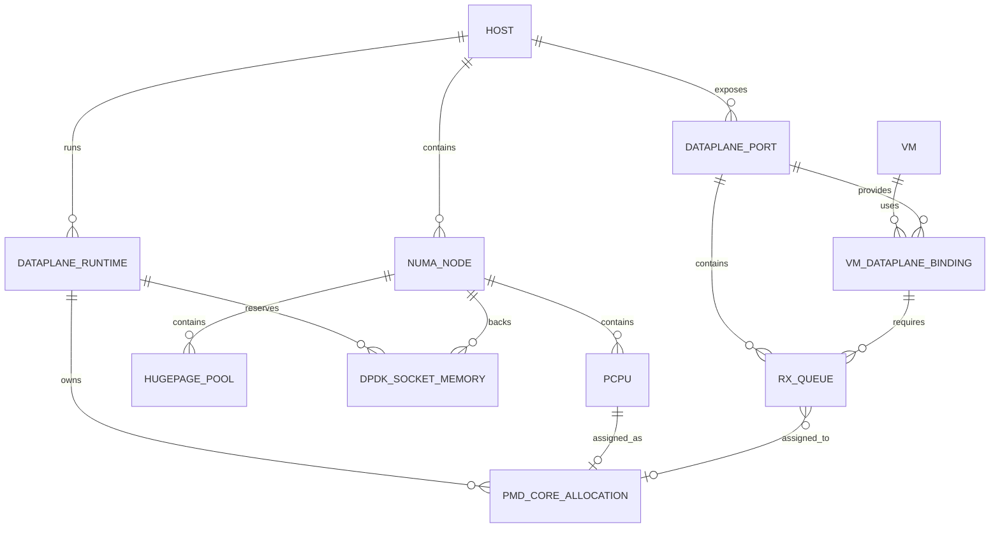

# NFV Dataplane Resource Architecture

- 状態: Baseline
- 更新日: 2026-08-09

## 1. 目的

既存のCPU/NUMA/HugePages/PCI/SR-IOVモデルを、OVS-DPDKを含むNFV dataplane resource modelへ拡張します。PMD CPU、DPDK memory、Port/Rx Queue、VM dataplane bindingを第一級resourceとして、Capability、Eligibility、Transactional Admission、Execution、Observationへ統合します。

## 2. 設計原則

1. workload CPUとdataplane CPUを同じpCPUから二重claimしない。
2. workload HugePagesとDPDK socket memoryを同じ物理poolから目的別に予約する。
3. NIC/Port、PMD、RxQ、VM memoryのNUMA localityを一つのplacement shapeとして評価する。
4. OVS/DPDK設定値ではなく、normalized capability、desired allocation、observed bindingを分離する。
5. PMD/RxQ統計はobservationであり、allocation authorityではない。
6. `ovs-vswitchd`再起動を必要とする変更を通常のVM作成へ暗黙に混ぜない。
7. arbitrary OVSDB key、EAL argument、PCI bind command、filesystem pathをAPI/Commandで受け付けない。
8. unsupported/degraded dataplaneからkernel datapath等へsilent fallbackしない。

## 3. Resource Model



### Dataplane Runtime

- mode: `ovs-kernel`、`ovs-dpdk`
- OVS/DPDK versionとcompatibility
- DPDK initialization/readiness
- EAL capability、VFIO/IOMMU capability
- PMD assignment policy: automatic、pinned、mixed
- desired/observed generation
- restart-required configuration generation

### pCPU Role

一つのexclusive pCPU allocationは同時に複数roleを持ちません。

- housekeeping
- workload shared
- workload dedicated
- emulator
- dataplane PMD
- dataplane service/lcore

SMT sibling、NUMA node、isolated/nohz/rcu stateをcapabilityとconstraintに含めます。CPU role変更はallocation ledgerとHost impactを検証します。

### HugePage Pool and DPDK Socket Memory

物理HugePage poolはNUMA nodeとpage sizeで識別し、purpose別ledgerを持ちます。

- workload memory
- DPDK socket memory
- platform reserve

DPDK socket memoryはNUMAごとのdesired MiB/page count、page size、runtime generationを持ちます。設定値だけでなく、reserved、allocated、observed availableを区別します。

### Dataplane Port

- stable port IDとHost ID
- PF、VF、representor、vhost-user、vhost-user-client
- PCI BDF、vendor/device、driver、IOMMU group
- NUMA node、link/queue capability
- OVS interface identityとdatapath type
- queue count/min/max、offload/multiqueue capability
- ownershipとallocation generation

Linux device nameやvhost socket pathをstable identityにしません。

### Rx Queue and PMD Assignment

- queue ID、port ID、generation
- desired PMD coreまたはautomatic pool
- observed PMD core、isolation state
- observed cycles/utilization/drop metrics
- assignment policyとrebalance generation

manual pinning時はRxQ→PMD mappingをdesired stateとして管理します。automatic時も必要queue数とPMD pool capacityを予約し、OVSの実割当をobservationとして検証します。

### VM Dataplane Binding

- VM/Port/resource identity
- requested dataplane mode
- queue pair countとvhost multiqueue
- target NUMA node/guest NUMA affinity
- physical/virtual port locality
- PMD capacity claim
- HugePage/socket memory dependency
- SR-IOV/PF/VF/representor binding
- latency/throughput policy class

## 4. Capability

Host AgentのDataplane Collector/Adapterは最低限以下を正規化します。

- OVS datapath type、OVS/DPDK version、runtime readiness
- PMD/lcore CPU maskとNUMA mapping
- HugePage mount/page size/NUMA availabilityとDPDK socket memory
- DPDK Port、PCI/IOMMU/driver binding、representor
- configured/available RxQ、PMD assignment、queue utilization/drop
- vhost-user/multiqueue capability
- restart-required/degraded/misconfigured reason

capabilityはraw `other_config`やcommand outputではなく、versioned schemaとbounded evidenceで公開します。

### PCI/SR-IOV Observation, Qualification, and Allocation

PCI/SR-IOV は次の authority chain を分離します。

```text
Raw PCI / SR-IOV Evidence
  → Normalized Device Projection
  → Immutable Qualification Evidence
  → Current Qualification Binding
  → Allocation State
  → Transactional Final Admission Claim
```

Normalized Device Projection は BDF、vendor/device/subsystem、driver、device/firmware revision、NUMA node、IOMMU group、PF/VF capacity、`virtfn`/`physfn` reciprocal relationship を保持します。sysfs fixture の成功は parser/relationship contract の証拠であり、VF assignment capability の認証ではありません。

Qualification Evidence は qualification/profile revision、test artifact/evaluator digest、observation generation/digest、device/firmware/driver/kernel/IOMMU/libvirt/QEMU fingerprint、validated operation set を immutable に保持します。operation set は `VF_DISCOVER`、`VF_ENABLE`、`VF_DISABLE`、`VF_ASSIGN`、`VF_DETACH`、`VF_REASSIGN`、`VF_READ_BACK` 等を個別に認証し、未認証 operation を許可しません。

Current Qualification Binding は `CURRENT / STALE / UNKNOWN / REVOKED`、Allocation State は `AVAILABLE / BLOCKED / CLAIMED / UNKNOWN` を使用します。Observed が `AVAILABLE` でも binding が `CURRENT` でなければ allocation は `BLOCKED` です。firmware、driver、kernel、IOMMU topology、libvirt/QEMU profile、artifact/evaluator、observation generation/digest の変化は過去 qualification を `STALE` にします。

## 5. Eligibility and Admission

Dataplane要求を含むVM placementは、既存resource shapeに以下を追加します。

```text
VM CPU / NUMA / HugePages
  + Dataplane mode
  + PMD CPU claim
  + DPDK socket-memory dependency
  + Port / Queue claim
  + PCI / IOMMU / driver ownership
  + vhost / guest queue binding
```

Eligibility rule:

- OVS-DPDK runtime/capability/versionが要求を満たす。
- PMD CPUがhousekeeping/workload/emulatorと重複しない。
- PMD CPU、Port、DPDK memory、VM memoryが許可されたNUMA policyを満たす。
- requested RxQ/queue pairがPort/PMD/runtime limit内である。
- PF/VF/representor/IOMMU ownershipが競合しない。
- VF の Qualification Binding が current observation/profile に対して `CURRENT` で、要求 operation が validated operation set に含まれる。
- DPDK HugePage/socket memoryとworkload HugePagesを合計して物理capacity内である。
- restart-required未適用configurationをreadyとして扱わない。

PolicyはNUMA localityを`required`、`preferred`、`allow-cross-numa`として明示します。cross-NUMAを黙って選択しません。

## 6. Transactional Final Admission

既存Placement transaction内で以下を不可分にclaimします。

- workload vCPU/pCPU、emulator CPU
- PMD/service lcore CPU
- workload HugePages
- DPDK socket memory share/reservation
- PF/VF/representorとIOMMU ownership
- immutable Qualification Evidence が裏付ける current VF Allocation Claim
- Dataplane PortとRx Queue/queue pair
- network/volume/quota/desired state

一つでも失敗した場合は全claim、Desired、Job、Command intentをrollbackします。このtransaction中にOVSDB、Agent、libvirt、DPDK、PCI driverへ接続しません。

VF claim の直前に、Host capability generation、device observation、PF/VF relationship、Qualification Binding、allocation policy、NUMA/IOMMU constraint、active/release-pending claim 不在を同じ PostgreSQL transaction で再読込します。

## 7. Execution

Dataplane変更は影響度で分類します。

### Online Typed Operation

- Port/RxQ desired assignmentの変更
- runtimeが対応するbounded PMD/RxQ rebalance
- queue configurationのうち無停止が証明された操作

### Disruptive Typed Operation

- DPDK initialization mode変更
- `dpdk-socket-mem`、HugePage backing、lcore/PMD topologyのうちrestart-requiredな変更
- PCI driver binding/rebinding
- `ovs-vswitchd` restartを伴う変更

disruptive operationは通常VM createから自動実行せず、impact set、maintenance authority、precondition、drain、rollback/read-back、verificationを持つ独立Operationにします。

Host Agentはclosed Dataplane Commandだけを受け付けます。arbitrary `ovs-vsctl`、`ovs-appctl`、EAL arguments、PCI BDF操作、shellを受け付けません。

## 8. Observation and Compliance

successful Command Resultだけでdataplaneをcompliantにしません。後続observationで以下を検証します。

- runtime generation/readiness
- PMD CPUとNUMA node
- Port/RxQ→PMD assignment
- vhost/guest queue count
- PCI driver/IOMMU ownership
- DPDK socket memoryとHugePage consumption
- link、queue polling、drop/error state

PMD utilization、cycles、dropはtime-series telemetryです。短期負荷変動だけでdurable allocationを変更せず、policyに基づくrebalance proposalと明示Operationを経由します。

## 9. Failure Semantics

- PMDが存在しない/停止: affected Portを`dataplane_unavailable`、新規placement停止。
- RxQがpollされない: bindingをdegraded/blockedとし、readyを返さない。
- Portが異NUMA PMDへdrift: policyに応じdegradedまたはnon-compliant。
- HugePage/socket memory不足: runtime restartを繰り返さず、Hostをineligibleにする。
- OVS restart結果不明: UNKNOWNを保持しruntime/Port/queue full observationで解決。
- PCI driver binding結果不明: device ownershipをquarantineし、VM/OVSへ再割当しない。
- PMD rebalance後Result喪失: observed mappingとgenerationで解決し、blind replayしない。

## 10. Security Boundary

- OVSDB accessはHost-local scoped adapterに限定する。
- `ovs-appctl`相当の診断はread-only allow-listとbounded parserを使用する。
- VFIO/vhost socket/hugetlbfs permissionを最小権限化する。
- raw PCI address、socket path、EAL argsをTenant APIへ公開しない。
- Tenantはperformance policy/queue要求を指定できても、物理core IDや任意PMD maskを指定できない。
- Dataplane mutationはHost Operation Authority、Command Lease、Auditを必須とする。

## 11. Support and Compatibility

OVSとDPDKは対応versionの組合せをリリースごとのsupport matrixで固定します。Capabilityが存在しても未認定組合せは`Compatible`であり、`Validated`とは区別します。

Developer Previewではdiscovery、eligibility、transactional claim、observationを優先します。disruptive automatic tuningは対象外とし、明示的なmaintenance operationから段階導入します。

## 12. 参照資料

- [Open vSwitch with DPDK](https://docs.openvswitch.org/en/latest/intro/install/dpdk/)
- [Open vSwitch PMD Threads](https://docs.openvswitch.org/en/latest/topics/dpdk/pmd/)
- [Open vSwitch DPDK Support](https://docs.openvswitch.org/en/latest/topics/dpdk/)
- [DPDK Linux EAL Parameters](https://doc.dpdk.org/guides-25.07/linux_gsg/linux_eal_parameters.html)
- [ETSI GS NFV-IFA 001: Acceleration Technologies](https://www.etsi.org/deliver/etsi_gs/nfv-ifa/001_099/001/01.01.01_60/gs_nfv-ifa001v010101p.pdf)
