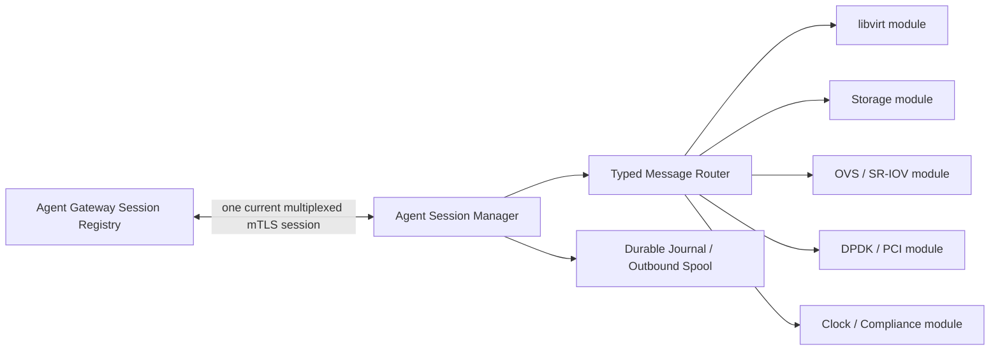

# Phase 1 Implementation Plan

- 状態: Active
- 更新日: 2026-08-09
- Target: Developer Preview
- Planning baseline: `3375ac2` (`docs: complete phase 0 decision gates`)

## 1. Outcome

Phase 1 では、2 Host の標準 KVM 環境に対して API から VM create/delete を繰り返し実行でき、Agent/Gateway/API の再起動、message duplicate、response loss、Lease expiry があっても二重 VM や stale authority を作らない Developer Preview を構築します。

この phase は Phase 0 Architecture を再解釈する期間ではありません。Accepted ADR、Invariant、Test Contract を実行可能な code/schema/test/evidence へ変換します。

### Implementation status

| Item | 状態 | 実装範囲 / 残作業 |
|---|---|---|
| P1-A01 | In Progress | Go module、command scaffold、CI、format/vet/test/document contract lint を開始。component runtime wiring は未着手 |
| P1-A02 | In Progress | fresh PostgreSQL schema、checksummed migration runner、transaction helper を実装。session current/immutable attempt/event、Host-scoped session admission lock、Outbox claim generation/UNKNOWN evidence を PostgreSQL 17 で検証。failure test は継続 |
| P1-A03/A05 | In Progress | versioned protobuf Envelope、Session Manager/Module interface、bounded priority queue、Authority View、stale session fence、gRPC/typed HTTP/2 mTLS adapter を実装。durable spool/resync は未実装 |
| P1-A04 | In Progress | PostgreSQL current generation、immutable Attempt/Event、idempotent grant、stale Attempt replay fence、Gateway admission limiter を実装。production mTLS handler wiring は未実装 |
| Q-094 | In Progress | 両 candidate が basic contract と 10,000-session handoff を通過。gRPC は operational/control-path leader、typed HTTP/2 は density leader。[reconnect storm result](spikes/results/q094-reconnect-storm-20260809.md) を記録し、proxy/spool 評価を継続 |

## 2. Implementation Principles

- fresh KIM schema と package namespace を作り、v1 table/API を KIM authority として直接昇格しない。
- v1 code は source-level selection と contract adaptation により再利用し、compiled artifact や certification evidence を継承しない。
- PostgreSQL transaction が authority を所有し、Message Bus、Gateway session、cache、backend observation を authority にしない。
- Final Admission commit 前に libvirt、OVS、LVM、Agent side effect を開始しない。
- KIM Host Agent は primary Go daemon とし、標準 KVM/QEMU/libvirt interface を使用する。
- 1 Host Agent identity / 1 current multiplexed outbound mTLS session を通常形とし、module 数を connection/certificate 数へ連動させない。
- implementation detail を public API、Agent capability、domain model へ漏らさない。
- Test Contract を実装 item の Definition of Done とし、後付け test catalog にしない。

## 3. Target Repository Layout

```text
cmd/
├─ kim-api
├─ kim-worker
├─ kim-agent-gateway
└─ kim-host-agent
internal/
├─ authority
├─ operation
├─ execution
├─ placement
├─ hostlifecycle
├─ network
├─ storage
├─ agentgateway
└─ agent/
   ├─ session
   ├─ journal
   ├─ modules
   └─ adapters
api/
├─ openapi
└─ agent-protocol
db/
├─ migrations
└─ queries
tests/
├─ contract
├─ integration
├─ fault
└─ system
```

package path は実装開始時に Go module 名とともに固定します。v1 から file tree を一括 copy せず、reuse decision と KIM Test ID を持つ小さな change set で移植します。

## 4. Agent Session Manager Boundary

Agent Session Manager は Agent 内で唯一、Gateway transport と Host credential を扱う component です。



### Session Manager owns

- outbound mTLS connection、certificate selection、protocol negotiation
- current `session_generation`、old/new session handoff、drain、reconnect/backoff
- logical stream multiplexing、envelope validation、routing
- bounded queue/message、priority scheduling、backpressure、resync
- Receipt、message digest、transport metrics、session audit

### Typed module owns

- immutable module descriptor、capability advertisement、schema range
- typed Command handler と precondition
- narrow backend adapter と read-back/verification
- module-specific Inventory/Observation producer と evidence schema

### Typed module must not own

- socket、HTTP/gRPC client、TLS key/certificate、Gateway endpoint
- reconnect loop、session generation、cross-module queue
- Command Lease issuance、Host arming、authorization decision
- module 専用 Host identity または独自 credential lifecycle

初期 internal interface は次の責務を分離します。Go interface の具体的な method signature は P1-A design spike で fixture とともに確定します。

| Interface | Direction | Contract |
|---|---|---|
| `ModuleDescriptor` | module → Session Manager | name ではなく typed capability、schema range、limits、health |
| `CommandHandler` | router → module | validated immutable Command、local deadline、journal handle |
| `EvidenceProducer` | module → router | typed Inventory/Observation、generation、provenance、digest |
| `SessionPublisher` | module → Session Manager | logical stream と typed envelope。transport object は公開しない |
| `ReadBackVerifier` | execution → module | bounded backend observation。authority decision は返さない |

## 5. Multiplexed Transport Work Package

### Logical stream classes

| Class | Priority | Persistence | Ordering scope |
|---|---|---|---|
| Session/Control | highest | session audit | Host identity + session generation |
| Command/Lease | high | PostgreSQL + Agent journal | Command + Attempt + Lease token |
| Result/Receipt | high | Agent journal + DB Receipt | Command + Attempt + result digest |
| Heartbeat/Health | high, bounded | current observation | Host + session generation |
| Credential lifecycle | high | PKI decision/evidence | Credential Binding + trust generation |
| Inventory/Observation | normal/bulk | snapshot/evidence policy | resource + observation generation |
| Resync | bulk/checkpointed | journal/snapshot manifest | session + resync checkpoint |

global FIFO は要求しません。logical scope 間の依存は sequence ではなく、PostgreSQL authority、generation、correlation、verification で解決します。

### Backpressure policy

- per-stream queue、total memory、durable spool、message/chunk size に hard limit を持つ。
- Control、Lease、Result、Heartbeat は bulk Inventory/Resync により starvation しない。
- Result/journal evidence を silent drop しない。spool pressure 時は新しい mutation dispatch を停止する。
- Inventory/Observation は schema が許す未送信 obsolete generation だけを coalesce し、参照中 evidence を破棄しない。
- reconnect storm は bounded exponential backoff、jitter、Gateway admission/rate limit で制御する。

### Session handoff

credential renewal/rekey または reconnect で一時的に old/new connection が存在しても、Gateway transaction で一つの current session generation だけを選びます。old session は drain/fence され、old message は同一 accepted digest の idempotent Receipt 回収以外に current authority を進めません。

## 6. Workstreams and Milestones

### P1-A: Foundation, Gateway, and Inventory

| ID | Deliverable | Dependency | Reuse / build decision | Exit evidence |
|---|---|---|---|---|
| P1-A01 | Go module、repository layout、CI、ID/link/schema lint | Phase 0 baseline | new scaffold | unit/contract pipeline |
| P1-A02 | PostgreSQL baseline schema、migration runner、transaction helper、Outbox/Inbox skeleton | A01 | reuse v1 transaction/locking pattern、fresh schema | AT-DATA-001/004/005/006 |
| P1-A03 | Agent Protocol envelope、logical stream/schema registry、compatibility negotiation | A01 | adapt v1 envelope/digest | AT-AGT-012/013、FI-UPG-006 |
| P1-A04 | Agent Gateway Session Registry、single-current-session generation、mTLS authentication | A02/A03 | new boundary、reuse v1 TLS primitive | AT-AGT-002/011、FI-GATEWAY-003 |
| P1-A05 | Agent Session Manager、router、bounded spool/backpressure/resync | A03/A04 | reuse v1 publisher/spool/watch | FI-GATEWAY-004/005 |
| P1-A06 | module descriptor/handler/evidence interface | A03/A05 | adapt compile-time v1 registry | AT-AGT-011/012、XCT-AGENT-001 |
| P1-A07 | CPU/NUMA/HugePages/PCI/network/storage/libvirt inventory modules | A06 | reuse v1 collector/normalizer | AT-HST-002、AT-DPL-001 |
| P1-A08 | manual Enrollment、bootstrap/CSR、Credential Binding、Host session/authority view | A02/A04 | reuse v1 PKI primitive、new KIM Binding | AT-HLC-001/002/017、AT-PKI-006/009 |

P1-A exit では、全 module を有効化しても一つの current Host session/certificate で動作し、bulk stream saturation、stale session、connection loss test を通過する必要があります。

### P1-B: Operation, Execution, and Host Authority

| ID | Deliverable | Dependency | Reuse / build decision | Exit evidence |
|---|---|---|---|---|
| P1-B01 | Resource API idempotency、Operation resource/state machine | A02 | reuse v1 validation/idempotency、new public API | AT-API-001〜003、AT-OPS-001 |
| P1-B02 | Job/Command/Lease/Attempt/Result/Receipt schema and dispatcher | A02/A04 | adapt v1 execution tables/code | AT-EXEC-001〜007 |
| P1-B03 | write-before-execute journal と typed read-back verification | A05/A06/B02 | reuse v1 journal/result fencing | FI-AGENT-001、FI-TRANSPORT-001/002 |
| P1-B04 | Host Authority generation、manual arming、reconnect non-rearm | A08/B02 | reuse v1 arm/disarm generation | FI-GATEWAY-002、FI-HLC-008 |
| P1-B05 | Host Profile/Baseline Assignment、read-only Compliance/Evaluator result | A07/A08 | new domain、reuse CPU policy checks | AT-HLC-004〜007 |
| P1-B06 | explicit HostGroup/Placement Pool membership generation | A02/B05 | new domain | AT-HGR-001〜007 |

### P1-C: Minimal Resource Lifecycle

| ID | Deliverable | Dependency | Reuse / build decision | Exit evidence |
|---|---|---|---|---|
| P1-C01 | Image metadata/checksum と Flavor resource | B01 | new | AT-IMG-001/002、AT-FLV-001 |
| P1-C02 | dry eligibility/scoring/selection/transactional Final Admission | B01/B05/B06 | reuse v1 claim SQL、new fleet scheduler | AT-PLC-001〜009 |
| P1-C03 | VLAN/IPAM/MAC/Port Claim と basic Port Binding | A07/C02 | reuse v1 NIC adapter、new authority | AT-NET-002〜007 |
| P1-C04 | Local LVM Volume/Attachment Claim/generation/single-writer | A07/C02 | reuse v1 disk/LVM adapter、new authority | AT-STO-001〜008 |
| P1-C05 | VM create/delete with typed libvirt module | C01〜C04/B02 | reuse v1 libvirt adapter、new lifecycle | AT-CMP-001〜003 |
| P1-C06 | Availability Policy/VM Binding と Workload Resilience/Recovery Queue read-only model | B06/C02 | new model、no automatic recovery | AT-AVR-001〜005、AT-WRI-001 |
| P1-C07 | OVS-DPDK capability discovery/read-only observation | A07 | reuse OVS/CPU/PCI collector、new schema | AT-DPL-001/002/009 |

### P1-D: Integration and Developer Preview Qualification

| ID | Deliverable | Dependency | Reuse / build decision | Exit evidence |
|---|---|---|---|---|
| P1-D01 | API→Placement→Execution→Agent→Observation E2E | P1-C | new system fixture | repeated 2-Host VM lifecycle |
| P1-D02 | duplicate/reorder/response-loss/restart/partition fault suite | P1-A/B/C | remap v1 fault fixtures | Developer Preview FI subset |
| P1-D03 | Release Manifest、artifact digest、schema readiness、single-target canary | A01/A02 | adapt v1 rollout primitive | AT-UPG-002〜007 |
| P1-D04 | Debian/Ubuntu package、systemd hardening、containerized Control Plane、offline install | A01/A05 | reuse v1 package pipeline | AT-OFFLINE-001、AT-DEPLOY-001/002 |
| P1-D05 | second Linux family adapter/package/validation lane | A06/A07/D04 | new adapter/package | AT-AGT-006/008 |
| P1-D06 | metrics、audit、diagnostic evidence、operator runbook | all | reuse v1 metrics/audit | AT-AUD-001/002、AT-O11Y-001 |

## 7. Critical Path

```text
Schema/CI
   ↓
Protocol Envelope
   ↓
Gateway Session Registry ↔ Agent Session Manager
   ↓
Execution + Host Authority
   ↓
Placement + Network + Storage claims
   ↓
VM lifecycle E2E
   ↓
Fault/Packaging/2-OS qualification
```

Image/Flavor、HostGroup、read-only Compliance は Session/Execution foundation 後に並行できます。VM create/delete は Placement、Port Claim、Attachment Claim、Execution verification が揃うまで開始しません。

## 8. v1 Reuse Controls

| v1 asset | Phase 1 treatment |
|---|---|
| collector/normalizer | module interface へ adapt し、v1 snapshot を authority にしない |
| publisher/spool/digest ACK | Session Manager の bounded stream/spool へ adapt |
| Job/Command/Lease/Attempt | semantics/locking を reuse し fresh KIM schema へ実装 |
| direct Controller HTTPS | Session Manager→Agent Gateway へ置換し compatibility bridge 後に discard |
| machine-id Host authority | candidate identity evidence へ降格 |
| `executor_credential_*` | active authority として discard、必要 history だけ archive evidence |
| Debian/systemd pipeline | initial Ubuntu/Debian lane として reuse |
| E2E/fault fixture | KIM Test ID へ map して再実行。過去 pass は継承しない |

## 9. Phase 1 Quality Gates

各 work item は次を満たすまで Done にしません。

- linked Requirement、Invariant、AT/FI/XCT ID
- authority owner、transaction boundary、failure/UNKNOWN behavior
- schema migration、compatibility、rollback/forward repair
- unit/contract/integration/fault test と保存可能な evidence
- metrics、audit、bounded resource limit、redaction
- no arbitrary shell/XML/SQL、no module-owned credential/connection
- new module 追加前後の Gateway connection count test

Developer Preview exit では特に次を blocking にします。

1. 2 Host VM create/delete repeated E2E
2. API/Result retry で duplicate VM なし
3. one-current-session multiplexing、stale session fencing、bulk backpressure
4. Agent/Gateway restart 後の journal/resync convergence
5. dry/final admission race、IP/LVM single-writer claim
6. manual Enrollment/arming、Critical compliance placement block
7. two Linux families with same Control Plane contract
8. clean/offline install、upgrade/rollback fixture

## 10. Phase 1 Non-goals

- automatic infrastructure-managed VM recovery
- live migration、SR-IOV mutation、disruptive OVS-DPDK tuning
- Ceph RBD production fencing、OVN L3/Gateway/NAT full support
- policy-auto Enrollment、full continuous remediation
- production 3-node Control Plane HA/PITR
- full rolling upgrade and emergency CA rollover

read-only resource model や future-compatible schema を Phase 1 へ含めても、上記の mutation authority を有効化しません。

## 11. Open Implementation Decisions

- Q-094: initial multiplexed transport implementation と library profile
- existing Q-002/Q-031/Q-035/Q-041/Q-044: Developer Preview support/certification profile
- Q-005: internal durable Message Bus implementation readiness
- Q-057/Q-059/Q-067/Q-074〜081/Q-086〜089: Phase 1 に必要な schema/time/upgrade/trust profile

これらは Architecture semantics を変更できません。implementation choice が Invariant を満たせない場合は、implementation を変更するか新 ADR で明示的に baseline 変更を提案します。
