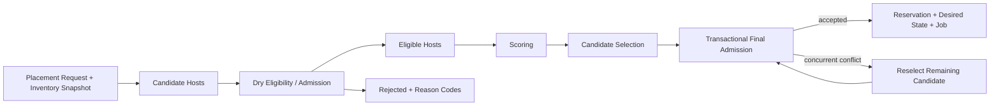

# Placement Architecture

- 状態: Draft
- 更新日: 2026-08-09

## 1. 原則

Eligibility/Admission と Scoring を分離します。score が高くても不適格な Host は選択しません。dry evaluation は state を変更せず、最終的な容量確保は PostgreSQL transaction 内で再評価します。

## 2. Placement Request Snapshot

評価は以下を固定した immutable snapshot に対して行います。

- request ID と canonical request digest
- project、quota generation、policy generation
- workload shape と placement constraints
- Host inventory generation と capability generation
- allocation/reservation generation
- network/storage locality requirements
- migration の場合は source Host と current attachment/device state

snapshot が古くなった場合、結果を部分的に継ぎ足さず、新しい evaluation を作成します。

## 3. Dry Eligibility / Admission

pure evaluation とし、DB row、reservation、Desired、Job を変更しません。

backend mutation、Agent Command、Message publish、external API callも行いません。入力snapshotとversioned ruleだけから決定的な結果を返します。

評価対象:

- Host enabled/maintenance/reachability と Agent capability
- CPU、overcommit、pCPU set、NUMA locality
- memory、HugePage size/node、reserved memory
- PCI/SR-IOV/IOMMU group と device ownership
- network segment/provider reachability
- PMD/service CPU、DPDK socket memory、Dataplane Port/RxQ、vhost queue、dataplane NUMA locality
- storage backend/access/locality
- affinity/anti-affinity、AZ、trait、policy
- quota と project policy
- migration capability と destination compatibility

結果:

- `eligible: true/false`
- bounded reason code と非機密 details
- required claims/reservations
- evaluation generation/fingerprint
- score input facts

OVS-DPDK要求を持つshapeは [NFV Dataplane Resource Architecture](nfv-dataplane-resource-architecture.md) のresource/claimを含めます。

## 4. Scoring

Scoring は eligible set にだけ適用します。初期候補:

- resource spread / pack policy
- NUMA fragmentation
- image cache locality
- network/storage locality
- failure-domain diversity
- operator weight

score は適格性を上書きしません。weight と計算根拠は versioned policy とともに記録します。

## 5. Transactional Final Admission

選択 Host に対して一つの PostgreSQL transaction が次を行います。

1. workload、quota、policy、Host allocation generation をlock/検証する。
2. dry evaluation と同じ admission rule を最新 authority state へ再適用する。
3. CPU、memory、HugePages、PCI、network、storage のclaimsを不可分に確保する。
   OVS-DPDK利用時はPMD/service CPU、DPDK socket memory、Port/RxQ、VM Dataplane Bindingも同じtransactionに含める。
4. Quota usage、Reservation、Desired State、Job、Command intent、idempotency recordを同時にcommitする。

一つでも満たせない場合は何もcommitしません。競合による不適格化は通常動作であり、同じ request snapshot でまだ有効な次候補を選び直します。policy/inventoryの意味が変わった場合は新しいevaluationへ戻します。

Final Admissionの副作用境界はPostgreSQL commitまでです。このtransaction中にlibvirt、Agent、OVN、Cephへ接続しません。commit後にExecution domainがCommand配送とbackend mutationを開始します。したがって、DB rollbackとbackend rollbackを一つのtransactionのように表現しません。

## 6. Explanation

各候補について以下を保存・提示できるようにします。

- eligible / ineligible
- rule ID、reason code、required/available のbounded summary
- score とpolicy version
- selection rank
- final admission conflict reason
- re-selection count

生のdevice path、secret、他Tenantのresource identityは表示しません。

## 7. Migration

Migration は単一の製品booleanではなく、VMと候補Hostの組合せごとに評価します。

| Capability | 意味 |
|---|---|
| cold | VM停止状態で移動可能 |
| live | 実行状態を維持して移動可能 |
| restart-on-other-host | source停止確認/fencing後に別Hostで再起動可能 |
| none | 現在のdevice/placement/storage/network条件では移動不可 |

SR-IOV、PCI passthrough、CPU model/pinning、HugePages、NUMA、local storage、dataplane stateは明示的なeligibility ruleです。

Migration capabilityはHost capabilityだけから決めません。少なくとも以下をVM/resource bindingとして評価します。

- source/destination CPU model、NUMA、pCPU claim、HugePage size/node
- attached PCI/SR-IOV device、IOMMU group、代替device availability
- Volume backend、attachment mode、shared/local、fencing capability
- Port type、provider network、tunnel/gateway reachability、dataplane state
- VM runtime state、machine type、firmware、device model
- active Job/Command/Lease、ownership、desired revision

## 8. v1から維持する不変条件

- simulation は予約しない。
- complete resource shape を一つのadmissionとして扱う。
- CPU claimだけ成功しHugePages reservationが失敗する部分commitを許さない。
- Agent結果はverification開始であり、後続observationで収束を確認する。
- stale inventory generationはfail closedとする。
