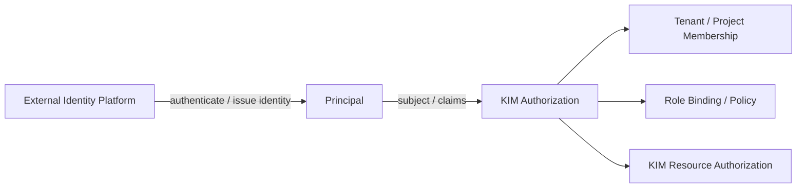

# 責任境界

- 状態: Baseline
- 更新日: 2026-08-09

## 1. 目的

KIM が製品として所有する authority と、外部 Platform、Identity Provider、Configuration Management、WIM、NFVO/VNFM が所有する責務を分離します。連携できることは、KIM がそのライフサイクルを所有することを意味しません。

## 2. Identity、Tenancy、Authorization



| 領域 | Authority |
|---|---|
| User lifecycle、password、MFA、federation | External Identity Platform |
| Human/Northbound Service Principal credential 発行・失効 | External Identity Platform |
| Tenant、Project | KIM |
| Membership、Role Binding、KIM Policy | KIM |
| Resource ownership、Quota | KIM |
| KIM action authorization decision | KIM |

KIM は外部 Principal の安定した subject と issuer を参照します。email、display name、group claim は補助属性であり、単独では永続 identity にしません。

Human/Service credential authorityと、KIM workload/Host transport PKIを区別します。customer/external CAがRoot/issuer custodyを持つ場合でも、KIMはaccepted Trust Domain/Profile、Credential Binding、trust generation、session/application authorizationを所有します。証明書発行主体とKIM resource authorityを混同しません。詳細は [PKI and Trust Lifecycle Architecture](pki-and-trust-lifecycle-architecture.md) に従います。

## 3. Host Configuration

```text
Discovery
  -> Preflight / Validation
      -> Eligibility and diagnostics
          -> optional Typed Infrastructure Remediation
```

KIM が所有するもの:

- Host capability と現状の discovery
- workload 要件に対する preflight/admission
- bounded reason code と remediation hint
- KIM resource を成立させるために仕様化された typed operation
- Enrollment、Host Profile/Baseline、Compliance evidence、Placement block、maintenance authority
- HostGroup、materialized membership、Placement Scope、rollout/maintenance snapshotとKIM内policy binding

外部 Configuration Management が所有するもの:

- 汎用 package installation と OS patching
- 任意 service、設定ファイル、kernel argument の管理
- reboot orchestration と全社 OS baseline
- KIM 外のアプリケーションおよび Host 構成
- PXE/OS installation、汎用ZTP、firmware lifecycle、Host wipe

KIM の typed remediation は schema、precondition、対象 resource、rollback/verification、authority generation を持つ閉じた操作です。任意 package 名、shell、argv、file path、設定内容を受け取りません。

外部Configuration Managementとの連携では、KIMはControl requirement、対象Host、Baseline/Assignment generation、maintenance/fencing条件、必要evidenceを持つscoped requestを所有します。外部systemは実際の汎用Host変更を所有します。外部systemの完了通知はclaimであり、KIMがfresh observationを取得してCompliance Evaluatorで再判定するまでKIMのCompliance/READY/authorityを変更しません。

CMDB/asset systemはHostGroup selector/assertionのsourceになれますが、KIM membership authorityを直接所有しません。KIMがsource identity、generation、freshnessを検証しPostgreSQLへmaterializeして初めてmembershipになります。

Placement Scopeは公開candidate populationのauthorityであり、HostGroup membership、Group Policy Binding、Hierarchyから暗黙生成しません。Scope-aware Placement Requestだけがclosed consumer Scopeを参照し、Scope membershipから導出されたvisibilityはEligibilityやFinal resource claimを意味しません。Projectは現在compatibility identifierだけを検証し、first-class Project generation authorityを実装済みとはみなしません。

## 4. Network

| KIM | External Network / WIM / Physical Infrastructure Manager |
|---|---|
| Virtual Network、Subnet、Port | WAN path と transport network |
| Tenant overlay と virtual router | Inter-PoP connectivity |
| Provider network binding | Physical switch lifecycle/configuration |
| DHCP、Security Group、Floating IP | Carrier/WAN resource orchestration |
| IP/MAC、VLAN/VNI、Port Binding、Gateway/NAT Claim | external IPAM/segment/transport authority（連携時） |
| VM connectivity と NFVI-PoP gateway attachment | 外部ネットワーク容量 authority |
| OVS-DPDK PMD/DPDK memory/Port/RxQのHost内allocation | NIC firmware、physical fabric、外部DPDK application lifecycle |

KIM は provider network、gateway、external connectivity の参照とbindingを保持できますが、外部物理ネットワークを暗黙に構成しません。外部資源変更は別authorityとの明示的な契約を必要とします。

OVN NB/SB/Host dataplaneはKIM network intentのmaterialization/observationであり、KIMのProject ownershipやallocation authorityそのものではありません。external IPAM/WIMを利用する場合も、そのreservation/connectivity claimをversioned contractでKIM resourceへbindします。

## 5. NFV MANO

| KIM | NFVO/VNFM |
|---|---|
| NFVI virtual resource lifecycle | NS/VNF lifecycle |
| Image、Flavor、VM、Network、Volume | VNFD/NSD interpretation |
| Placement、Quota、Capacity | VNF scaling intent |
| Infrastructure Fault/Performance | VNF configuration/behavior |
| Virtual-to-physical mapping | Service-level orchestration |
| Infrastructure Managed Policyでのfenced VM restart/evacuate | Workload Managed PolicyでのNF/VNF service failover |
| Host failure evidence、Availability Binding、Fault/Event | active/standby role、application health、replacement intent |
| 公開Failure Domain constraint、transactional Domain Claim | member role/集合、VNF redundancy intent、replacement timing |

ETSI model は Northbound adapter で対応づけ、内部 authority model へ直接焼き込みません。

Availability responsibilityはVMごとのBindingで固定します。`WORKLOAD_MANAGED`ではKIMはsource containmentとFault/Eventを所有しますが、自動VM restart/replacementを所有しません。`INFRASTRUCTURE_MANAGED`でもKIMはfencing、storage single-writer、Placement eligibilityを満たす範囲だけを所有し、VNF内部のservice recoveryを保証しません。

NFVO/VNFMはopaque member roleと公開Failure Domain classを指定します。KIMはProject ownership、hard separation、Domain Claim、drift evidenceを所有しますが、active/standby role transitionやapplication healthを解釈しません。

## 6. データベース Authority

PostgreSQL は desired state、allocation、network intent、attachment、operation/execution authority の System of Record です。libvirt、OVN、Ceph の observed state は復旧証拠ですが、未知 resource を自動的に KIM 所有へ昇格させません。復旧時の adoption は identity、provenance、generation と operator authorization を必要とします。

KIMは自身のauthority data、decision/evidence、delivery journal、schema migration、retention/GC、backup/PITR reconciliationを所有します。ただし、汎用Data Warehouse、顧客application backup、外部SIEM/Archive lifecycle、Secret valueの保管を所有しません。DB retentionやrestoreをbackend resource削除/作成のauthorityとして使用しません。

## 7. Storage

KIMはKIM Volumeのmetadata/ownership、Backend Binding、Attachment Claim/Generation、typed lifecycle、fencing decisionを所有します。Ceph cluster/OSD/MON/MGR、physical disk/VG、SAN/NAS fabric、外部backup、guest filesystem/application consistencyは所有しません。Ceph/LVMのwatcher/lock/holderはKIM authorityではなく、Claimと照合するobservationです。

## 8. 明示的な非責任

KIMは以下を暗黙にも代行しません。

- User/Service credentialの発行、password/MFA/federation
- 汎用OS構成管理、任意package/service/configuration、patching、reboot orchestration
- PXE/OS provisioning、firmware update、secure erase
- 物理switch/router、WAN transport、inter-PoP pathのライフサイクル
- Ceph cluster、OVN cluster、外部IdPそのものの構築・アップグレード
- NS/VNF lifecycle、VNFD/NSD interpretation、VNF内部設定
- backendにだけ存在するresourceの自動adoptionまたは自動削除
- 結果不明なmutationに対する推測ベースの逆操作

外部systemとのadapterが存在しても、このauthority境界は移動しません。境界変更にはRequirementsとAccepted ADRの同時更新が必要です。
## Failure evidence authority boundary

Failure observationは何を誰がどのgenerationで観測したかを保持し、Failure Epochは一incidentのidentityとその時点のexact VM Availability Bindingを固定します。signal、Epoch、confirmation、fencing proof、Recovery Eligibility、Recovery Operationは別authorityです。Migration 050はtyped observationと`SUSPECTED` Epochを実装し、Migration 051はexact typed Policy/Evidence snapshotのpure Evaluationとexplicit Decisionを分離して`CONFIRMED` factまでを実装します。heartbeat/Agent loss、`UNKNOWN`、`STALE`、`CONFLICTING`をconfirmationへ昇格させず、`CONFIRMED`からHost fencing、Recovery、resource/runtime mutationを暗黙生成しません。

Migration 052はFailure Fencing ProofとLocal LVM Storage Safety Proofをさらに分離します。Fencingはsource execution停止のbounded positive authority、Storage Safetyはsource Attachment/holder/single-writer ownershipのpositive authorityです。一方のproofで他方を推測せず、EvaluationをProofへ、proof集合をRecovery Eligibility/Operationへ暗黙昇格させません。

Migration 053はRecovery Eligibilityをpermission authorityとして追加します。KIMはexact historical responsibility/action、current-usable proofs、typed Planning Budget、read-only destination feasibilityを束ねてexplicit Decisionを発行できますが、そのDecisionでVMをrestart/evacuateせず、destination capacityを予約しません。`WORKLOAD_MANAGED`と`MANUAL`のautomatic Decisionは発行せず、future Recovery Operationが別authorityとしてDecision/Claimを引き継ぎcurrent inputsを再検証します。
Recovery Eligibility Decisionはpermission、Operation Requestはintent、Recovery Operation/Planはlifecycle/action authority、Final Admissionはdestination resource authority、Execution Job/Command/Leaseはmutation authority、Observation/Verificationはoutcome authorityである。Migration 054のpreparation Command成功はVM recoveryまたはOperation `VERIFIED`を意味せず、`WORKLOAD_MANAGED`/`MANUAL`およびunsupported `EVACUATE` backendをautomatic Operationへ昇格させない。
