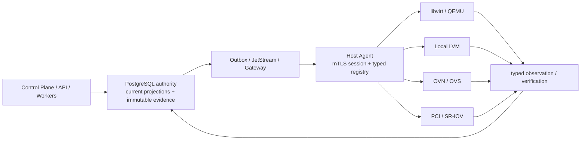
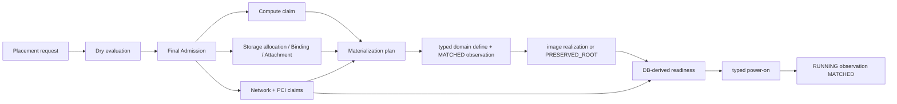
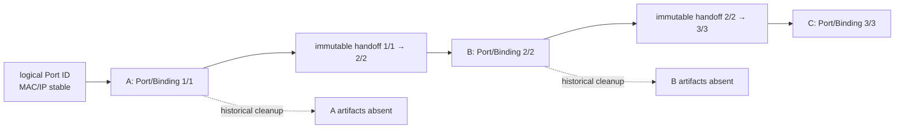

# KIM Architecture & Qualification Inventory Review

- Review date: 2026-08-13
- Repository baseline: Migration 001–072
- Baseline commit: `ce79b0189f97fb4e821f13cae30552dfb6e26ff2`
- Method: schema, producer, consumer, test, and latest validation evidence were cross-checked; older reports were treated as historical evidence, not current gate truth
- Change scope: review documentation only; no migration, implementation, or refactor

## Executive summary

KIM is an authority-oriented KVM control plane, not a generic virtualization shell. PostgreSQL owns desired state, identity, allocation, admission, execution, recovery, relocation, and cleanup decisions. Agents execute a closed set of typed operations, journal before mutation, and return observations; a command response is never sufficient evidence of convergence.

The current phase is best described as **authority-complete for the main zero-Port/OVN/Local-LVM lifecycle, functionally mature in synthetic integration, and selectively production-qualified**. Real two-Host Recovery with Local LVM and with one OVN Port has passed. Planned Host EVACUATE, Local LVM data-preserving relocation, cross-Host block transport, source cleanup, and capacity reclamation have complete synthetic PostgreSQL authority chains but have not mutated a disposable real g01/g02 workload.

What is complete:

- PostgreSQL authority, immutable evidence/current projection split, typed Command/Lease/Attempt/Result/Observation/Verification, and `UNKNOWN → READ_BACK_FIRST` semantics;
- VM Placement and materialization, Local LVM allocation/binding/attachment, OVN/OVS convergence, Recovery zero-Port and OVN, Host EVACUATE zero-Port and OVN;
- Local LVM planned copy with whole-volume content identity, cross-Host transport authority, post-terminal exact-LV cleanup, and capacity reclamation in synthetic integration;
- repeated EVACUATE A→B→C and mixed Recovery A→B → EVACUATE B→C lineage and ABA fencing;
- generic PCI retirement/handoff/Recovery authority in synthetic integration;
- real JetStream/Gateway/Agent fault convergence, real libvirt/LVM typed backend read-back, real two-Host Recovery, isolated real OVN/Geneve paths, and a real Debian/systemd upgrade fixture.

What remains:

- production Host Agent wiring and real two-Host qualification of Local LVM streaming, EVACUATE, cleanup, and capacity reuse;
- a real disposable SR-IOV VF profile and the planned EVACUATE PCI consumer;
- exact CPU-ID pinning/NUMA-local realization rather than aggregate admission only;
- Ceph RBD and OVS-DPDK implementation promised by accepted architecture documents;
- operator workflows for stuck `UNKNOWN`/`BLOCKED`/`CONFLICTING`, evidence retention/partition/archive implementation, wider metrics export, and sustained mixed-workload soak.

Top production blockers are the absence of a deployed disposable real EVACUATE profile, inactive `kim-agent` on g01/g02, no safe real VF inventory, and incomplete operator/retention operations. No P0 authority bypass, data-corruption shortcut, or split-brain path was found in this review. Post-review hardening wired Local LVM transport into the normal Host Agent runtime and added direct TLS 1.3 enforcement; see ADR-0028 and the runtime wiring validation.

Recommended next phase: **release hardening and real qualification**, not another large authority expansion. Wire the existing Local LVM transport through the normal Agent, provision an isolated disposable two-Host profile, execute real EVACUATE/cleanup, then qualify real SR-IOV. In parallel, close operator recovery, metrics, retention, and mixed-load endurance gaps.

## Classification and evidence rules

| Classification | Meaning in this review |
|---|---|
| `IMPLEMENTED` | Schema and executable producer/consumer exist, but no complete subsystem synthetic campaign was found. |
| `SYNTHETIC_PASS` | A complete authority chain passed with disposable PostgreSQL/in-memory/test backend evidence. It is not a real hardware claim. |
| `REAL_PASS` | The relevant mutation/read-back or distributed failure path ran on a real process, KVM Host, storage, network, or package manager fixture with safety isolation. |
| `BLOCKED` | The capability or required qualification cannot currently complete because code, hardware, environment, or policy authority is missing. |
| `OUT_OF_SCOPE` | The repository explicitly treats the capability as a product boundary, rather than unfinished current functionality. |
| `UNKNOWN` | Evidence was insufficient to classify. No matrix row is left `UNKNOWN`; uncertainty is described as debt instead of being promoted. |

A validation `PASS` is accepted only where the current schema still has a producer and consumer and the relevant test remains present. Later validation supersedes earlier gate statements: for example, Migration 072 supersedes Migration 070/071 reports that still called generic Local LVM source cleanup blocked.

## Architecture inventory



The Control Plane is responsible for policy, identity, admission, claims, generations, and terminal decisions. PostgreSQL is the write authority and transaction boundary. JetStream/Gateway provide durable at-least-once delivery, not domain authority. A Host Agent validates Host/session/Lease/payload identity, writes a local attempt journal, dispatches only compile-time registered typed backends, and publishes results/observations. libvirt, LVM, OVN/OVS, and PCI are mutation/read-back systems; their observed state is joined to PostgreSQL authority before terminal decisions.

No generic arbitrary backend method is exposed by `internal/agent/execution.Module`. It seals its registry at first use. Fixed CLI invocations exist inside typed adapters (`lvs`, `vgs`, `lvcreate`, `lvremove`, `ovs-vsctl`, `dpkg`) and qualification helpers; SSH appears in opt-in remote qualification harnesses, not as a product backend.

## Common authority semantics

| Concept | Definition and use | Common vs specific variants |
|---|---|---|
| generation | Monotonic identity for a mutable authority incarnation; stale generations cannot authorize current work. | Common across Host, VM, materialization, Port/Binding, Volume/Binding, cleanup, copy, and transport. |
| revision | Immutable policy/catalog/config version. | Flavor/Image, policy, credential binding, storage class, release compatibility, and transport policy. |
| incarnation | A physical realization of a logical resource on a Host/backend. | Usually represented by a generation plus Host/plan/binding identity; terminology is not fully uniform. |
| attempt | One execution try within an operation generation. | Command Attempts, cleanup/copy/transport attempts, OVN work, upgrade targets. Attempt index is not operation generation. |
| Lease | DB-time bounded permission for one exact command/claim/worker and generation. | Execution Lease, child slot claim, recovery budget/claim, cleanup/OVN/upgrade work claims. |
| Host authority generation | Fences a Host identity after rearm/fence/replacement. | Joined by execution, placement, Recovery, EVACUATE, and Local LVM transport. |
| credential binding revision | Identifies the currently authorized certificate binding. | Agent session and Local LVM transport peer authority. |
| Agent session generation | Identifies one current connection incarnation. | Delivery, result acceptance, replay fencing, and transport authority. |
| `UNKNOWN` | The mutation outcome cannot be proven; it is not failure or absence. | Common execution rule; subsystem projections use `UNKNOWN`, `DISPATCH_UNKNOWN`, or equivalent. |
| `READ_BACK_FIRST` | After response loss/expired uncertain work, a successor must observe exact backend state before any repeat mutation. | OVN work, upgrade, PCI retirement, cleanup, copy/transport recovery. |
| immutable evidence | Append-only historical fact/decision; UPDATE is rejected. | Static Migration 001–072 audit found 178 tables ending `_evidence`, all with a `BEFORE UPDATE` immutable trigger. |
| current projection | Replaceable pointer/state for the latest accepted incarnation. | 80 `_current` tables. They are convenience/serialization state, not historical truth. |
| verification evidence | Pure or read-back-backed decision joining expected authority to observed backend state. | Command, VM power/definition, network/dataplane, Recovery, EVACUATE child, copy. |
| terminal evidence | Immutable final decision; exact replay returns the same result and conflicting identity reuse is rejected. | Recovery, EVACUATE child/parent, cleanup, copy, transport, upgrade. |
| origin authority | The producer whose terminal/decision allows a downstream action. | Recovery and planned EVACUATE remain separate; cleanup accepts typed `RECOVERY_TERMINAL`, `MATERIALIZATION`, or `DELETE_OPERATION` schema origins. |
| cleanup authority | Post-workload-terminal permission to retire an exact historical backend incarnation. | Generic framework in 064/065; Recovery libvirt/network consumers and planned Local LVM producer/consumer are implemented. |

Naming varies (`generation`, `state_generation`, `binding_generation`, `materialization_generation`; `terminal`, `completion`, `decision`; `realization`, `binding`, `observation`). The semantic checks are mostly consistent, but a glossary/type layer would reduce review cost without collapsing intentionally different identities.

## Resource identity model

| Resource | Logical identity | Physical realization / incarnation | Current projection | Historical authority |
|---|---|---|---|---|
| VM | UUID plus VM generation | Host, Admission, plan, materialization generation, domain identity | `virtual_machines_current`, materialization/readiness/power current | VM plan, definition, image, readiness inputs, power observations |
| materialization | plan ID for a VM | Host + Admission + materialization generation + plan digest | `vm_materialization_plans_current`, readiness current | plan and relocation/recovery evidence |
| Host | Host ID | authority generation, credential revision, session generation, inventory snapshot | Host identity/operation/session current projections | identity, credential, session, inventory evidence |
| Volume | Volume ID and VM/root role | storage backend/VG/LV UUID, size, capacity generation | `volumes_current` | storage capacity and copy/cleanup evidence |
| Binding | Binding ID | binding generation + backend generation + LV UUID | `volume_backend_bindings_current` | backend binding evidence |
| Attachment | Attachment ID | generation + Host + VM + device role (`vda`) | `volume_attachments_current` | attachment observation evidence |
| Network | Network ID | immutable/revisioned intent | network current projections | network intent revision evidence |
| Subnet | Subnet ID | CIDR/gateway/address policy revision | subnet current projection | revision/claim evidence |
| Port | stable Port ID, MAC/IP identities | Port generation | Port current projection | intent, realization, retirement and handoff evidence |
| Port Binding | Binding ID for Port | binding generation + Host/chassis/interface | binding current projection | immutable handoff/retirement evidence |
| OVN chassis realization | expected chassis/encap | NB/SB/OVS observation generation | runtime/realization current projections | NB, SB, chassis, Geneve, dataplane evidence |
| PCI VF | logical PCI requirement/claim | Host BDF, PF/VF relation, IOMMU group, claim generation | qualification/claim current projections | observation, qualification, retirement/handoff evidence |
| cleanup resource | cleanup operation ID | resource type/id/generation + exact backend identity digest | cleanup operation/claim current | origin eligibility, attempts, observations, terminal evidence |

SR-IOV is a **logical requirement → destination physical VF allocation** model. A workload does not carry a source BDF as a portable identity. Exact physical identity is bound per Host incarnation and fenced during retirement/handoff.

## VM lifecycle



Final Admission atomically rechecks eligibility/capacity/current generations; a dry result is not a reservation. Materialization consumes the exact Admission and resource claims. Domain definition, image/root provenance, storage attachment, network/PCI readiness, and power are separate evidence producers. `vm_materialization_readiness_current` is projected from these inputs; it is not an independent caller assertion. Power success requires a RUNNING observation, and relocation/recovery terminal consumers rejoin exact current plan, evidence IDs, observation generations, and Host authority.

The ordinary create path and generic relocation primitive are shared. Recovery contributes Recovery-specific eligibility/terminal provenance; EVACUATE contributes planned quiescence/relocation provenance. Recovery is not fabricated to access materialization.

## Placement, drain, CPU, and capacity

Placement handles vCPU, memory, root storage bytes/class, Network/Port requirements, PCI requirements, Host current identity/authority/capability, Pool/membership/scope, availability policy, drain state, and active capacity claims. Final Admission uses serializable transactions, request and Host advisory locks, current row checks, and active-claim predicates.

Host drain and Final Admission share the `host-placement/<host>` advisory-lock namespace. `StartHostEvacuation` creates the drain while holding that Host serialization authority; Final Admission rejects `DRAINING`/`DRAINED` even when supplied a pre-drain dry evaluation. Parent terminal leaves the Host `DRAINED`; only explicit `ReleaseHostPlacementDrain` removes the fence.

CPU/NUMA/HugePages status is narrower than the architecture documents suggest:

- Linux Host inventory normalizes CPU topology, isolated CPUs, NUMA nodes, memory, and global/NUMA HugePage pools. This is implemented and unit/fixture tested.
- Flavor/catalog and Placement carry vCPU, shared/dedicated allocation, pinning intent, NUMA policy/node count, and HugePage size. The evaluator checks aggregate available vCPU/isolated vCPU, memory, NUMA node count, and HugePage capacity in synthetic tests.
- There is no exact CPU-ID pin-set allocation/claim and no evidence that libvirt CPU pinning and NUMA-local memory realization match an exact Admission. Therefore exact pinning/NUMA realization is not production-qualified.
- Real inventory reports did not provide a qualified multi-node NUMA/configured-HugePage workload profile.
- OVS-DPDK PMD/lcore, RxQ, socket memory, and transactional dataplane claims appear in accepted ADR/requirements documents but not in active schema/backend code. DPDK is `BLOCKED`, not PASS.

Compute claims use `RESERVED`/`ALLOCATED`/`RELEASE_PENDING`/`RELEASED`. Storage claims additionally fence unknown/quarantined states. Physical absence is required before reusable Local LVM capacity reaches `RELEASED`; terminal workload success alone does not reclaim it.

## Storage inventory and Local LVM lifecycle

Local LVM is the only implemented storage backend. Storage classes, backend identity/generation/VG UUID, observed capacity, capacity claims, Volume, backend Binding, Attachment, and holder/read-back evidence are present. Ceph RBD is selected in ADR-0003 and referenced in fencing architecture, but no Ceph client/backend, RBD identity, watcher/blocklist consumer, or qualification is present. `SHARED` in image visibility or CPU allocation is unrelated to shared storage.


Migration 068 establishes planned source root safety and generic relocation materialization. Migration 070 adds exact source/destination Volume/Binding/LV copy authority, pre/post source digest, destination digest, content verification, copy terminal, and `PRESERVED_ROOT`. Migration 071 binds a cross-Host transport session to both Host authority generations, credential revisions, Agent sessions, certificate fingerprints, exact byte count/chunk policy, and copy authority. Migration 072 makes the verified child/materialization origin a producer for exact historical source-LV cleanup and makes capacity reclamation consume only a verified exact-UUID absence terminal.

The qualified synthetic profile uses a direct frozen source point: VM SHUTOFF, exact `vda`, exact source LV, no QEMU/attachment holder, current Storage SAFE, and unchanged source whole-volume SHA-256 before/after copy. It does not use an LVM snapshot. The source contains unique guest-like mutations, so independently creating two roots from one base image cannot pass. Partial copy, one-block corruption, wrong same-size LV, source drift, stale Binding, and old-incarnation copy evidence fail closed.

### Availability boundary

`Local LVM cross-host copy = planned relocation capability`.

There is no DRBD-like continuous replication, replicated write log, synchronous mirror, or unexpected-source-loss copy source. Consequently Local LVM planned EVACUATE is not sudden-failure data HA. Real Recovery qualification used a deliberately safe profile and its evidence does not establish general preservation of data that existed only on an unexpectedly failed Local LVM Host. Workloads requiring restart-on-other-Host after unplanned source loss need a storage capability that independently provides data availability; automatic HA for non-replicated Local LVM is intentionally out of scope.

Whole-volume SHA-256 is correct for the qualification profile but expensive for large disks. Documents acknowledge future optimized verification; no production Merkle/incremental/storage-native verified-clone profile is implemented.

## Network and lineage

Network/Subnet/Port intent, MAC/IP claims, Port and Binding generations, OVN NB desired/observed state, OVN SB chassis binding, OVS interface/bridge state, Geneve observations, pre-boot realization, post-boot dataplane convergence, retirement, handoff, and cleanup are represented.



The logical Port, MAC, and IP identity remain stable while Port/Binding generations advance. Handoff evidence is immutable; the latest projection moves forward only. Repeated A→B→C and mixed Recovery→EVACUATE tests retain both historical handoffs and reject old generations. Network terminal decisions require the joined source retirement/quiescence, destination NB, SB, pre-boot OVS realization, and post-boot dataplane evidence. NB-only, SB-only, or VM RUNNING-only states cannot pass.

Real evidence includes isolated two-Host kernel Geneve and OVN-generated Port-bound packet paths, production-shape OVN runtime adapters, and a real two-Host one-Port Recovery whose NB/SB/OVS/dataplane evidence joined the same PostgreSQL Recovery history. It does not establish arbitrary tenant L3/application health.

## Failure Recovery

```text
Failure Observation
→ Failure Epoch OPEN
→ policy Confirmation
→ typed Fencing Proof
→ Storage Safety
→ Recovery Eligibility and Budget
→ Recovery Operation
→ exact source compute/network/PCI retirement
→ destination Final Admission
→ Recovery materialization
→ definition/image/storage/network/PCI readiness
→ power-on and RUNNING read-back
→ Recovery Verification
→ atomic Terminal VERIFIED / Epoch RECOVERED / Budget RELEASED
```

The implementation preserves these inequalities: observation is not confirmation; `CONFIRMED` is not `FENCED`; fencing is not Storage Safety; eligibility is not a started Recovery; a successful command is not convergence; VM RUNNING alone is not Recovery VERIFIED. Recovery terminal rechecks destination materialization/readiness/power and required resource evidence and atomically closes Operation/Epoch/Budget.

Real zero-Port and one-OVN-Port two-Host Recovery are `REAL_PASS`. Generic PCI retirement/handoff/destination allocation/hostdev and Recovery consumers are `SYNTHETIC_PASS`; real VF qualification is blocked because g01/g02 exposed no safe enabled VFs. Recovery cleanup producers exist for exact source libvirt domain and already-absent network artifacts.

## Planned Host EVACUATE and mixed origin

```text
Host DRAINING
→ PostgreSQL immutable workload snapshot
→ bounded child slot claim
→ typed SHUTOFF / Lease / Attempt
→ exact source SHUTOFF read-back
→ Planned Source Quiescence
→ source Storage SAFE; Network/PCI retirement as required
→ destination Final Admission
→ generic relocation materialization
→ definition/root/network/PCI readiness
→ destination RUNNING read-back and dataplane verification
→ pure Child Verification
→ Child Terminal VERIFIED
→ Parent Terminal VERIFIED
→ Host DRAINED
```

`FinalizeHostEvacuation` still requires all snapshot children `VERIFIED`, zero active current VMs on the source, and zero Admissions decided on the source after drain creation. Cleanup is independent and no automatic undrain occurs.

Zero-Port, one-OVN-Port, one-Local-LVM-root data preservation, repeated A→B→C, and mixed Recovery A→B → planned EVACUATE B→C are synthetic PASS. The mixed campaign uses separate Failure Epoch/Fencing/Recovery and planned drain/quiescence chains while sharing VM, materialization, Port/Binding, storage, and cleanup lineage. Cross-origin terminal textual-ID collisions are rejected by both terminal consumers. EVACUATE PCI/SR-IOV remains blocked: generic PCI primitives exist, but no EVACUATE child consumer and no real VF profile closes the chain.

## Cleanup framework

Migration 064 defines generic cleanup operation/current claim, Attempt, Observation, terminal, origin eligibility, and typed resource/backend identity. Migration 065 hardens response-loss, successor `READ_BACK_FIRST`, replay, and terminal namespaces. Migration 072 adds the Local LVM materialization-origin producer and capacity reclamation consumer.

| Origin adapter | Status | Consumers |
|---|---|---|
| `RECOVERY_TERMINAL` | implemented / synthetic and real-origin evidence | exact source libvirt Domain; network artifact already-absent cleanup |
| `MATERIALIZATION` | synthetic PASS | verified EVACUATE child/copy terminal → exact historical Local LVM cleanup |
| `DELETE_OPERATION` | schema-only | no generic delete producer API/qualified consumer found |

| Backend | Status | Boundary |
|---|---|---|
| libvirt Domain | `SYNTHETIC_PASS` cleanup framework; backend read-back is real-qualified elsewhere | exact retired source materialization only |
| network | `SYNTHETIC_PASS` | generic cleanup consumes verified already-absent source artifact; network handoff performs its own typed retirement |
| Local LVM | `SYNTHETIC_PASS` | exact LV UUID absence, then capacity release |
| PCI | no generic cleanup consumer | PCI has its own retirement/handoff state machine; EVACUATE consumer is blocked |

Cleanup never rewrites workload/Recovery/EVACUATE success. Lease expiry and lost delete response retain uncertainty. A successor observes first; `PRESENT` is non-terminal and permits only an exact same-operation apply, while exact `ABSENT` authorizes the cleanup terminal. Delayed cleanup resolves historical A/mat1 or B/mat2 identity after current has moved to C/mat3. A same-name foreign LV UUID is never deleted. Storage remains `RELEASE_PENDING` until absence terminal; replay cannot release capacity twice.

## Agent transport, cross-Host data plane, and TLS

The normal Agent path is mTLS gRPC logical streams over one current Host identity/session. PostgreSQL binds Host authority, credential revision, session generation, Command, Lease, Attempt, Result, Observation, Verification, Receipt, Outbox/Inbox, and route evidence. Real process campaigns cover NATS leader failover, Gateway/Agent kill/restart, Result and Receipt response loss, Lease expiry, stale Result fencing, stable replay, and libvirt read-back.

The Local LVM block data plane is a separate closed HTTP/2 protocol. `Authority` contains exact source/destination Host/Volume/Binding/VG/LV identities, Host authority generations, credential revisions, session generations, certificate fingerprints, copy operation/generation, exact byte count, chunk size, SHA-256, policy revision, and expiry. Frames contain sequence, offset, length, and chunk digest. Source is read-only and holder-fenced; destination is exact-size/holder-fenced; final source/destination whole-volume read-back decides integrity. Paths, shell, argv, and caller device names are not accepted.

Two production gaps remain:

1. `SourceHandler` and `DestinationClient` are instantiated only by `locallvmtransport` tests; no normal Host Agent command/service wiring was found. Migration 071 and the linked EVACUATE campaign therefore prove the authority and synthetic two-Agent transport contract, not deployability.
2. The handler/client verify HTTP/2, mutual peer certificate presence, and exact fingerprint, but do not themselves test `tls.ConnectionState.Version == tls.VersionTLS13`. Qualification TLS configs and normal Agent/Gateway TLS constructors set TLS 1.3 minimum. The Local LVM component currently relies on its caller to preserve that invariant.

## Security and PostgreSQL authority audit

- Arbitrary shell/argv: absent from product Agent execution. Typed adapters build fixed executables and bounded arguments from validated identity. The Debian package executor uses fixed `dpkg` operations and an FD, not caller paths/argv.
- Caller paths: rejected by Local LVM, relocation, transport, and typed command schemas. Backend paths are configuration or resolved from exact backend identity.
- Arbitrary backend methods: prevented by the sealed compile-time execution registry and command/schema-version key.
- SSH mutation: present only in explicit opt-in real qualification helpers. It is not an Agent backend and production workloads were checked before mutation.
- Raw guest blocks: streamed Agent-to-Agent or held in test memory; PostgreSQL evidence stores digest, size, and identity, not guest contents.
- Credentials: Lease capabilities are delivered to exact sessions and not persisted in result/evidence artifacts; remote helper capability is accepted on stdin. Certificate fingerprints/revisions are stored, not private keys.
- Metrics cardinality: reviewed Local LVM copy/transport/cleanup, EVACUATE, and OVN worker metrics are aggregate and do not label Host/VM/Volume/Binding IDs.
- Direct backend mutation: normal mutation consumers require PostgreSQL authority. Opt-in qualification helpers and test setup/cleanup are the exceptions; integration fixtures seed catalog/inventory preconditions directly but exercise authority transitions through repository functions.
- Agent local decisions: local journal and observation cannot grant placement, ownership, terminal, or capacity authority; they must be accepted and joined in PostgreSQL.

Static schema audit at Migration 072 found 296 tables, 80 `_current` projections, 178 tables ending `_evidence`, and 201 tables with a `BEFORE UPDATE` immutable trigger. All 178 suffix-identified evidence tables are UPDATE-protected. The additional protected tables include immutable decision/history structures whose names do not end `_evidence`. This is a static DDL audit, not a runtime catalog count.

Current projections are routinely row-locked and checked against evidence identity/digest. No major terminal consumer was found using a current state alone as historical proof. The principal risk is complexity: there are many current/evidence pairs, so future consumers can accidentally omit one exact provenance join. Existing negative/drift tests substantially mitigate this but do not replace schema-level typed references everywhere.

## Terminal namespaces, replay, ABA, and auditability

Major terminals exist for execution verification/job convergence, Recovery, EVACUATE child and parent, Local LVM copy, transport, cleanup, and upgrade. Same-origin exact replay returns the original decision; same ID with different identity conflicts. Recovery and EVACUATE explicitly query the other terminal namespace to reject textual-ID reuse. Mixed-origin tests also reject Recovery verification as an EVACUATE child proof and vice versa.

ABA fences include old Host authority, credential revision, Agent session, Admission, materialization, plan/evidence digest, Port/Binding generation, Volume/Binding/LV UUID, copy/transport generation, cleanup resource identity, and terminal ID/digest. Repeated A→B→C tests prove old A/mat1 and old copy/handoff evidence cannot uplift into B→C or C current authority while remaining usable for delayed exact-incarnation cleanup.

For one VM, the evidence chain can reconstruct create/materialize, Failure Epoch and Recovery A→B, planned EVACUATE B→C, Port/storage lineage, and delayed cleanup A/B without rewriting history. Audit ergonomics are weaker than audit semantics: no single operator API/report assembles this chain, so reconstruction currently requires SQL and subsystem knowledge.

## Concurrency and lock ordering

KIM uses PostgreSQL transactions (often `SERIALIZABLE` for final authority), row locks, transaction-scoped advisory locks, partial unique indexes, DB-time Leases, child slots, Recovery budgets, and worker claims. Host Placement/drain uses a common Host advisory key. Resource/request/operation keys provide idempotent serialization; active claim indexes fence double allocation.

No demonstrated deadlock was found in tests, including placement races, repeated relocation, worker scale/drain, and race detector runs. However, no repository-wide declared ordering for multiple advisory and row locks was found. Functions generally acquire deterministic named advisory locks before row locks, but nested helpers and multi-resource admissions make the convention implicit. This is P2 debt: document and test a global ordering (`database/host/pool/workload/resource/operation`, or the chosen actual order) before broad multi-VM/multi-Host concurrency.

## Capacity lifecycle and leak review

- Compute and storage are reserved by Final Admission and become allocated/current through materialization.
- Source release moves claims to `RELEASE_PENDING`; uncertainty, quarantine, or holder presence remains capacity-consuming.
- Network MAC/IP and PCI claims likewise remain unavailable through retirement uncertainty.
- Local LVM relocation success does not release the old LV. Migration 072 requires exact physical absence before `RELEASED` and updates binding/Volume projections in the same reclamation transaction.
- Recovery Budget release is independent of backend cleanup; cleanup failure cannot reopen a completed workload terminal.

No path was found that reclaims Local LVM capacity from command exit code or missing current VM alone. A failed or never-completed cleanup can intentionally retain `RELEASE_PENDING` forever; this is safe but can leak usable capacity operationally until an operator/worker retries. Backlog/age alarms and operator resolution are incomplete.

## Test and failure-injection inventory

| Test class | Present coverage |
|---|---|
| unit | model validation, digest/codec, evaluator, inventory normalization, typed backend behavior |
| persistence integration | migrations, Placement, materialization, Recovery, EVACUATE, copy/transport joins, cleanup/capacity, replay/drift/ABA |
| backend contract | libvirt Domain/Volume, Local LVM, OVS, SR-IOV, image/root, package executor |
| synthetic E2E | zero/OVN/Local-LVM EVACUATE, repeated/mixed origin, PCI Recovery, cleanup, upgrade campaigns |
| real Host/process | JetStream/Gateway/Agent fault campaign, remote KVM read-back, two-Host Recovery, OVN/Geneve, LVM/libvirt kill-read-back, Debian/systemd package fixture |
| race | repository race suite plus targeted worker/concurrency tests |
| migration replay | fresh 001–latest and latest migration replay in persistence integration/validation campaigns |
| negative/ABA | old generation/session/Binding/plan/terminal, cross-origin IDs, foreign LV, stale handoff/copy |
| fault injection | response loss, partial timeout, Lease expiry, Agent/Gateway/NATS/worker kill, DB leader/failover, OVN delay, pool saturation, source authority loss, holder open, partial copy, data corruption, terminal drift |

Additional covered failures include durable message redelivery, stale Result/Receipt, journal absence, OVS worker renewal ambiguity, upgrade coordinator/target death, destination binding drift, and cleanup foreign replacement. Gaps are real EVACUATE process loss during block streaming, real partial LVM copy/retry, physical VF detach/handoff, multi-Host power/network partition during EVACUATE, and long mixed-origin endurance.

The repository contains an OVN backlog/retry multi-worker soak and latency/pool-saturation fixtures, but no general whole-system many-VM/many-Host soak harness that spans placement, libvirt, storage, network, Recovery, EVACUATE, and cleanup.

## Capability and qualification matrix

Status is the highest level actually demonstrated for the named capability. A `SYNTHETIC_PASS` row may still have a real blocker in its Real column.

| # | Capability | Implementation | Synthetic qualification | Real qualification | Status | Authority maturity / production blocker | Primary evidence |
|---:|---|---|---|---|---|---|---|
| 1 | PostgreSQL authority and migration replay | yes | yes | PostgreSQL 17 campaigns | `REAL_PASS` | mature; HA/retention operations remain | migrations 001–072; persistence integration |
| 2 | Agent trust/session/delivery | yes | yes | real NATS/Gateway/Agent fault campaign | `REAL_PASS` | mature delivery semantics | B08/B09/B12 validation |
| 3 | typed Command/Lease/Attempt/read-back | yes | yes | remote KVM kill/read-back | `REAL_PASS` | mature; operator UI incomplete | execution module; B10/B12 |
| 4 | Linux Host inventory | yes | yes | real Linux observations | `REAL_PASS` | exact production profile coverage varies | `internal/agent/inventory/linuxhost` |
| 5 | Placement/Final Admission/drain fence | yes | yes | consumed in real Recovery, not broad shape matrix | `SYNTHETIC_PASS` | exact CPU/NUMA realization gap | migration 011+, placement tests |
| 6 | VM materialization/readiness/power | yes | yes | real two-Host Recovery | `REAL_PASS` | zero/OVN profiles proven | materialization tests; real Recovery |
| 7 | Local LVM allocate/bind/attach/read-back | yes | yes | isolated real LVM/libvirt backend tests | `REAL_PASS` | backend lifecycle proven locally | C04 validation |
| 8 | OVN Port/OVS dataplane | yes | yes | isolated two-Host and real Recovery | `REAL_PASS` | tenant L3/app health is separate | C03 and real OVN Recovery |
| 9 | generic PCI/VF allocation and retirement | yes | yes | no safe VF | `SYNTHETIC_PASS` | hardware profile blocked | PCI validation; migration 063 |
| 10 | Recovery zero-Port | yes | yes | g01→g02 | `REAL_PASS` | qualified exact profile | real two-Host Recovery |
| 11 | Recovery one OVN Port | yes | yes | g01→g02 | `REAL_PASS` | qualified exact profile | real two-Host OVN Recovery |
| 12 | Recovery PCI | yes | yes | blocked: no enabled disposable VF | `SYNTHETIC_PASS` | generic chain mature, hardware unproven | PCI Recovery validation |
| 13 | EVACUATE zero-Port | yes | yes | blocked: no disposable deployed-Agent profile | `SYNTHETIC_PASS` | parent/child/drain mature | zero-Port EVACUATE validation |
| 14 | EVACUATE one OVN Port | yes | yes | blocked | `SYNTHETIC_PASS` | exact handoff/dataplane joins present | OVN EVACUATE validation |
| 15 | EVACUATE Local LVM | yes | yes | blocked | `SYNTHETIC_PASS` | data preservation authority present | migrations 068–072 |
| 16 | EVACUATE PCI/SR-IOV | incomplete consumer | no | blocked: code + hardware | `BLOCKED` | planned child/terminal consumer missing | latest gate matrices |
| 17 | repeated EVACUATE A→B→C | yes | yes | not run | `SYNTHETIC_PASS` | incarnation/ABA mature | repeated validation |
| 18 | mixed Recovery→EVACUATE | yes | yes | not run | `SYNTHETIC_PASS` | origins separate, lineage shared | mixed-origin validation |
| 19 | Local LVM content preservation | yes | whole-device mutated-marker profile | blocked | `SYNTHETIC_PASS` | whole-volume cost; no real device transfer | migration 070 validation |
| 20 | cross-Host Local LVM transport | product Agent runtime + DB authority | two-Agent HTTP/2/mTLS normal typed execution | blocked | `SYNTHETIC_PASS` | real disposable deployment remains | migration 071 and runtime wiring validation |
| 21 | Local LVM exact source cleanup | yes | yes | blocked | `SYNTHETIC_PASS` | `kim-agent` inactive/no disposable LV | migration 072 validation |
| 22 | Local LVM capacity reclamation | yes | yes | blocked | `SYNTHETIC_PASS` | requires real absence campaign | migration 072 validation |
| 23 | generic backend cleanup | yes | yes | origins include real Recovery, cleanup mutation synthetic | `SYNTHETIC_PASS` | DELETE producer and PCI consumer absent | migrations 064/065/072 |
| 24 | Host groups/scopes/policies | yes | yes | no broad real topology campaign | `SYNTHETIC_PASS` | policy operations mostly DB-qualified | migrations 038–049 |
| 25 | Availability binding/rebind/policy | yes | yes | consumed by real Recovery | `SYNTHETIC_PASS` | policy breadth not real-qualified | availability validations |
| 26 | maintenance/upgrade authority | yes | yes | Debian/systemd package fixture | `REAL_PASS` | production package/rollback matrix open | D03 validation |
| 27 | JetStream/Gateway failover | yes | yes | real 3-process JetStream/process faults | `REAL_PASS` | network partition/rotation/backlog extensions remain | B08/B09 |
| 28 | exact CPU pinning/NUMA/HugePage realization | partial | aggregate synthetic admission | not run | `SYNTHETIC_PASS` | no exact CPU IDs/libvirt realization proof | catalog, evaluator, inventory |
| 29 | real Host EVACUATE as a product profile | authority implemented | yes | blocked | `SYNTHETIC_PASS` | no disposable workload/deployed Agent | latest EVACUATE/LVM preflights |
| 30 | OVN worker soak/concurrency | yes | multi-worker soak/saturation/drain | limited real process work, not whole-system | `SYNTHETIC_PASS` | no mixed subsystem endurance | qualification package/Makefile |
| 31 | operator recovery workflows | partial | individual replay APIs tested | not qualified | `IMPLEMENTED` | no unified stuck-state inspect/rearm/resolve workflow | subsystem functions/docs |
| 32 | observability | partial | aggregate metric snapshots tested | partial endpoints only | `IMPLEMENTED` | inconsistent export/alerts/SLO coverage | OVN, EVACUATE, LVM metrics |
| 33 | evidence retention/archive/partition | architecture docs only | no | no | `BLOCKED` | policies/open questions, no executor/schema lifecycle | persistence/time docs |
| 34 | Ceph RBD/shared storage | architecture decision only | no | no | `BLOCKED` | backend and fencing consumer absent | ADR-0003/0019 |
| 35 | OVS-DPDK/PMD/RxQ authority | architecture decision only | no | no | `BLOCKED` | resource ledger/backend/support matrix absent | ADR-0012; v1 gap analysis |
| 36 | continuous Local LVM replication | deliberately absent | n/a | n/a | `OUT_OF_SCOPE` | use replicated storage capability for sudden-loss HA | storage ADR/boundary |

### Matrix counts

```text
REAL_PASS       11
SYNTHETIC_PASS  18
IMPLEMENTED      2
BLOCKED          4
OUT_OF_SCOPE     1
UNKNOWN          0
TOTAL           36
```

## BLOCKED and OUT-OF-SCOPE inventory

| Gate/capability | Classification of blocker | Exact reason / unblock condition |
|---|---|---|
| `REAL_TWO_HOST_KVM_HOST_EVACUATION` | environment + operations | `kim-agent` inactive on g01/g02; all observed system/image LVs open; no authorized disposable VM/LV. Deploy the normal Agent and create an isolated profile. |
| `REAL_TWO_HOST_LOCAL_LVM_DATA_PRESERVATION` | environment + wiring | no production Agent transport wiring or disposable source/destination Volume. |
| `REAL_TWO_HOST_LOCAL_LVM_SOURCE_CLEANUP` / capacity | safety/environment | no safe obsolete exact LV; production LVs must not be mutated. |
| real PCI Recovery | hardware | no enabled qualified VF; g02 production Domains remained untouched. |
| `EVACUATE_PCI_SRIOV` | code + hardware | planned EVACUATE consumer/terminal joins absent and no real VF fixture. |
| exact CPU pinning/NUMA realization | code + hardware | aggregate capacity/intents only; no exact CPU set and real libvirt pin/read-back evidence. |
| Ceph RBD | code/policy | accepted technology direction but no backend/fencing/qualification. |
| OVS-DPDK | code/hardware/support policy | accepted model but no PMD/RxQ/socket-memory claims or typed runtime. |
| retention/partition/archive | operations/architecture implementation | contracts exist, but no data-class executor, partitions, archival verifier, or production test. |

Intentional boundaries, not incomplete gates:

- DRBD-style continuous Local LVM replication and automatic unplanned-failure HA for non-replicated Local LVM;
- mutation of production workloads merely to obtain qualification evidence;
- generic remote execution, arbitrary infrastructure scripting, arbitrary shell/argv/path, or storage-replication product behavior;
- implicit Host undrain and cleanup as a prerequisite for workload terminal success.

## Real qualification inventory and environment blockers

Real PASS evidence currently includes:

1. three-process JetStream/Raft leader failover and durable consumer redelivery;
2. Gateway/Agent process death, reconnect/session generation, Result/Receipt response loss, stale replay, and no duplicate backend execution;
3. remote standard libvirt KVM power mutation surviving Agent death and converging by the same Attempt read-back;
4. isolated real Local LVM create/inspect and libvirt attachment kill/read-back;
5. production-shape OVN runtime plus isolated one/two-Host Geneve/OVN-generated packet paths;
6. real g01→g02 zero-Port KVM Recovery with ordinary PostgreSQL authority and Local LVM safety evidence;
7. real g01→g02 one-OVN-Port Recovery with source retirement, handoff, NB/SB/OVS convergence, destination RUNNING, and atomic terminal;
8. Debian/systemd closed package upgrade/recovery fixture with real dpkg lock/process semantics.

The real Recovery profiles are exact qualified profiles, not universal hardware certification. Current g01/g02 EVACUATE blockers are: `kim-agent` inactive, no authorized disposable VM/LV, all listed LVs open, four running Domains on g01 and fifteen on g02 at the latest preflight, no enabled VF, and a deliberate policy not to mutate production Domains/network/storage. Read-only preflight is correctly `BLOCKED`, not failed qualification.

## Architecture debt, duplication, and genericization

What is successfully generic:

- Command/Lease/Attempt/Result/Observation/Verification/Receipt delivery;
- immutable evidence plus current projection and replay semantics;
- Placement/Final Admission and generic VM materialization;
- Port retirement/handoff used by Recovery and EVACUATE;
- generic backend cleanup with typed origin adapters;
- `UNKNOWN → READ_BACK_FIRST` across multiple worker state machines.

Intentional subsystem-specific behavior remains necessary for Storage Safety, network NB/SB/dataplane joins, PCI ownership, copy content identity, and terminal conditions. These should not be flattened into one boolean convergence interface.

Debts:

- evidence/current pairs and generation terminology are highly repetitive; a shared glossary, query helpers, and conformance tests would reduce semantic drift;
- producer-specific joins still live in large persistence functions, especially Recovery/EVACUATE child verification and Local LVM cleanup;
- generic cleanup advertises `DELETE_OPERATION` without a producer and has no PCI consumer;
- Local LVM transport authority and data-plane implementation are not integrated with the normal typed Agent execution lifecycle;
- cross-origin terminal collision checks are manual pairwise queries rather than a global typed terminal namespace;
- lock order is convention rather than an explicit audited contract;
- several qualification helpers necessarily seed preconditions or use fixed SSH commands; their opt-in/test-only boundary must remain enforced;
- architecture documents contain accepted Ceph/DPDK goals that can be mistaken for delivered capabilities.

No evidence was found that the generic cleanup framework forces an unsafe common denominator. The main over-generalization risk is future origin/resource combinations being admitted by schema enums before a producer/consumer exists. Capability matrices and conformance tests should remain explicit per pair.

## Operator recovery and observability

Operators can query current/evidence tables and invoke subsystem retry/read-back functions. Exact replay and DB-time Lease expiry support safe successor work. However, there is no unified API or runbook that explains, for a stuck operation, which current authority is missing, which read-back is permitted, whether a rearm/new generation is required, and how capacity/slots/budgets will be released. `BLOCKED`, `CONFLICTING`, `STALE`, `RECOVERY_REQUIRED`, and `UNKNOWN` are observable in schema but not consistently presented as an operator workflow.

Existing low-cardinality metrics include Agent/transport scale and worker metrics; OVN worker state, backlog, claims, renewals, errors and latency; EVACUATE active/workload/concurrency/unknown counts; Local LVM copy/transport/cleanup attempts, bytes, uncertainty, integrity failures, physical observations, release-pending and released bytes. High-cardinality resource IDs are kept out of reviewed metric labels.

Priority gaps are age of oldest UNKNOWN/claim/backlog, terminal and verification failure reason counts, Placement rejection by bounded reason, Recovery budget wait, drain duration/blocked child reason, storage release-pending bytes/age by backend class, cleanup retry age, certificate/session expiry/rotation health, immutable table/index growth, migration/backfill/retention backlog, and end-to-end operation latency/SLOs. Evidence IDs belong in logs/traces, not metric labels.

## Migration, upgrade, retention, and performance safety

Fresh PostgreSQL 17 migrations 001–072 and replay are exercised by the persistence suite and latest validation campaigns. Migrations are sequential additive history; this review did not change historical migrations. Upgrade campaigns cover release compatibility, coordinator/target Leases, process loss, rolling worker behavior, canary decisions, package recovery, and real Debian/systemd semantics. They do not yet prove every prior deployed schema/data volume, long backfill, downgrade/rollback, or partitioned evidence retention.

Retention, legal hold, archive, partition, decoder lifetime, PITR, and GC safety are well specified in architecture/invariant documents, but implementation was not found. Immutable evidence growth therefore has an unresolved production storage/index/backup cost. Whole-volume hashing and unpartitioned append-heavy evidence will require capacity measurements before large-scale production.

## Completion definition and scores

`100%` is split into three independent claims:

- **Architecture Complete**: every intended in-scope authority edge/resource is modeled, origins and terminal namespaces cannot collide, identity/generation/ABA rules are explicit, and no known semantic gap remains. Hardware execution is not required.
- **Functional Complete**: every in-scope capability has an executable producer/consumer and a full synthetic positive, negative, replay, response-loss, and drift path. Remaining blockers may be real environment/hardware only.
- **Production Qualified**: representative real Hosts/backends/hardware have run the exact authority chain, including physical fault/read-back, upgrade, operations, observability, concurrency, and soak. Synthetic proof receives lower weight.

The denominator is the 35 in-scope rows in the capability matrix; row 36 is intentional `OUT_OF_SCOPE` and is excluded.

### Architecture completion: 90.0% (post-runtime-wiring update)

Scoring after ADR-0028: the Local LVM transport runtime binding moved from partial to complete, adding 0.5 without changing the denominator. The exact arithmetic is `31.5 / 35 = 90.0%`. A partial score means the boundary is designed but at least one required authority edge is absent.

### Functional completion: 85.7%

Scoring by current maturity: each `REAL_PASS` or `SYNTHETIC_PASS` row receives 1 functional point, `IMPLEMENTED` receives 0.5, and `BLOCKED` receives 0. There are `11 + 18 + (2 × 0.5) = 30` points over 35 in-scope rows: `30 / 35 = 85.7%`.

### Production qualification: 50.0%

Scoring deliberately discounts synthetic evidence: `REAL_PASS = 1`, `SYNTHETIC_PASS = 0.35`, `IMPLEMENTED = 0.10`, `BLOCKED = 0`. Thus `(11 × 1) + (18 × 0.35) + (2 × 0.10) = 17.5`; `17.5 / 35 = 50.0%`. This is a qualification coverage score, not a probability of correctness.

The architecture score does not excuse missing implementation; the functional score does not promote synthetic to real; the production score does not penalize continuous Local LVM replication because it is outside the denominator.

## Defects and debts

### P0 correctness blockers

None found. This is not a proof of absence; it records that no current path was found that allows caller assertion, exit code, current projection alone, or stale authority to produce Recovery/EVACUATE/copy/cleanup terminal success or capacity reuse.

### P1 production blockers

1. Real Host EVACUATE, Local LVM transport, source cleanup, and capacity reclaim lack a safe disposable two-Host profile and deployed active Agent.
2. Real PCI/SR-IOV Recovery and EVACUATE lack enabled, qualified, disposable VFs; EVACUATE also lacks its PCI consumer.
3. Operator resolution for stuck UNKNOWN/BLOCKED/CONFLICTING and release-pending capacity is not a complete product workflow.
4. Evidence retention/partition/archive/GC is specified but not implemented/qualified.
5. Ceph RBD and OVS-DPDK are accepted product architecture but not delivered implementations; any release claiming those capabilities is blocked.

### P2 architecture debt

1. No explicit global advisory/row lock ordering contract.
2. No global typed terminal-ID namespace; pairwise collision checks require continuing discipline.
3. Exact CPU pin-set, NUMA-local memory/HugePage assignment, and libvirt realization provenance are absent.
4. Evidence/current projection and generation vocabulary is repetitive and can drift across subsystems.
5. Generic cleanup's DELETE origin and PCI resource combination are schema-visible but producer/consumer-incomplete.
6. Audit chain reconstruction and operator diagnosis require subsystem-specific SQL.
7. Whole-volume SHA-256 is correct but costly; scalable content-verification policy is open.
8. Architecture documents intermingle long-term accepted designs with current delivered code, increasing capability-reporting risk.
9. General multi-VM/multi-Host mixed-origin soak and physical partition campaigns are absent.
10. Metrics exist as subsystem snapshots but export, alerts, and SLO definitions are uneven.

### P3 cleanup/refactor

1. Introduce one terminology/glossary table for generation/revision/incarnation/attempt and terminal/completion/decision.
2. Add capability-to-schema/producer/consumer/test/validation metadata so this review can be regenerated mechanically.
3. Consolidate repeated immutable replay/conflict helper patterns where that does not weaken typed provenance.
4. Split very large persistence verification functions into named pure query/decision components.
5. Mark qualification-only SSH/process helpers consistently in package names/build tags and documentation.

## Top ten invariants

1. PostgreSQL, not Agent/backend state, owns control-plane authority.
2. A command/result/exit code is not backend convergence.
3. Timeout, response loss, process death, and Lease expiry yield uncertainty, not proof of failure or absence.
4. After uncertainty, read back the exact identity before repeat mutation.
5. Historical evidence is immutable; current projections cannot rewrite it.
6. Old generation, Host authority, credential, session, Binding, materialization, or terminal authority cannot uplift into current authority.
7. Final Admission rechecks current eligibility/capacity/drain and never trusts dry evaluation alone.
8. Workload terminal success is independent from cleanup; cleanup cannot reverse destination success.
9. Physical absence, not delete success, authorizes capacity reuse.
10. Recovery and planned EVACUATE have separate origins even when VM/network/storage lineage is shared.

## Top ten residual risks

1. No real disposable Host EVACUATE/cleanup campaign.
2. Local LVM bandwidth policy is recorded but not runtime-enforced.
3. No real VF and incomplete planned PCI evacuation.
4. Real deployment certificate SAN/firewall/listener behavior remains unqualified despite strict product TLS enforcement.
5. Retention/index/archive growth can impair PostgreSQL before operational controls exist.
6. Stuck uncertainty can retain slots/capacity without a coherent operator workflow.
7. Implicit lock ordering may deadlock under broader mixed-resource concurrency.
8. Exact CPU/NUMA/HugePage realization may differ from aggregate Admission intent.
9. Accepted Ceph/DPDK architecture may be mistaken for supported product capability.
10. Synthetic repeated/mixed campaigns may miss timing interactions of real block/network transport and multi-Host faults.

## Top ten next qualification candidates

Repository/current-environment candidates:

1. run the product-wired Local LVM transport on disposable real two-Host LVs with process loss;
2. qualify real TLS certificate SAN, firewall, listener, and rotation behavior;
3. add a unified stuck-operation inspection/read-back/retry contract test;
4. run whole-system multi-VM/multi-worker mixed Recovery/EVACUATE/cleanup soak;
5. add a deterministic advisory-lock ordering/deadlock stress suite;
6. implement retention candidate/archive/reference integrity on a disposable large evidence set;
7. export consistent low-cardinality metrics and alert-condition tests.

Real-environment-required candidates:

8. real g01→g02 zero-Port Local LVM EVACUATE with disposable VM, marker, response loss, and cleanup;
9. real one-OVN-Port EVACUATE with packet/dataplane and source cleanup proof;
10. real Recovery and EVACUATE with qualified disposable SR-IOV VFs, followed by exact CPU/NUMA/HugePage realization.

## Proposed next phase

1. **Release hardening:** production-wire the already-designed transport, enforce TLS locally, complete operator/metrics/retention minimums, and add lock/endurance testing.
2. **Real Local LVM qualification:** create a disposable two-Host VM/LV profile; prove guest marker preservation, response-loss read-back, destination boot, source absence, and capacity reuse.
3. **Real EVACUATE network profile:** add one OVN Port and prove no source/destination overlap plus dataplane continuity.
4. **Real SR-IOV:** provide safe VFs, complete the planned consumer, then qualify detach/read-back/handoff/hostdev.
5. **Capability expansion:** only after the above, decide whether Ceph RBD and OVS-DPDK remain release commitments and fund their complete authority/qualification chains.

## Product capability summary

For non-developers, KIM currently provides:

1. authoritative VM placement and resource admission;
2. typed, replay-safe Host execution with immutable audit evidence;
3. VM definition, readiness, power, and backend read-back;
4. Local LVM allocation, attachment, planned data-preserving relocation, cleanup, and capacity accounting;
5. OVN/OVS Port identity, handoff, and dataplane convergence;
6. generic PCI/SR-IOV allocation/retirement authority, currently synthetic/hardware-limited;
7. failure confirmation, fencing, storage safety, Recovery budgets, and two-Host Recovery;
8. planned Host drain and multi-incarnation EVACUATE orchestration;
9. post-terminal backend cleanup independent from workload success;
10. Host groups, availability policy, maintenance, and upgrade authority;
11. durable Agent/Gateway/JetStream delivery under process and response loss;
12. append-only historical reconstruction and ABA fencing.

KIM is not OpenStack, a generic remote execution platform, a storage replication product, an arbitrary infrastructure scripting engine, or a promise that every accepted architecture document is already production-supported.

## Review regression record

The documentation-only review was validated at the stated baseline with:

| Check | Result |
|---|---|
| disposable `postgres:17-alpine`, fresh migrations 001–072 and all persistence integration | PASS (`23.328s`) |
| fresh independent PostgreSQL 17 database, persistence integration under `-race` | PASS (`24.462s`) |
| `go test ./...` | PASS |
| `go test -race ./...` | PASS |
| `make check` (format, vet, tests, documentation lint) | PASS |
| documentation lint | PASS (`496` requirements, `760` test contracts, `235` links) |
| `git diff --check` | PASS |

The normal unprivileged test invocation initially encountered the execution sandbox's loopback-bind restriction in the JetStream integration; the same suite was rerun outside that sandbox and passed. PostgreSQL suites were each run against a fresh database so fixture aggregate-count assertions did not inherit rows from a prior suite. The disposable container was stopped and removed after validation.

## Review conclusion

KIM's distinguishing achievement is not the number of tables or APIs. It is the consistent causal chain from PostgreSQL authority through bounded typed mutation, uncertainty-preserving execution, physical read-back, immutable verification, exact terminal decisions, historical incarnation cleanup, and capacity reuse. That chain is real-qualified for selected Recovery/network/execution profiles and synthetic-qualified for planned relocation and cleanup.

The next credible milestone is not “more schema.” It is converting the existing synthetic EVACUATE/Local-LVM authority into an ordinary deployed-Agent real two-Host campaign while making the system operable under stuck uncertainty, evidence growth, and sustained concurrency. Until that is done, KIM should be described as a mature authority foundation with selective production qualification—not as universally production-qualified infrastructure management.
