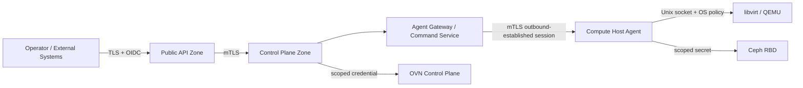

# セキュリティ設計

- 状態: Baseline
- 更新日: 2026-08-09

## 1. セキュリティ目標

- Tenant 間、および Tenant と Infrastructure 管理面を分離する。
- Control Plane の侵害が直ちに全 Host の無制限 root 操作へ拡大しないようにする。
- すべての重要操作について主体、判断、対象、結果を追跡できるようにする。
- supply chain とアップグレード経路を検証可能にする。
- ETSI NFV-SEC 029 の VIM Security Assurance 要件を製品セキュリティ評価へ取り込む。

## 2. Trust Boundary

## 3. Identity と権限

Root/Intermediate、TrustBundle/Profile、Agent/workload Credential Binding、renewal/revocation/compromise/offline/DRの正本は [PKI and Trust Lifecycle Architecture](pki-and-trust-lifecycle-architecture.md) です。本書はそのtrust resultを認証・認可・least privilegeへ適用します。

- 人間ユーザーは外部 IdP の OIDC を使用し、User lifecycle、password、MFA、federationは外部Identity Platformが所有する。
- User/Northbound Service Principal Identity/Credentialは外部Identity Platformが発行し、KIMはPrincipalとProject/Role Bindingだけを保持する。内部workload/Host transport certificateはPrincipal authorityにしない。
- Control Plane workload と Agent は相互 TLS の workload identity を持つ。
- Agent bootstrap credential は一回用途とし、登録後にノード固有証明書へ交換する。
- authenticated Hostを自動承認せず、Enrollment Policy/approvalとidentity evidenceを別に検証する。
- system administrator、infrastructure operator、tenant administrator、member、viewer を初期 role とする。
- break-glass 操作は追加認証、理由入力、短時間承認、専用監査を必要とする。

## 4. Agent と Host

- Agent は専用 OS user で動作し、systemd または対象 OS で同等の service sandbox を適用する。
- libvirt 操作はローカル Unix socket と polkit/Unix permission で制御する。
- Control Plane から任意 shell、任意 libvirt XML、任意 file path を送信できない設計とする。
- command schema、許可操作、入力上限を Agent 側でも検証する。
- image は checksum と署名ポリシーを通過した後にキャッシュする。
- Host 上の秘密情報を診断バンドルとログから除外する。
- SELinux、AppArmor、firewall、service manager の状態と評価結果を OS Integration Adapter が正規化する。変更は明示されたtyped remediationだけに限定する。
- Agentは内部Message Bus credentialを持たず、Agent Gatewayとのoutbound mTLS sessionを標準境界とする。
- Agent credentialはHost identityを証明するが操作authorityではない。Command Leaseにはarmed authority generationを必要とする。
- Hostは自身のEnrollment approval、Profile、Baseline、Control severity/remediation policyを変更できない。
- Baseline/Enrollment Policyはversion、digest、author/approver、auditを持ち、automatic arming/remediationのdecision evidenceを保存する。
- Hardware Identity Evidenceはsource/issuer/collector、request binding、freshness、integrity/attestation state、payload digestを保持し、MAC/hostname/IP等の単一可変値をauto-enrollment authorityにしない。
- raw serial/attestation payload/management credentialを通常log/eventへ出さず、access-controlled evidence referenceとdigestを使用する。
- External remediation callbackはservice identity、request/generation binding、expiry、replay/idempotency、integrityを検証し、callbackだけでCompliance/READY/authorityを進めない。
- HostGroup/membership/hierarchy/policy binding/exposureはSystem scope permissionで分離し、Agent/Tenant/未認証external assertionによる変更を許可しない。
- Tenantには許可されたPlacement Scopeだけを公開し、raw Host membership、rack/power topology、operator/owner cohortを秘匿する。
- AvailabilityPolicy publish/Pool binding/VM Rebind/Manual Recovery Decisionを別permissionとapprovalで保護し、Tenant/Agent/NFVO callbackによる責任変更を許可しない。
- source fencing proofはtrusted BMC/storage/cluster等のtyped evidenceから検証し、heartbeat lossやAgent自己申告だけでFENCEDへ進めない。
- Workload Resilience Group/memberはProject scopeを強制し、NFVO opaque roleをauthorization/application authorityに使用せず、raw failure topologyを公開しない。
- Recovery priorityは公開bounded classからmapし、Tenant指定の任意数値で他Projectをstarveさせない。Budget LeaseはCore serviceだけが発行する。
- persistent data classごとにTenant scope、PII/secret classification、retention/legal hold、archive/restore permissionをschema catalogへ宣言する。
- Outbox/Inbox/archive/backupへsecret valueや不要なraw identityを保存せず、restore/GC/migration operatorを通常resource operatorから権限分離する。
- Release publish、Upgrade Campaign start、schema/feature switch、destructive contract、rollback、support overrideを個別permissionへ分離し、不可逆stepへ追加approvalを要求できるようにする。
- Control Plane/Agent/extensionはversion自己申告だけでなくartifact digestとdeployment/build provenanceをRelease Manifestへ照合し、不一致artifactをquarantineする。
- upgrade coordinatorはrelease signing key、通常domain mutation、Command Lease、Host authorityを取得せず、artifact取得/検証/stage/activation identityも分離する。
- credential/token validityはverified Control Plane clock qualityとuncertaintyで評価するが、時間上有効なcredentialだけでEnrollment、Role、Host authority、Command Leaseを成立させない。
- clockがUNKNOWN/UNTRUSTEDなscopeでは新規privileged authentication、credential rotation、time-sensitive Commandをfail closedにし、既存VMをclock failureだけで停止しない。

## 5. Network と Tenant 分離

- Port の Project ownership を dataplane 設定前に検証する。
- default deny の security group policy を選択可能にする。
- 管理、ストレージ、migration、tenant overlay のネットワーク分離を標準構成とする。
- VLAN ID、VNI、tunnel endpoint、provider network mapping の競合を一元管理する。
- anti-spoofing、MAC/IP binding、DHCP trust をテスト対象とする。
- OVS-DPDK操作はHost-local typed adapterに限定し、arbitrary OVSDB key、EAL argument、`ovs-appctl` mutation、PCI bind commandを受け付けない。
- Tenantはqueue/performance policyを要求できても、物理core ID、PMD mask、PCI BDF、vhost socket pathを直接指定できない。
- VFIO、hugetlbfs、vhost-user socketは専用service identityと最小権限でアクセスする。
- IP/MAC/VLAN/VNI/Floating IP allocationをProject/Network/physical scopeのDB Claimで一意化し、UNKNOWN Binding/NAT中に再利用しない。
- Security Policy/Port membership/anti-spoofing realizationがUNKNOWNならnew exposureを停止し、default allowへfallbackしない。
- provider/segment pool、Gateway、external IP Pool、force unbind/delete、Adoptionへ個別permission/approvalを要求する。
- Network adapter credential、raw OVN object/chassis/tunnel IP、Host interface/physical topologyをTenant API/Event/diagnosticからredactする。

## 6. Storage と秘密情報

- CephX user は pool および用途ごとに最小権限化する。
- Volume の Project ownership と attachment generation を検証する。
- credential は Secret Provider に格納し、アプリケーション DB へ平文保存しない。
- backup は暗号化し、restore 権限を通常運用権限から分離する。
- 削除済み Volume のデータ消去保証レベルを backend ごとに文書化する。
- Storage Backend/Class/Attachment/Fencingの管理権限を分離し、force detach、client blocklist/lock break、backend delete、Adoptionへ個別permission/approvalを要求する。
- typed Storage Commandはstable backend resource identityとgenerationだけを受け、任意RBD/LVM command、argument、device pathを許可しない。
- watcher/lock/client、VG/LV/device path等のraw infrastructure detailをTenant API/Eventからredactする。

## 7. API 防御

- TLS 1.3 を標準とし、許可 cipher と証明書更新手順を管理する。
- schema validation、size limit、rate limit、timeout を全 endpoint に設定する。
- SSRF、path traversal、XML injection、command injection を設計レビュー項目に含める。
- Error response とログに token、secret、Domain XML 内秘密情報を含めない。
- Idempotency record を Tenant 境界外から参照できないようにする。

## 8. Audit

監査イベントには最低限以下を含めます。

- timestamp、request ID、trace ID
- actor、authentication method、source
- tenant、project、resource type、resource ID
- requested action と authorization decision
- before/after の機密情報を除いた要約
- Operation ID、結果、error code

監査ログは append-only sink へ転送し、保持期間とアクセス権を製品設定にします。

## 9. Supply Chain

- release artifact、container image、offline bundle に署名する。
- SPDX または CycloneDX SBOM を生成する。
- dependency、container、OS package の脆弱性を継続スキャンする。
- build provenance を保存し、再現可能 build を目標とする。
- Critical/High 脆弱性の公開・修正ポリシーを GA 前に定義する。
- Release Manifestへartifact digest、SBOM/provenance、supported upgrade path、contract/support range、migration、rollback boundaryをimmutableにbindする。
- offline bundleにもonline releaseと同一のintegrity、authorization、compatibility gateを適用する。

## 10. Security Verification

- Threat model と abuse case review
- SAST、dependency scan、secret scan、container scan
- API authorization matrix test
- Tenant isolation test
- malformed Agent command と replay test
- backup/restore と certificate rotation test
- external penetration test
- ETSI NFV-SEC 029 requirements traceability

## 11. 参照資料

- [ETSI NFV Security publications](https://docbox.etsi.org/isg/nfv/open/Publications_pdf/Specs-Reports)
- [libvirt access control and security documentation](https://www.libvirt.org/docs.html)
