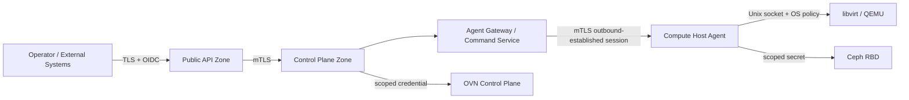

# セキュリティ設計

- 状態: Draft
- 更新日: 2026-08-09

## 1. セキュリティ目標

- Tenant 間、および Tenant と Infrastructure 管理面を分離する。
- Control Plane の侵害が直ちに全 Host の無制限 root 操作へ拡大しないようにする。
- すべての重要操作について主体、判断、対象、結果を追跡できるようにする。
- supply chain とアップグレード経路を検証可能にする。
- ETSI NFV-SEC 029 の VIM Security Assurance 要件を製品セキュリティ評価へ取り込む。

## 2. Trust Boundary

## 3. Identity と権限

- 人間ユーザーは外部 IdP の OIDC を使用し、User lifecycle、password、MFA、federationは外部Identity Platformが所有する。
- Service Identity/Credentialは外部Identity Platformが発行し、KIMはPrincipalとProject/Role Bindingだけを保持する。
- Control Plane workload と Agent は相互 TLS の workload identity を持つ。
- Agent bootstrap credential は一回用途とし、登録後にノード固有証明書へ交換する。
- system administrator、infrastructure operator、tenant administrator、member、viewer を初期 role とする。
- break-glass 操作は追加認証、理由入力、短時間承認、専用監査を必要とする。

## 4. Agent と Host

- Agent は専用 OS user で動作し、systemd または対象 OS で同等の service sandbox を適用する。
- libvirt 操作はローカル Unix socket と polkit/Unix permission で制御する。
- Control Plane から任意 shell、任意 libvirt XML、任意 file path を送信できない設計とする。
- command schema、許可操作、入力上限を Agent 側でも検証する。
- image は checksum と署名ポリシーを通過した後にキャッシュする。
- Host 上の秘密情報を診断バンドルとログから除外する。
- SELinux、AppArmor、firewall、service manager の状態と評価結果を OS Integration Adapter が正規化する。変更は明示されたtyped remediationだけに限定する。
- Agentは内部Message Bus credentialを持たず、Agent Gatewayとのoutbound mTLS sessionを標準境界とする。
- Agent credentialはHost identityを証明するが操作authorityではない。Command Leaseにはarmed authority generationを必要とする。

## 5. Network と Tenant 分離

- Port の Project ownership を dataplane 設定前に検証する。
- default deny の security group policy を選択可能にする。
- 管理、ストレージ、migration、tenant overlay のネットワーク分離を標準構成とする。
- VLAN ID、VNI、tunnel endpoint、provider network mapping の競合を一元管理する。
- anti-spoofing、MAC/IP binding、DHCP trust をテスト対象とする。
- OVS-DPDK操作はHost-local typed adapterに限定し、arbitrary OVSDB key、EAL argument、`ovs-appctl` mutation、PCI bind commandを受け付けない。
- Tenantはqueue/performance policyを要求できても、物理core ID、PMD mask、PCI BDF、vhost socket pathを直接指定できない。
- VFIO、hugetlbfs、vhost-user socketは専用service identityと最小権限でアクセスする。

## 6. Storage と秘密情報

- CephX user は pool および用途ごとに最小権限化する。
- Volume の Project ownership と attachment generation を検証する。
- credential は Secret Provider に格納し、アプリケーション DB へ平文保存しない。
- backup は暗号化し、restore 権限を通常運用権限から分離する。
- 削除済み Volume のデータ消去保証レベルを backend ごとに文書化する。

## 7. API 防御

- TLS 1.3 を標準とし、許可 cipher と証明書更新手順を管理する。
- schema validation、size limit、rate limit、timeout を全 endpoint に設定する。
- SSRF、path traversal、XML injection、command injection を設計レビュー項目に含める。
- Error response とログに token、secret、Domain XML 内秘密情報を含めない。
- Idempotency record を Tenant 境界外から参照できないようにする。

## 8. Audit

監査イベントには最低限以下を含めます。

- timestamp、request ID、trace ID
- actor、authentication method、source
- tenant、project、resource type、resource ID
- requested action と authorization decision
- before/after の機密情報を除いた要約
- Operation ID、結果、error code

監査ログは append-only sink へ転送し、保持期間とアクセス権を製品設定にします。

## 9. Supply Chain

- release artifact、container image、offline bundle に署名する。
- SPDX または CycloneDX SBOM を生成する。
- dependency、container、OS package の脆弱性を継続スキャンする。
- build provenance を保存し、再現可能 build を目標とする。
- Critical/High 脆弱性の公開・修正ポリシーを GA 前に定義する。

## 10. Security Verification

- Threat model と abuse case review
- SAST、dependency scan、secret scan、container scan
- API authorization matrix test
- Tenant isolation test
- malformed Agent command と replay test
- backup/restore と certificate rotation test
- external penetration test
- ETSI NFV-SEC 029 requirements traceability

## 11. 参照資料

- [ETSI NFV Security publications](https://docbox.etsi.org/isg/nfv/open/Publications_pdf/Specs-Reports)
- [libvirt access control and security documentation](https://www.libvirt.org/docs.html)
