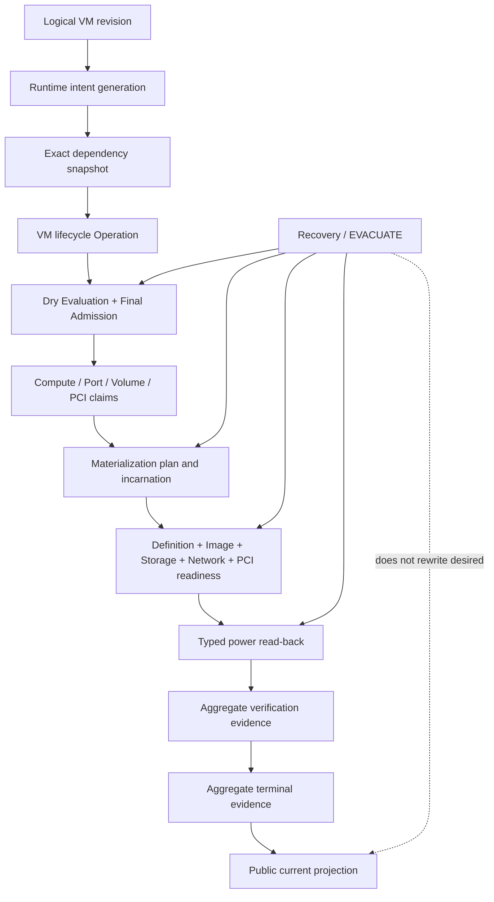

# VM Aggregate Resource Architecture

- 状態: Accepted（internal authority initial slice implemented）
- 更新日: 2026-08-15
- 対象: Phase 3 logical VM、Northbound API、Terraform Provider、Placement、Materialization、Power、Recovery、EVACUATE

## 1. 目的

本書は Phase 3 の VM を単純な CRUD row ではなく、既存の Placement、Final Admission、Materialization、Power、Recovery、Host EVACUATE を束ねる aggregate resource として公開するための設計 SSOT です。

VM の persistent desired identity と Host-local incarnation を分離し、次の因果だけを public convergence として認めます。

```text
logical VM desired revision
→ exact dependency snapshot
→ compiled Placement requirements
→ transactional Final Admission
→ exact materialization plan/incarnation
→ typed definition/image/network/storage execution
→ materialization READY
→ typed power execution
→ observed power MATCHED
→ aggregate verification
→ aggregate terminal
```

Phase 3 は既存 authority を置き換えません。VM aggregate は producer/consumer 間の exact provenance を保持し、既存 authority の positive terminal を合成する orchestration boundary です。

## 2. 中核原則

```text
logical VM identity != current Host
VM desired revision != VM runtime generation
VM runtime generation != materialization generation
desired power != observed power
Operation accepted != backend convergence
Recovery/EVACUATE incarnation change != Terraform desired drift
aggregate terminal != child Command success
```

Northbound caller は Host、Admission、allocation、plan、binding、LV UUID、PCI BDF、OVN/OVS UUID、Command、Attempt、Observation、Evidence ID を desired authority として供給しません。

## 3. Current repository audit

### 3.1 Current authority

| Current component | Existing authority | Phase 3 assessment |
|---|---|---|
| VM projection | Migration 017 `virtual_machines_current` | Admission、Host、plan と desired power を同じ current row に保持する internal runtime projection。public logical revision producer ではない |
| Placement | Migration 011 以降の Dry Evaluation / Final Admission | current capability、Policy、Scope、Network、Storage、PCI を再検証し、resource claims を atomic commitする producerとして再利用可能 |
| Materialization | Migrations 017–020、055、068 | exact Admission と resource authority から plan を作り、definition/image/network/storage readiness を導出する producerとして再利用可能 |
| Power | Migration 021 と typed power Command | Result ではなく exact libvirt read-backから `MATCHED` current projectionを作る producerとして再利用可能 |
| Availability | Migrations 048–058 | exact VM/Admission/Bindingを消費する Recovery authority。public VM desiredとは未接続 |
| Planned mobility | Migrations 066–072 | immutable workload snapshotからdestination incarnationを作る EVACUATE authority。logical VM desiredとは未接続 |
| Northbound prerequisites | Migrations 073–081 | Project、Flavor、Availability Policy、Image、Network、Subnet、Port、VolumeはAPI/Providerまでqualified |

### 3.2 Missing authority

Migration 082 より前は次が存在しませんでした。

- Project-owned logical VM revision evidence と current projection
- public VM desired と exact dependency revisions の immutable snapshot
- logical revision と runtime-affecting intent generation の分離
- Create/Update/Delete を束ねる VM aggregate Operation
- child terminalを合成する pure aggregate verification と terminal evidence
- public VM tombstone、dependency fence、Create replay binding
- Recovery/EVACUATE が logical desired を変更しなかったことを示す stable association
- Terraform VM schema、import、no-drift acceptance

Migration 082 は logical revision、dependency snapshot、runtime intent、aggregate Operation、Admission/materialization binding、verification/terminal と rebuildable runtime binding を追加しました。`virtual_machines_current` は引き続き internal physical runtime projection であり、直接 `/api/v1/vms` として公開してはいけません。

## 4. Target authority model



### 4.1 Conceptual persistence split

将来 Migration が必要な場合、repository naming conventionに従い最低限次の役割を分離します。表名は実装時のschema reviewで確定し、本書の概念名を無条件に採用しません。

| Conceptual authority | Role |
|---|---|
| `vm_resource_revision_evidence` | immutable public desired revision |
| `vm_resources_current` | logical VM current revision/lifecycle pointer |
| `vm_runtime_intent_evidence/current` | materialization/powerに影響するsemantic generation |
| `vm_dependency_snapshot_evidence` | exact Flavor/Image/Policy/Scope/Port/Volume revisions and digests |
| `vm_lifecycle_operation_evidence/current` | Create/Reconcile/Power/Delete aggregate operation |
| `vm_lifecycle_verification_evidence` | exact child terminal/current evidenceをpureに検証した結果 |
| `vm_lifecycle_terminal_evidence` | aggregate terminal decision |
| `vm_resource_tombstone_evidence` | final logical identity/revision/delete provenance |
| `vm_resource_runtime_bindings_current` | logical VMからexisting internal `virtual_machines_current` incarnationへのcurrent pointer |

既存の `virtual_machines_current`、Admission、plan、readiness、power、Recovery、EVACUATE evidence は historical/runtime authorityとして維持します。public resource revision tableへ物理identityを移しません。

## 5. Identity and generation model

| Identity/generation | Meaning | Changes when |
|---|---|---|
| VM ID | stable logical resource identity | never reused |
| VM resource revision | full user-managed desired revision | name、protection、desired power、dependency intent等のaccepted change |
| runtime intent generation | runtime-affecting desired snapshot | dependency、placement policy、device set、desired powerのsemantic change |
| VM generation | existing runtime compatibility/workload generation | existing internal contractが明示する replacement boundary only |
| Admission ID | one accepted Placement decision | new Placement/Recovery/EVACUATE admission |
| materialization generation | one Host-local VM incarnation | destination/rebuild materialization |
| attachment/binding generation | one Port/Volume/PCI incarnation | attach、handoff、relocation |
| observation generation | one backend read-back generation | new accepted observation |

rename と delete-protection change は VM resource revision を進めますが、runtime intent generation を進めません。これにより metadata update が進行中の safe Recovery を無関係に fence しません。

runtime-affecting desired mutation、Recovery、EVACUATE、Delete は `vm-resource/<vm_id>` の共通 lock domainで直列化します。Recovery/EVACUATE は desired revisionを変更せず、exact runtime intent generation/digestを再検証します。

## 6. Public desired contract

### 6.1 Initial desired fields

| Field | Class | Initial semantics |
|---|---|---|
| `id` | computed immutable | KIM stable UUID |
| `projectId` | required immutable | Project ownership |
| `name` | required mutable | display identityではない |
| `flavor` | required replacement | exact logical ID + revision |
| `image` | required replacement | exact VERIFIED Image ID + revision + verified digest provenance |
| `availabilityPolicy` | required replacement/rebind | exact supported Policy ID + revision。silent retrofitなし |
| `placementScope` | required replacement | stable logical Placement Scope ID + generation/revision。Host指定ではない |
| `ports` | optional replacement set | exact Port ID + revision + stable guest device role/order |
| `volumes` | required replacement set | exactly one boot/root role、optional future data roles、exact Volume ID + revision |
| `desiredPowerState` | required mutable async | `RUNNING` or `SHUTOFF` |
| `deleteProtection` | optional mutable | delete request fence |

Phase 3 initial implementationは `STANDARD` datapath、zero/one OVN Port、one boot/root Volume、zero PCIを最初のqualification profileとします。schemaは将来の複数Port/Volumeを表現できても、未qualified profileをsilent acceptしません。

### 6.2 Forbidden desired fields

- Host ID、Pool内candidate、NUMA node、pCPU、HugePage page identity
- Admission ID、allocation/claim ID、materialization plan/generation
- Port Binding ID/generation、OVN/OVS UUID、interface/socket path
- Storage backend、Host、VG/LV UUID、device path、attachment generation
- PCI BDF、PF/VF/IOMMU identity
- Command、Job、Lease、Attempt、Result、Observation、verification evidence
- Recovery、Failure Epoch、Fencing、EVACUATE、Cleanup identity/generation
- raw libvirt XML、QEMU argv、shell、backend-specific payload

## 7. Computed public projection

Base VM resourceは次のlogical/composite statusを返します。

- `revision`
- `lifecycleState`: `CREATING | ACTIVE | UPDATING | DELETE_PENDING | DELETED | BLOCKED`
- `convergenceState`: `PENDING | CONVERGING | CONVERGED | UNKNOWN | FAILED | ACTION_REQUIRED`
- `placementState`: `PENDING | ADMITTED | BLOCKED | UNKNOWN`
- `materializationState`: `PENDING | READY | BLOCKED | UNKNOWN`
- `observedPowerState`: `RUNNING | SHUTOFF | UNKNOWN`
- current aggregate Operation reference
- created/updated timestamps

Host、Admission、plan、binding、backend identityはbase Terraform stateへ含めません。権限付きdiagnostic/status endpointが必要な場合は別DTOで提供し、`x-kim-field-class=COMPUTED_DIAGNOSTIC_PHYSICAL`としてProvider state/exportから除外します。

## 8. Exact dependency snapshot

Createまたはruntime-affecting updateの受付時に、KIMはcallerのlogical referencesをcurrent authorityへ解決し、immutable snapshotを作ります。

最低限snapshotへ保存するもの:

- VM ID、resource revision、runtime intent generation、desired digest
- Project ID
- exact Flavor ID/revision/shape digest
- exact Image ID/revision/verified artifact digest
- exact Availability Policy ID/revision/binding input
- exact Placement Scope ID/generation/digest
- ordered Port ID/revision set、Network/Subnet/identity requirement digests
- ordered Volume ID/revision set、root role、Storage Class、capacity/materialization requirement digests
- desired power state
- compiler/schema/policy revision
- snapshot digest

snapshotはbackend realizationを所有しません。Port Binding、Volume backend、Host等は Final Admission/materialization時のexact current authorityから別evidenceとして固定します。

### 8.1 Dependency prerequisites

- all resources belong to the same Project or are explicitly visible by policy;
- Flavor revision is active and supported;
- Image revision is `VERIFIED`;
- Port revisions are active、realization-qualified、not attached by a conflicting intent;
- Volume revisions are active、materialization `VERIFIED`、not held by a conflicting writer;
- exactly one boot/root Volume is selected;
- boot content policy binds the VM Image and root Volume without ambiguous dual-source authority;
- Availability Policy and Placement Scope are current and compatible;
- no dependency is retiring、released、superseded、stale、or quarantined.

1つでも不一致ならlogical VM rowだけを残して実行を推測継続せず、request transactionをrollbackするか明示 `BLOCKED` Operationへ分類します。どちらを採用するかはerror classごとのcontractで固定します。

## 9. Placement requirement compiler

Northbound VM bodyを `PlacementAdmissionRequest` へ直接decodeしません。KIM compilerがexact snapshotから次を導出します。

```text
VM snapshot
├─ Flavor revision → compute / CPU / memory / HugePage requirements
├─ Availability + Scope → candidate visibility and failure-domain constraints
├─ Port revisions → Network requirements
├─ Volume revisions → Storage requirements
└─ Datapath profile → PCI/NUMA capability requirements
```

`workload_id` はVM logical identityからclosed mappingし、caller supplied alternate workload identityを許しません。Dry Evaluationはnon-reservingです。workerはcurrent candidatesを評価した後、同じrequest/snapshot digestで通常の Final Admissionを行います。Final Admissionは全claimsとAvailability Bindingをatomic commitし、dry結果が古ければfail closedで再評価します。

standalone Volumeがすでにexact capacityを予約している場合はMigration 080のconsumer contractに従い、その同一current allocationだけをadditional demandから控除します。reserved capacityをfree capacityへ戻しません。

## 10. Create and convergence chain

```text
POST /api/v1/vms
→ logical VM revision + runtime intent + idempotency binding
→ exact dependency snapshot
→ VM CREATE Operation accepted
→ worker claim
→ DryEvaluatePlacement
→ FinalAdmitPlacement
→ PrepareVMMaterialization
→ typed define/image/storage/network/PCI execution
→ exact read-back evidence
→ vm_materialization_readiness_current READY
→ typed power transition when desired RUNNING
→ vm_power_state_current MATCHED
→ EvaluateVMAggregateEvidence
→ CompleteVMLifecycleOperation
→ public VM CONVERGED
```

HTTP request transactionはHost、Agent、libvirt、OVN、LVMへ接続しません。logical authorityとOperation acceptanceだけをcommitします。

Aggregate verificationが必要とする最低条件:

- current logical revision/runtime intent/snapshot exact;
- current accepted Admission and all claims exact;
- current VM runtime binding points to that Admission and materialization;
- readiness is `READY` for the exact plan and evidence generations;
- desired/observed power is `MATCHED` for the exact VM/Host/incarnation;
- all required Port/Volume/PCI evidence sets match the snapshot;
- no dependency、Host authority、Scope、binding、readiness、power drift;
- no child authority is `UNKNOWN` or merely response-successful.

## 11. Update contract

Migration 087はinitial contractを内部authorityとして実装しました。metadata-only更新はimmutable logical revisionだけを追加し、runtime intent generationとdependency snapshotを維持します。desired power更新はlogical revisionとruntime intent generationを進めますが、同じexact dependency snapshotとcurrent runtime incarnationを消費し、Placementを再実行しません。

### 11.1 Initial in-place updates

- `name`: synchronous logical revision only;
- `deleteProtection`: synchronous logical revision only;
- `desiredPowerState`: new logical revision + runtime intent generation + asynchronous typed power Operation.

Power updateは exact current materialization/readinessを再検証します。`RUNNING`要求は `READY` が必須です。`SHUTOFF`要求もCommand responseだけで完了せず、exact `SHUTOFF MATCHED` observationを要求します。

### 11.2 Initial replacement fields

Flavor、Image、Availability Policy、Placement Scope、Port set/order、Volume set/roleはPhase 3 initialではreplacementです。in-place resize、reimage、attach/detach、policy rebindをVM Patchへ隠しません。後続のtyped operationがqualificationされた場合だけmutabilityを緩和します。

同じsingle-writer Volumeまたはattached Portを新旧VMが同時にconsumeできないため、Providerは一般的な `create_before_destroy` を保証しません。dependency conflictを無視してalternate resourceを作りません。

### 11.3 One-shot actions

reboot、reset、console token、rescue、snapshot、manual reconcile、Recovery、EVACUATEはpersistent desired fieldではありません。専用action/administrative Operationとして扱います。boolean toggleをTerraform resource fieldにしません。

## 12. Recovery and EVACUATE integration

RecoveryとEVACUATEはlogical VM ID、resource revision、runtime intent generation、dependency snapshot digestをread-only consumerとして固定します。既存のFailure/Fencingまたはplanned quiescence authorityはそのまま必要です。

```text
same logical VM desired
Host A / Admission 1 / materialization 1
→ Recovery or EVACUATE
Host B / Admission 2 / materialization 2
→ same VM resource revision and Terraform identity
```

destination terminal後に更新してよいのはruntime binding/computed projectionだけです。Port logical ID、MAC/IP、Volume logical ID、Image/Flavor/Policy snapshotを黙って変更しません。

Recovery/EVACUATE中にruntime-affecting user updateが競合した場合、共通VM lockとexact intent generationで一方をfail closedにします。rename等のmetadata-only revisionはruntime digestを変えず、historical operation provenanceに元revisionを残します。

Recovery/EVACUATEが `UNKNOWN`、`RECOVERY_REQUIRED`、`BLOCKED` の間、Terraform refreshはlogical resourceを消去またはreplacementしません。computed convergenceを `UNKNOWN`/`ACTION_REQUIRED` として返します。

## 13. Delete contract

Migration 087の最初のqualified producerはzero-Port、one ROOT Volume、no PCIです。`RUNNING`からの削除は直接許可せず、先に通常のpower Operationで`SHUTOFF MATCHED`へ収束させます。Host AgentがROOT hot-detachを禁止しているため、exact inactive Domainをtyped undefineした後、ROOT attachment absence/no-holderをREAD_BACK_FIRSTで証明します。Port付きまたは複数Volumeのdeleteは別campaignまでfail-closedです。

VM Deleteはcascade deleteではありません。

1. exact VM revisionとdelete protectionを検証する;
2. new Recovery/EVACUATE/runtime updateをfenceする;
3. RUNNINGならtyped SHUTOFFとexact read-backを行う;
4. Port/Volume/PCI attachmentをtyped detach/retireし、absence/no-holderを検証する;
5. libvirt Domain absenceをread-backする;
6. compute and attachment claimsをreleaseする;
7. aggregate delete verification/terminalをcommitする;
8. immutable tombstoneを残す.

referenced Port/Volume/Image/Flavor/Policy resourceそのものは削除しません。backend cleanup/capacity reclamationが別authorityの場合、safe VM deletion terminalと物理cleanupを混同しません。ただしsingle-writer holderやactive claimを残したままlogical VMをnot-foundへしません。

Providerはverified delete terminalまたはcontract-defined tombstone/not-foundを確認するまでstateを除去しません。

## 14. Idempotency, concurrency, and response loss

- Createはprincipal、Project、canonical path、stable client reference、canonical desired digestへbindする;
- same key + same digestはsame VM/Operationへ収束する;
- same key + different digestはconflict;
- Patch/Deleteは`If-Match` exact revisionを要求する;
- Operation generationとAttempt indexを混同しない;
- Lease expiryだけでside effect未実行と判断しない;
- response loss後はsame Operation/Commandのread-backを先に行う;
- stale Operation terminalはnew runtime intent/current incarnationを変更できない;
- duplicate aggregate verification/terminalはsame identitiesならidempotent、different identitiesならconflict.

## 15. Northbound API contract

Migration 088 and ADR-0037 implement this surface for the bounded qualified profile. The public projection remains logical-only; the physical-incarnation exclusions below are enforced by OpenAPI and Provider contract tests.

Proposed initial surface:

```text
POST   /api/v1/vms
GET    /api/v1/vms
GET    /api/v1/vms/{vm_id}
PATCH  /api/v1/vms/{vm_id}
DELETE /api/v1/vms/{vm_id}
GET    /api/v1/operations/{operation_id}
```

Createはlogical resource/Operationをcommitしてresource representationを返します。Update/Deleteのbackend-convergent mutationもOperation referenceを返します。common Operationは `UNKNOWN` をnonterminalに保ち、aggregate verification terminalが存在する時だけ `SUCCEEDED`を返します。

List/filterはProject scope、stable cursor、permission-aware existence hidingをPhase 2 contractから継承します。import identifierは `vm/<uuid>` を候補とし、backend Domain UUIDの発見/adoptionには使用しません。

## 16. Terraform contract

`kim_vm` はthin Northbound clientです。

- configuration/stateはlogical desired、stable VM ID、resource revision、logical computed convergenceだけを保持する;
- Host、Admission、binding、plan、LV、BDF、evidence identityをstateへ保存しない;
- Create/desired power/DeleteはOperationをbounded pollする;
- `UNKNOWN`時にdelete/recreateしない;
- importはKIM stable VM IDだけを受ける;
- Recovery/EVACUATE A→B後にsame desiredならno-op plan;
- remote desired revision changeはdriftとして表示し、stale ETagをsilent overwriteしない;
- administrative actionをpersistent resource fieldへ追加しない.

## 17. Security and trust boundary

- public principalはProject-scoped VM actionだけを要求し、Host Agent/backend credentialを取得しない;
- dependency Read権限とVM Create権限の両方を検証する;
- diagnosticsのphysical identityはseparate permission/redaction contractに従う;
- raw libvirt XML、guest block content、secret、token、private keyをdesired/evidence log/stateへ保存しない;
- idempotency/auditへactor、request、resource revision、desired digest、Operationを記録する;
- Provider/UI/CLIはPostgreSQL、Message Bus、Agent endpointへ直接接続しない;
- backend-only Domainをname/UUID similarityでmanaged VMへadoptしない.

## 18. Observability

最低限、次をresource IDをmetric labelにせずcorrelate可能にします。

- VM lifecycle operations、phase、duration、terminal outcome;
- Placement conflicts and re-evaluations;
- materialization readiness blockers;
- power response loss/read-back convergence;
- dependency drift and stale terminal rejection;
- Recovery/EVACUATE-induced incarnation transitions;
- Terraform polling timeout、read-back、no-drift result;
- delete quiescence、detach、absence、claim release duration.

High-cardinality VM/Admission/evidence identityはtrace、structured log、auditへ置きます。

## 19. Failure semantics

| Failure | Required behavior |
|---|---|
| Create response lost | same idempotency keyでsame VM/Operationをread back |
| dry result stale | Final Admission reject、bounded re-evaluation。alternate Hostをsilent forceしない |
| Command result missing/LOST | read-back first、`UNKNOWN` nonterminal |
| readiness evidence drift | aggregate verification reject |
| power Result success but observation absent | convergence reject |
| dependency revision retired/superseded | new execution reject、historical snapshot保持 |
| Host authority loss during create | block/unknown; Recovery eligibilityを別authorityで評価 |
| concurrent desired power and Recovery | exact intent generation/lockで一方をreject |
| Terraform timeout | resource/Operationを保持しbackend rollbackを推測しない |
| Delete during active Recovery/EVACUATE | conflictまたはexplicit takeover policy。並行破壊を許さない |
| old terminal replay after relocation | current incarnationを変更しない |

## 20. Migration and compatibility path

1. Proposed ADRと本書をreviewし、initial field/mutability/profileをAcceptする。
2. logical VM revision/runtime intent/dependency snapshot/aggregate Operation schema gapだけを新Migrationで追加する。
3. existing `virtual_machines_current`をruntime projectionとしてbridgeし、Migrations 011–072を書き換えない。
4. internal aggregate producerをzero-Port/one root/no-PCI profileでqualificationする。
5. one OVN Port profileとlogical Port handoff/no-driftをqualificationする。
6. Northbound API/OpenAPI/RBAC/idempotency/auditを追加する。
7. Terraform `kim_vm` CRUD/import/response-loss/no-driftをreal HTTP/PostgreSQLでqualificationする。
8. Recovery A→B、EVACUATE A→B、repeated incarnation後のTerraform no-opをqualificationする。
9. qualified capabilityごとにdata Volume、multiple Port、shared storage、HIGH_PERFORMANCE、DIRECT_IOを段階開放する。

expand/migrate/switch/contractを採用し、existing runtime rowsを根拠なくpublic logical desiredとしてbackfillしません。adoptionにはexplicit、audited、exact dependency reconstructionとconflict quarantineが必要です。

## 21. Future qualification plan

最低限のPhase 3 gate:

- `VM_AGGREGATE_RESOURCE_AUTHORITY`
- `VM_DEPENDENCY_SNAPSHOT_AUTHORITY`
- `VM_PLACEMENT_ADMISSION_BINDING`
- `VM_MATERIALIZATION_AGGREGATE_VERIFICATION`
- `VM_POWER_DESIRED_OBSERVED_SEPARATION`
- `VM_RECOVERY_EVACUATE_NO_DESIRED_DRIFT`
- `VM_DELETE_QUIESCENCE_AND_ABSENCE`
- `NORTHBOUND_VM_RESOURCE`
- `TERRAFORM_VM_RESOURCE`
- `TERRAFORM_VM_IMPORT_RESPONSE_LOSS`

Mandatory negative coverage:

- stale Flavor/Image/Policy/Scope/Port/Volume revision;
- unverified Image/Volume、attached Port、conflicting Volume writer;
- caller supplied Host/Admission/binding/backend identity;
- dry/final Placement race;
- fake READY、fake RUNNING、Command-only success;
- response LOST、Lease expiry、successor read-back;
- readiness/power/binding/materialization generation drift;
- concurrent power update/Recovery/Delete;
- old verification/terminal ABA replay;
- Recovery and EVACUATE physical incarnation changes causing no Terraform desired drift;
- delete before SHUTOFF/detach/domain absence;
- immutable evidence UPDATE rejection.

## 22. Current implementation and remaining expansion

| Area | Implemented | Remaining expansion |
|---|---|---|
| logical VM producer | immutable Project-owned revisions/current/tombstone | live dependency mutation |
| VM current state | logical desired and runtime binding separated | none for the qualified profile |
| dependencies | exact immutable aggregate snapshot | cardinality/profile expansion |
| create orchestration | one aggregate Operation consumes existing producers | HIGH_PERFORMANCE/DIRECT_IO |
| terminal | pure VM aggregate verification/terminal | larger dependency sets |
| public API | `/api/v1/vms` bounded logical contract | attachment-specific actions |
| Terraform | `kim_vm` logical state with Operation polling | production registry release |
| mobility drift | Recovery/EVACUATE association and no-drift qualification | multi-Port/multi-Volume mobility |
| delete | zero through two STANDARD Ports + ROOT with optional DATA verified delete | profiles beyond public create bounds |

## 23. Implemented internal profiles

Migration 082–087 と `internal/persistence/postgres/vm_aggregate.go` / `vm_aggregate_mobility.go` / `vm_aggregate_lifecycle.go` は、次の限定profileを実装・qualificationしました。

```text
logical VM revision 1
+ exact Flavor/Image/AvailabilityPolicy/PlacementScope snapshot
+ one exact VERIFIED boot Volume
+ zero Port または one STANDARD Port
+ zero PCI
+ desired RUNNING
→ compiled ordinary Placement request
→ Availability-aware Final Admission
→ generic VM materialization
→ definition/image/network readiness
→ RUNNING read-back
→ aggregate verification VERIFIED
→ aggregate terminal VERIFIED
```

callerはHost、Admission、backend、Binding、LV、READY、RUNNINGを供給しません。Final Admission後にVolume/Port attachment intentのcurrent evidence IDが進んでも、snapshotのREQUESTED evidenceからimmutable lineageを検証します。

one STANDARD Port profileではlogical Port revision/digestとrequested attachment intentだけをdesired snapshotへ保存します。Host、binding generation、OVN backend UUID、OVS interface identityは保存しません。compilerはexact current Network/Subnet/segment/identity authorityからordinary Network requirementを導出し、Final AdmissionがHost binding incarnationを作成します。aggregate verificationは、そのbindingとexact VM planに一致するtyped OVS preboot observationを別のimmutable provenance rowとして消費します。

Migration 084のmobility associationは、既存RecoveryまたはHost EVACUATEの`VERIFIED` terminalを消費するpost-terminal authorityです。mobility primitiveを再実装せず、terminalのexact source incarnationがaggregate runtime binding currentと一致し、destination Admission/plan/readiness/network/powerがcurrentである場合だけruntime pointerをCASで更新します。VM revision、runtime intent generation、dependency snapshot/digest、desired digest、logical Port revision/digestは更新しません。one STANDARD Port aggregateについて、Recovery A→Bと、その直後のplanned EVACUATE B→Cを同一logical authorityのassociation generation 1/2として実chainでqualification済みです。

Migration 085ではSTANDARD Port集合を最大2件まで一般化します。create producerはcaller配列順をauthorityにせずlogical Port IDでsortし、denseなzero-based ordinal、exact revision/digest、attachment intentをsnapshotします。Placement compiler、Admission binding、OVS verification、terminal drift fenceはすべてsnapshot cardinalityとの完全一致を要求します。一部Portだけの成功、duplicate Port、stale revision、one-Port binding driftはaggregate成功へ縮約されません。qualified positive profileは2 Portであり、multi-Port mobilityは別qualificationです。

Migration 086ではVolume集合をone ROOT plus one DATAまで一般化します。ROOTは必ずordinal 0かつbootable、DATAはordinal 1かつnon-bootableです。両Volumeのexact revision/digest、requested attachment intentをdesired snapshotへ固定し、Final Admission後のphysical attachment、backend binding generation、VERIFIED materialization terminalは別のimmutable runtime evidence setへ保存します。VM boot readinessのROOT成功だけでDATA成功を推論せず、aggregate verificationとterminalは2件すべてのcurrent authority完全一致を要求します。multi-Volume Recovery/EVACUATE associationは未qualificationのためfail-closedです。

Recovery network verification digestはNB/SB/OVS/dataplane/source-quiescence/handoff集合、EVACUATE network verification digestはdestination preboot OVS集合です。consumerは両者を同じdigest algorithmと誤認せず、Recovery terminal digestをcurrent readinessへexact bindしたうえで、logical Port revision/digestとdestination preboot evidenceを独立に再検証します。

Migration 087はmetadata、power、zero-Port/one-ROOT deleteを実装し、Migration 088はNorthbound create replayを追加しました。Migration 089はone STANDARD Port delete、Migration 090はROOT+DATA deleteを追加し、Migration 091はcanonical ordinal付きtwo-Port snapshot、per-Port absence、complete absence-setを追加しました。Migration 090/091を同じterminalで消費するtwo-Port+ROOT+DATA最大profileもschema追加なしでqualification済みです。OpenAPI `/api/v1/vms` と Terraform `kim_vm` のbounded create/delete matrixは対称になりました。未実装の主対象はmulti-Port/multi-Volume mobilityです。qualification詳細は [VM Northbound/Terraform qualification](validation/p3-vm-northbound-terraform-resource-20260815.md) と各internal profile validationを参照してください。

## 24. Explicitly out of scope

- production VM/Host/backend mutation;
- arbitrary Host pinning or physical resource selectors;
- live resize、live attach/detach、reimage、rescue、snapshot、console implementation;
- VM template/module catalog;
- Router、Floating IP、Security Policy implementation;
- Ceph/shared storage implementation or qualification;
- HIGH_PERFORMANCE/OVS-DPDK implementation;
- DIRECT_IO/SR-IOV public qualification;
- guest OS/application readiness as KIM VM convergence;
- Recovery、EVACUATE、Cleanup authority rewrite;
- existing historical evidence rewrite or automatic backend adoption.

## 25. Related documents

- [ADR-0036: VM is a logical aggregate over physical incarnations](adr/0036-vm-logical-aggregate-over-physical-incarnations.md)
- [ADR-0037: VM public contract consumes the verified aggregate authority](adr/0037-vm-northbound-and-terraform-contract.md)
- [Infrastructure Lifecycle and IaC Architecture](infrastructure-lifecycle-iac-architecture.md)
- [API Design Principles](api-principles.md)
- [Placement Architecture](placement-architecture.md)
- [Execution Architecture](execution-architecture.md)
- [Availability Responsibility Architecture](availability-responsibility-architecture.md)
- [Network Resource Architecture](network-resource-architecture.md)
- [Storage Attachment and Fencing Architecture](storage-attachment-fencing-architecture.md)
- [Architecture Invariants](architecture-invariants.md)
